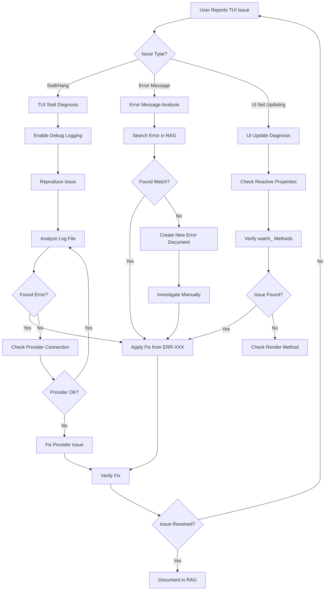

# WORKFLOW-001: TUI Troubleshooting Workflow

## Metadata
- **Workflow ID**: WORKFLOW-001
- **Category**: Diagnosis Workflow
- **Applies To**: TUI application issues

## Overview

This workflow guides the debugging agent through systematic diagnosis of TUI issues.

## Workflow Steps



## Step Details

### Step 1: Identify Issue Type

Ask the user to describe the issue:
- **Stall/Hang**: Application freezes, shows "Thinking..." indefinitely
- **Error Message**: Application shows an error
- **UI Not Updating**: Application runs but UI doesn't reflect changes

### Step 2: Enable Debug Logging

```batch
set OPENCODE_LOG_LEVEL=DEBUG
set OPENCODE_LOG_FILE=%~dp0python_embeded\Lib\site-packages\opencode\docs\opencode_debug.log
```

### Step 3: Search Troubleshooting RAG

```bash
opencode rag query --agent troubleshooting "TUI stalls at Thinking"
```

### Step 4: Apply Fix

If a matching error is found, apply the fix from the error document.

### Step 5: Verify Fix

1. Run the application
2. Reproduce the original issue
3. Confirm the issue is resolved

### Step 6: Document New Errors

If the issue was not in the RAG:
1. Create new error document in `RAG/troubleshooting/errors/`
2. Update the RAG index

## Related Patterns
- PATTERN-001: TUI Stall Diagnosis
- PATTERN-002: Provider Connection Diagnosis

## Related Errors
- ERR-010: Async Generator Await Error
- ERR-014: Reactive Property Watch Missing
- ERR-015: Installed vs Source Mismatch
