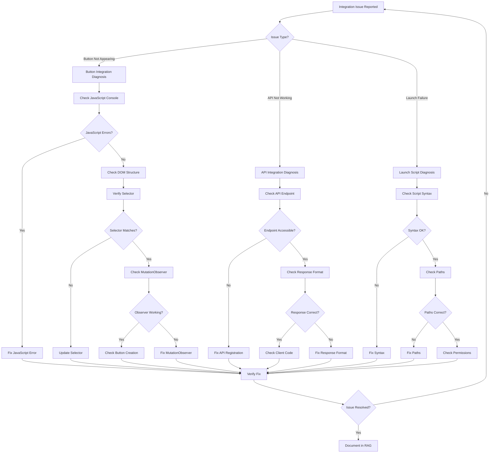

# WORKFLOW-002: Integration Troubleshooting Workflow

## Metadata
- **Workflow ID**: WORKFLOW-002
- **Category**: Diagnosis Workflow
- **Applies To**: Integration issues with external applications

## Overview

This workflow guides the debugging agent through systematic diagnosis of integration issues, particularly with ComfyUI.

## Workflow Steps



## Step Details

### Step 1: Identify Issue Type

- **Button Not Appearing**: UI element not visible in target application
- **API Not Working**: HTTP endpoint not responding or returning errors
- **Launch Failure**: Script fails to start the application

### Step 2: Check JavaScript Console

```javascript
// Open browser developer tools (F12)
// Check Console tab for errors
// Common errors:
// - "Cannot read properties of null" - selector not finding element
// - "MutationObserver is not defined" - API not available
// - "button.appendChild is not a function" - wrong element type
```

### Step 3: Check DOM Structure

```javascript
// Inspect the target element
// Right-click > Inspect
// Look for:
// - Element class names
// - Element attributes (title, aria-label)
// - Parent container structure
```

### Step 4: Verify Selector

```javascript
// Test selector in browser console
document.querySelector('button[title="ComfyUI Manager"]')
// Should return the element, not null
```

### Step 5: Check API Endpoint

```bash
# Test API endpoint directly
curl http://localhost:8182/opencode/start

# Expected response:
# {"status": "success", "message": "OpenCode TUI started"}
```

### Step 6: Check Launch Script

```batch
# Run script manually to see errors
.\python_embeded\python.exe -m opencode run
```

## Related Patterns
- PATTERN-003: Integration Verification

## Related Errors
- ERR-016: MutationObserver Button Positioning
- ERR-017: ComfyUI Button Selector Specificity
- ERR-005: Web Framework Response Types
- ERR-001: CLI Command Structure
