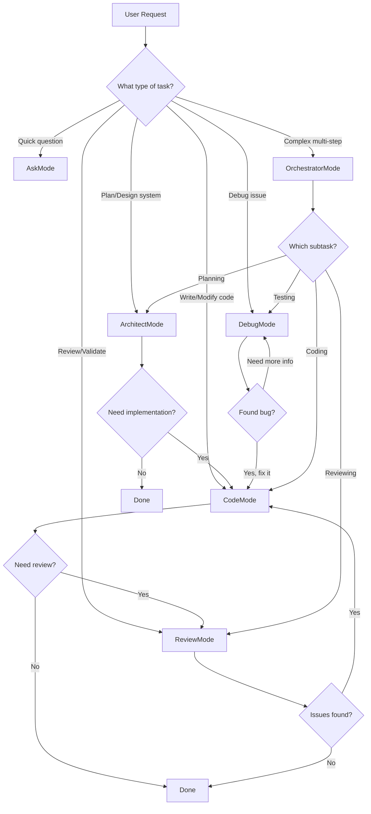

# Agent Orchestration with Multiple Local AI Models

## Your Understanding - Corrected and Expanded

Your conceptual model is on the right track! Let me clarify and expand on how agents orchestrate multiple local AI models in OpenCode.

### Your Model (Refined)

```
opencode_4py/
├── prompt
│   ├── agent(x)              # Agent receives prompt, AI model(s) configured here
│   │   ├── ai model(x)       # Multiple models process, outputs flow to next agent
│   ├── agent(y)              # Second agent to improve/validate output
│   │   ├── ai model(1)       # Compares/refines output from previous agent
│   └── END: wait for user input
```

### How It Actually Works

The orchestration system uses **three interconnected layers**:

```
┌─────────────────────────────────────────────────────────────────────────────┐
│                           ORCHESTRATION LAYER                                │
│  ┌─────────────────────────────────────────────────────────────────────┐    │
│  │                        Coordinator                                   │    │
│  │   - Receives user prompt                                            │    │
│  │   - Routes to appropriate agent via IntentClassifier                │    │
│  │   - Manages task queue and execution                                │    │
│  └─────────────────────────────────────────────────────────────────────┘    │
│                              │                                               │
│                              ▼                                               │
│  ┌─────────────────────────────────────────────────────────────────────┐    │
│  │                     OrchestrationRouter                              │    │
│  │   - Classifies intent (CODE_GENERATION, DEBUGGING, etc.)            │    │
│  │   - Selects best agent based on capabilities                        │    │
│  │   - Returns RoutingResult with agent_id and confidence              │    │
│  └─────────────────────────────────────────────────────────────────────┘    │
└─────────────────────────────────────────────────────────────────────────────┘
                              │
                              ▼
┌─────────────────────────────────────────────────────────────────────────────┐
│                              AGENT LAYER                                     │
│  ┌──────────────┐  ┌──────────────┐  ┌──────────────┐  ┌──────────────┐    │
│  │  CodeAgent   │  │  DebugAgent  │  │  AskAgent    │  │ ArchitectAgent│   │
│  │              │  │              │  │              │  │              │    │
│  │ Capabilities:│  │ Capabilities:│  │ Capabilities:│  │ Capabilities:│    │
│  │ - CODE_GEN   │  │ - DEBUGGING  │  │ - RESEARCH   │  │ - ARCHITECT  │    │
│  │ - REFACTOR   │  │ - TESTING    │  │ - EXPLAIN    │  │ - PLANNING   │    │
│  └──────────────┘  └──────────────┘  └──────────────┘  └──────────────┘    │
│         │                 │                 │                 │             │
│         └─────────────────┴─────────────────┴─────────────────┘             │
│                                    │                                         │
│                           AgentRegistry                                       │
│                           (registers all agents)                              │
└─────────────────────────────────────────────────────────────────────────────┘
                              │
                              ▼
┌─────────────────────────────────────────────────────────────────────────────┐
│                           WORKFLOW ENGINE LAYER                              │
│                                                                              │
│  This is where WORKFLOW_ENGINE.md fits!                                      │
│                                                                              │
│  ┌─────────────────────────────────────────────────────────────────────┐    │
│  │                        WorkflowEngine                                │    │
│  │   - Executes DAG-based workflows                                     │    │
│  │   - Manages node execution order (topological sort)                  │    │
│  │   - Handles data flow between nodes                                  │    │
│  │   - Parallel execution where possible                                │    │
│  └─────────────────────────────────────────────────────────────────────┘    │
│                              │                                               │
│                              ▼                                               │
│  ┌──────────────┐  ┌──────────────┐  ┌──────────────┐  ┌──────────────┐    │
│  │DataSourceNode│→ │LLMProcessNode│→ │ValidationNode│→ │  ToolNode    │    │
│  │              │  │              │  │              │  │              │    │
│  │ Load data    │  │ Call AI model│  │ Validate     │  │ Write output │    │
│  └──────────────┘  └──────────────┘  └──────────────┘  └──────────────┘    │
│                                                                              │
│  Each LLMProcessNode can call a specific AI model with its own prompt       │
└─────────────────────────────────────────────────────────────────────────────┘
```

## Where WORKFLOW_ENGINE.md Fits

The [`WORKFLOW_ENGINE.md`](docs/WORKFLOW_ENGINE.md) document describes the **Workflow Engine Layer** - the lowest level of execution that handles:

1. **Node-based execution** - Each processing step is a node
2. **DAG (Directed Acyclic Graph)** - Defines execution order and data flow
3. **LLMProcessNode** - The node type that calls AI models

### Key Integration Points

| Component | Location | Purpose |
|-----------|----------|---------|
| [`WorkflowEngine`](src/opencode/src/opencode/workflow/engine.py) | `workflow/engine.py` | Orchestrates workflow execution |
| [`LlmProcessNode`](src/opencode/src/opencode/workflow/nodes/llm_process.py) | `workflow/nodes/llm_process.py` | Calls AI models with prompts |
| [`Coordinator`](src/opencode/src/opencode/core/orchestration/coordinator.py) | `core/orchestration/coordinator.py` | Routes tasks to agents |
| [`Agent`](src/opencode/src/opencode/core/orchestration/agent.py) | `core/orchestration/agent.py` | Executes tasks with specific capabilities |

## Multi-Model Accuracy Improvement Pattern

Here's how multiple local models can be orchestrated to improve accuracy:

### Pattern 1: Sequential Refinement (Your Model)

```python
# Workflow definition for sequential refinement
workflow = WorkflowGraph()

# Agent 1: Initial generation with Model A
workflow.add_node(WorkflowNode(
    id="initial_generation",
    type="llm_process",
    config={
        "model": "llama3:8b",  # Local model A
        "prompt": "Generate code for: {{user_prompt}}"
    }
))

# Agent 2: Review with Model B
workflow.add_node(WorkflowNode(
    id="review",
    type="llm_process",
    config={
        "model": "mistral:7b",  # Local model B
        "prompt": "Review and improve this code: {{initial_generation.output}}"
    }
))

# Agent 3: Final validation with Model C
workflow.add_node(WorkflowNode(
    id="validation",
    type="llm_process",
    config={
        "model": "codellama:13b",  # Local model C
        "prompt": "Validate this code for correctness: {{review.output}}"
    }
))

# Connect nodes
workflow.add_edge(WorkflowEdge(source="initial_generation", target="review"))
workflow.add_edge(WorkflowEdge(source="review", target="validation"))
```

### Pattern 2: Parallel Ensemble (Multiple Models Vote)

```python
# Multiple models process same input, results aggregated
workflow = WorkflowGraph()

# Three models analyze in parallel
for i, model in enumerate(["llama3:8b", "mistral:7b", "codellama:7b"]):
    workflow.add_node(WorkflowNode(
        id=f"model_{i}",
        type="llm_process",
        config={
            "model": model,
            "prompt": "Analyze: {{input}}"
        }
    ))

# Aggregator node collects and synthesizes
workflow.add_node(WorkflowNode(
    id="aggregator",
    type="llm_process",
    config={
        "model": "llama3:70b",  # Larger model for synthesis
        "prompt": "Synthesize these analyses: {{model_0.output}}, {{model_1.output}}, {{model_2.output}}"
    }
))
```

### Pattern 3: Specialized Agent Chain

```python
# Different agents with specialized models
agents = [
    Agent(
        description=AgentDescription(
            agent_id="code_writer",
            capabilities=[AgentCapability.CODE_GENERATION],
        ),
        # Uses creative model for generation
    ),
    Agent(
        description=AgentDescription(
            agent_id="code_reviewer",
            capabilities=[AgentCapability.CODE_REVIEW],
        ),
        # Uses analytical model for review
    ),
    Agent(
        description=AgentDescription(
            agent_id="tester",
            capabilities=[AgentCapability.TESTING],
        ),
        # Uses precise model for test generation
    ),
]
```

## File Structure Integration

```
opencode_4py/
├── src/opencode/
│   ├── core/
│   │   └── orchestration/        # Agent orchestration layer
│   │       ├── agent.py          # Agent definitions
│   │       ├── coordinator.py    # Task coordination
│   │       ├── router.py         # Intent routing
│   │       └── registry.py       # Agent registry
│   │
│   ├── workflow/                 # Workflow engine layer (WORKFLOW_ENGINE.md)
│   │   ├── engine.py             # WorkflowEngine
│   │   ├── graph.py              # DAG structure
│   │   ├── node.py               # BaseNode class
│   │   └── nodes/
│   │       └── llm_process.py    # AI model calls
│   │
│   └── provider/                 # AI model providers
│       ├── ollama.py             # Local Ollama models
│       ├── lmstudio.py           # LM Studio models
│       └── ...
│
├── docs/
│   ├── WORKFLOW_ENGINE.md        # Workflow documentation
│   └── AGENT_MODEL_ORCHESTRATION.md  # This document
│
└── for_testing/                  # Test workflows here
```

## Execution Flow Summary

```
User Prompt
     │
     ▼
┌─────────────────┐
│  Coordinator    │  ← Receives prompt, manages task queue
└────────┬────────┘
         │
         ▼
┌─────────────────┐
│  Router         │  ← Classifies intent, selects agent
└────────┬────────┘
         │
         ▼
┌─────────────────┐
│  Agent          │  ← Executes task with capabilities
└────────┬────────┘
         │
         ▼
┌─────────────────┐
│  WorkflowEngine │  ← Runs workflow DAG
└────────┬────────┘
         │
         ▼
┌─────────────────┐
│  LlmProcessNode │  ← Calls specific AI model
└────────┬────────┘
         │
         ▼
    Model Output
         │
         ▼ (if multi-step workflow)
    Next Node/Agent
         │
         ▼
    Final Result
```

## Key Takeaways

1. **Your model is correct in concept**: Agents do chain together, and each can use different AI models.

2. **WORKFLOW_ENGINE.md describes the execution layer**: It explains how DAG-based workflows execute nodes (including LLM calls) in order.

3. **Three-layer architecture**:
   - **Orchestration Layer**: Routes prompts to appropriate agents
   - **Agent Layer**: Specialized handlers for task types
   - **Workflow Layer**: Low-level execution with node-based processing

4. **Multiple models improve accuracy through**:
   - Sequential refinement (one model improves another's output)
   - Parallel ensemble (multiple models vote/consensus)
   - Specialized agents (right model for right task)

5. **Configuration happens at multiple levels**:
   - Agent level: Which capabilities an agent has
   - Workflow level: Which model each LlmProcessNode uses
   - Settings level: Default model preferences

---

## Current Implementation Status

### ✅ What EXISTS (Infrastructure Ready)

| Component | Status | Location |
|-----------|--------|----------|
| [`LlmProcessNode`](src/opencode/src/opencode/workflow/nodes/llm_process.py) | ✅ Implemented | Supports `provider` and `model` config per node |
| [`WorkflowEngine`](src/opencode/src/opencode/workflow/engine.py) | ✅ Implemented | DAG execution with parallel support |
| [`WorkflowGraph`](src/opencode/src/opencode/workflow/graph.py) | ✅ Implemented | Node/edge connections, data flow |
| [`Config`](src/opencode/src/opencode/core/config.py) | ✅ Implemented | Provider/model configuration |
| [`Provider System`](src/opencode/src/opencode/provider/) | ✅ Implemented | Ollama, LMStudio, OpenAI, etc. |
| [`Workflow API`](src/opencode/src/opencode/server/routes/workflow.py) | ✅ Implemented | REST endpoints for workflow management |

### ❌ What's MISSING (Needs Implementation)

| Feature | Status | Description |
|---------|--------|-------------|
| Multi-Model Templates | ❌ Not implemented | No pre-built sequential/ensemble workflows |
| Simple User Settings | ❌ Not implemented | No easy config for multi-model patterns |
| CLI Multi-Model Command | ❌ Not implemented | No `opencode run --multi-model` option |
| Workflow Templates DB | ❌ Empty | `WorkflowTemplate` table exists but unused |
| Ensemble Aggregator Node | ❌ Not implemented | No built-in node to combine multiple model outputs |

### How to Use Multi-Model Today (Manual Approach)

You CAN use multi-model patterns today, but it requires manual workflow construction:

```python
# Example: Create a sequential refinement workflow via API
import httpx

# 1. Create workflow
workflow = httpx.post("http://localhost:4096/workflows/", json={
    "name": "Multi-Model Refinement",
    "description": "Generate → Review → Validate"
})

workflow_id = workflow.json()["id"]

# 2. Add first model node (Generator)
httpx.post(f"http://localhost:4096/workflows/{workflow_id}/nodes", json={
    "node_type": "llm_process",
    "config": {
        "provider": "ollama",
        "model": "llama3.2",
        "systemPrompt": "You are a code generator.",
        "userPromptTemplate": "Generate code for: {{input}}"
    }
})

# 3. Add second model node (Reviewer)
httpx.post(f"http://localhost:4096/workflows/{workflow_id}/nodes", json={
    "node_type": "llm_process",
    "config": {
        "provider": "ollama",
        "model": "mistral:7b",
        "systemPrompt": "You are a code reviewer.",
        "userPromptTemplate": "Review and improve: {{input}}"
    }
})

# 4. Connect nodes
httpx.post(f"http://localhost:4096/workflows/{workflow_id}/edges", json={
    "source_node_id": "node_1",
    "target_node_id": "node_2"
})

# 5. Execute
httpx.post(f"http://localhost:4096/workflows/{workflow_id}/execute", json={
    "variables": {"input": "Write a Python function to sort a list"}
})
```

### Configuration File Support

The [`Config`](src/opencode/src/opencode/core/config.py) class supports:

```toml
# opencode.toml (project config)
[providers.ollama]
base_url = "http://localhost:11434"
models = ["llama3.2", "mistral:7b", "codellama:13b"]
default_model = "llama3.2"

[providers.openai]
api_key = "sk-..."
models = ["gpt-4o", "gpt-4o-mini"]

[models."llama3.2"]
provider = "ollama"
max_tokens = 4096
temperature = 0.7

[models."mistral:7b"]
provider = "ollama"
max_tokens = 8192
temperature = 0.5
```

But there's **no simplified multi-model pattern configuration** like:

```toml
# NOT YET SUPPORTED - Conceptual only
[multi_model.refinement]
pattern = "sequential"
models = ["llama3.2", "mistral:7b", "codellama:13b"]
prompts = [
    "Generate code for: {{input}}",
    "Review and improve: {{previous}}",
    "Validate correctness: {{previous}}"
]

[multi_model.ensemble]
pattern = "parallel"
models = ["llama3.2", "mistral:7b", "codellama:7b"]
aggregator = "llama3.2:70b"
```

---

## What Needs to Be Built

To provide simple user settings for Multi-Model Accuracy Patterns, the following should be implemented:

### 1. Multi-Model Workflow Templates

Create pre-built templates in [`workflow/models.py`](src/opencode/src/opencode/workflow/models.py):

```python
# Conceptual implementation
BUILTIN_TEMPLATES = {
    "sequential_refinement": {
        "name": "Sequential Refinement",
        "description": "Chain of models improving each other's output",
        "nodes": [
            {"id": "generator", "type": "llm_process", "config": {...}},
            {"id": "reviewer", "type": "llm_process", "config": {...}},
            {"id": "validator", "type": "llm_process", "config": {...}},
        ],
        "edges": [
            {"source": "generator", "target": "reviewer"},
            {"source": "reviewer", "target": "validator"},
        ]
    },
    "parallel_ensemble": {
        "name": "Parallel Ensemble",
        "description": "Multiple models analyze in parallel",
        "nodes": [...],
        "edges": [...]
    }
}
```

### 2. CLI Command for Multi-Model

Add to [`cli/commands/run.py`](src/opencode/src/opencode/cli/commands/run.py):

```python
def run_command(
    ...
    multi_model: str = typer.Option(None, "--multi-model", help="Multi-model pattern: sequential, ensemble"),
    models: List[str] = typer.Option([], "--models", help="Models to use in multi-model pattern"),
):
    if multi_model:
        # Load template and execute multi-model workflow
        ...
```

### 3. Config Extension

Extend [`core/config.py`](src/opencode/src/opencode/core/config.py):

```python
class MultiModelConfig(BaseModel):
    """Configuration for multi-model patterns."""
    pattern: str  # "sequential" or "ensemble"
    models: List[str]
    prompts: Optional[List[str]] = None
    aggregator_model: Optional[str] = None
```

### 4. Ensemble Aggregator Node

Create new node type in [`workflow/nodes/`](src/opencode/src/opencode/workflow/nodes/):

```python
@NodeRegistry.register("ensemble_aggregator")
class EnsembleAggregatorNode(BaseNode):
    """Combines outputs from multiple models."""
    
    async def execute(self, inputs, context):
        # Collect outputs from all connected model nodes
        # Use another model to synthesize/aggregate
        ...
```

---

## RAG Integration with Agent Orchestration

OpenCode includes a complete RAG (Retrieval-Augmented Generation) system that can be optionally integrated with agent orchestration to provide context-aware responses.

### RAG System Architecture

```
┌─────────────────────────────────────────────────────────────────────────────┐
│                              RAG LAYER                                       │
│                                                                              │
│  ┌─────────────────────────────────────────────────────────────────────┐    │
│  │                        RAGPipeline                                   │    │
│  │   - Orchestrates retrieval-augmented generation                     │    │
│  │   - Manages document indexing and retrieval                         │    │
│  │   - Integrates with LLM for context-enhanced responses              │    │
│  └─────────────────────────────────────────────────────────────────────┘    │
│                              │                                               │
│          ┌───────────────────┼───────────────────┐                         │
│          ▼                   ▼                   ▼                         │
│  ┌──────────────┐  ┌──────────────┐  ┌──────────────┐                     │
│  │EmbeddingEngine│  │   Retriever  │  │ QueryRewriter│                     │
│  │              │  │              │  │              │                     │
│  │ - Ollama     │  │ - Similarity │  │ - HyDE       │                     │
│  │ - OpenAI     │  │ - MMR        │  │ - Expansion  │                     │
│  │ - Local      │  │ - Threshold  │  │ - Rewriting  │                     │
│  └──────────────┘  └──────────────┘  └──────────────┘                     │
│          │                   │                   │                         │
│          └───────────────────┼───────────────────┘                         │
│                              ▼                                               │
│  ┌─────────────────────────────────────────────────────────────────────┐    │
│  │                     Document Store                                   │    │
│  │   - Document chunks with embeddings                                 │    │
│  │   - Metadata filtering                                              │    │
│  │   - Persistent storage                                              │    │
│  └─────────────────────────────────────────────────────────────────────┘    │
└─────────────────────────────────────────────────────────────────────────────┘
```

### RAG Components

| Component | Location | Purpose |
|-----------|----------|---------|
| [`RAGPipeline`](src/opencode/src/opencode/core/rag/pipeline.py) | `core/rag/pipeline.py` | Main RAG orchestration |
| [`RAGConfig`](src/opencode/src/opencode/core/rag/config.py) | `core/rag/config.py` | RAG configuration settings |
| [`EmbeddingEngine`](src/opencode/src/opencode/core/rag/embeddings.py) | `core/rag/embeddings.py` | Text embedding generation |
| [`Retriever`](src/opencode/src/opencode/core/rag/retriever.py) | `core/rag/retriever.py` | Document retrieval |
| [`QueryRewriter`](src/opencode/src/opencode/core/rag/query_rewriter.py) | `core/rag/query_rewriter.py` | Query optimization |
| [`RAGEvaluator`](src/opencode/src/opencode/core/rag/evaluation.py) | `core/rag/evaluation.py` | RAG quality metrics |

### Agent + RAG Integration Pattern

```
User Prompt
     │
     ▼
┌─────────────────┐
│  Coordinator    │  ← Receives prompt
└────────┬────────┘
         │
         ▼
┌─────────────────┐
│  Router         │  ← Classifies intent
└────────┬────────┘
         │
         ▼
┌─────────────────┐     ┌─────────────────┐
│  Agent          │────▶│  RAG Pipeline   │  ← Optional RAG enhancement
└────────┬────────┘     │  (if enabled)   │
         │              └────────┬────────┘
         │                       │
         │    ┌──────────────────┘
         │    │ Retrieved Context
         ▼    ▼
┌─────────────────┐
│  WorkflowEngine │  ← Runs workflow with context
└────────┬────────┘
         │
         ▼
┌─────────────────┐
│  LlmProcessNode │  ← Calls AI model with RAG context
└────────┬────────┘
         │
         ▼
    Model Output
```

### RAG-Enhanced Multi-Model Pattern

```python
# Workflow with RAG context for all models
workflow = WorkflowGraph()

# RAG retrieval node
workflow.add_node(WorkflowNode(
    id="rag_retrieval",
    type="rag_process",
    config={
        "collection": "project_docs",
        "top_k": 5,
        "similarity_threshold": 0.7,
    }
))

# Model 1: Initial generation with RAG context
workflow.add_node(WorkflowNode(
    id="generator",
    type="llm_process",
    config={
        "model": "llama3:8b",
        "prompt": "Based on this context: {{rag_retrieval.context}}\n\nGenerate: {{user_prompt}}"
    }
))

# Model 2: Review with same RAG context
workflow.add_node(WorkflowNode(
    id="reviewer",
    type="llm_process",
    config={
        "model": "mistral:7b",
        "prompt": "Context: {{rag_retrieval.context}}\n\nReview: {{generator.output}}"
    }
))

# Connect nodes
workflow.add_edge(WorkflowEdge(source="rag_retrieval", target="generator"))
workflow.add_edge(WorkflowEdge(source="generator", target="reviewer"))
```

### Configuration for RAG-Enhanced Agents

```toml
# opencode.toml

[rag]
enabled = true
embedding_model = "nomic-embed-text"
embedding_provider = "ollama"
chunk_size = 512
chunk_overlap = 50
retrieval_top_k = 5
similarity_threshold = 0.7

[rag.query_rewriting]
enabled = true
method = "hyde"  # hyde, expansion, or rewrite

[rag.collections.project_docs]
path = "./docs"
file_patterns = ["*.md", "*.txt", "*.py"]
```

### RAG Node Types

| Node Type | Purpose | Config Options |
|-----------|---------|----------------|
| `rag_process` | Retrieve documents | `collection`, `top_k`, `threshold` |
| `rag_index` | Index documents | `path`, `patterns`, `chunk_size` |
| `rag_query_rewrite` | Optimize query | `method`, `expansion_count` |

### When to Use RAG with Agents

| Use Case | RAG Benefit |
|----------|-------------|
| Code documentation queries | Retrieve relevant docs before generation |
| Project-specific questions | Context from project files |
| Knowledge base Q&A | Search indexed knowledge |
| Multi-file analysis | Cross-reference related files |
| Historical context | Previous conversations/decisions |

### RAG + Multi-Model Best Practices

1. **Retrieve once, use many**: Run RAG retrieval once, pass context to all models
2. **Context window management**: RAG helps fit relevant context within limits
3. **Ensemble with RAG**: Multiple models can validate retrieved information
4. **Query rewriting**: Use HyDE or expansion for better retrieval before multi-model processing

```python
# Example: RAG + Ensemble pattern
async def rag_ensemble_query(query: str, models: List[str]):
    # 1. Retrieve context
    rag = RAGPipeline(config)
    context = await rag.retrieve(query, top_k=5)
    
    # 2. Run multiple models with context
    results = await asyncio.gather(*[
        model.generate(f"Context: {context}\n\nQuery: {query}")
        for model in models
    ])
    
    # 3. Aggregate results
    return await aggregator.synthesize(results)
```

---

## Simplified RAG File Structure

OpenCode supports a simplified, file-based RAG structure for agent-specific retrieval:

```
opencode_4py/
├── RAG/
│   ├── agent_{name}/              # RAG for specific agent
│   │   ├── RAG/                   # Holds RAG files
│   │   │   ├── {name}-RAG/        # Generated RAG index
│   │   │   ├── README-RAG.md      # Information about the RAG
│   │   │   └── {source_files}/    # Files used to generate RAG
│   │   └── config.json            # Agent RAG configuration
```

### Agent RAG Manager

The [`AgentRAGManager`](src/opencode/src/opencode/core/rag/agent_rag_manager.py) provides a simple interface:

```python
from opencode.core.rag.agent_rag_manager import AgentRAGManager

manager = AgentRAGManager()

# Create RAG for an agent
await manager.create_rag(
    agent="code",
    sources=["./src", "./docs"],
    description="Code patterns and best practices"
)

# Query an agent's RAG
results = await manager.query("code", "How to implement authentication?")

# Add more files
await manager.add_files("code", ["./new_module.py"])

# Get status
status = manager.get_status("code")
```

### CLI Commands

```bash
# Create RAG for an agent
opencode rag create --agent code --source ./src --source ./docs

# Query an agent's RAG
opencode rag query --agent code "How to implement error handling?"

# Add files to existing RAG
opencode rag add --agent code ./new_module.py

# List agents with RAG
opencode rag list

# Get RAG status
opencode rag status --agent code

# Delete an agent's RAG
opencode rag delete --agent code
```

### Configuration (config.json)

Each agent's RAG has a `config.json`:

```json
{
  "agent": "code",
  "description": "RAG for code generation agent",
  "embedding_model": "nomic-embed-text",
  "embedding_provider": "ollama",
  "chunk_size": 512,
  "chunk_overlap": 50,
  "top_k": 5,
  "min_similarity": 0.7,
  "sources": ["./src", "./docs"],
  "file_patterns": ["*.py", "*.md", "*.txt"],
  "created_at": "2024-01-15T10:30:00",
  "updated_at": "2024-01-15T10:30:00",
  "document_count": 42
}
```

### Pre-configured Agents

| Agent | Directory | Purpose |
|-------|-----------|---------|
| `code` | `RAG/agent_code/` | Code patterns, best practices |
| `architect` | `RAG/agent_architect/` | Architecture decisions, plans |
| `debug` | `RAG/agent_debug/` | Error patterns, solutions |
| `ask` | `RAG/agent_ask/` | General knowledge, documentation |
| `review` | `RAG/agent_review/` | Review standards, quality criteria |
| `orchestrator` | `RAG/agent_orchestrator/` | Workflow patterns, coordination |

---

## Modes and Agents Reference

### Built-in Modes (6)

OpenCode provides 6 specialized modes for different task types:

| Mode | Purpose | Tools | Use Case |
|------|---------|-------|----------|
| [`CodeMode`](src/opencode/src/opencode/core/modes/modes/code.py) | Everyday coding, edits, file operations | All tools | Implementation, file modifications |
| [`ArchitectMode`](src/opencode/src/opencode/core/modes/modes/architect.py) | Planning, specs, migrations | Read, write docs, search | System design, specifications |
| [`AskMode`](src/opencode/src/opencode/core/modes/modes/ask.py) | Fast answers and explanations | Read, search | Quick questions, explanations |
| [`DebugMode`](src/opencode/src/opencode/core/modes/modes/debug.py) | Trace issues, root cause analysis | Read, execute, git tools | Troubleshooting, debugging |
| [`ReviewMode`](src/opencode/src/opencode/core/modes/modes/review.py) | Review code, plans, documents | Read, git tools (read-only) | Quality assurance, validation |
| [`OrchestratorMode`](src/opencode/src/opencode/core/modes/modes/orchestrator.py) | Coordinate tasks across modes | Mode switching, delegation | Complex multi-step workflows |

### Mode Capabilities Matrix

```
┌─────────────────┬──────┬──────────┬──────┬───────┬────────┬──────────────┐
│ Capability      │ Code │ Architect│ Ask  │ Debug │ Review │ Orchestrator │
├─────────────────┼──────┼──────────┼──────┼───────┼────────┼──────────────┤
│ Read files      │  ✅  │    ✅    │  ✅  │  ✅   │   ✅   │      ✅      │
│ Write files     │  ✅  │    ✅    │  ❌  │  ❌   │   ❌   │      ❌      │
│ Execute commands│  ✅  │    ❌    │  ❌  │  ✅   │   ❌   │      ❌      │
│ Git operations  │  ✅  │    ❌    │  ❌  │  ✅   │   ✅   │      ❌      │
│ Search codebase │  ✅  │    ✅    │  ✅  │  ✅   │   ✅   │      ✅      │
│ Switch modes    │  ❌  │    ❌    │  ❌  │  ❌   │   ❌   │      ✅      │
│ Delegate tasks  │  ❌  │    ❌    │  ❌  │  ❌   │   ❌   │      ✅      │
│ Create workflows│  ❌  │    ❌    │  ❌  │  ❌   │   ❌   │      ✅      │
└─────────────────┴──────┴──────────┴──────┴───────┴────────┴──────────────┘
```

### Built-in Subagents (9)

Subagents are specialized agents that can be invoked for specific tasks:

| Subagent | Purpose | Tools | Tags |
|----------|---------|-------|------|
| `general` | Multi-step tasks and searches | All tools | general, assistant |
| `code-reviewer` | Code review and quality analysis | read, glob, grep, ls, lsp | code, review, quality |
| `test-generator` | Generate unit tests | read, write, glob, grep, ls, bash | testing, generation |
| `doc-writer` | Write documentation | read, write, glob, grep, ls | documentation, writing |
| `refactorer` | Code refactoring | read, write, edit, glob, grep, ls, lsp | refactoring, code-quality |
| `security-analyzer` | Security analysis | read, glob, grep, ls | security, analysis |
| `project-reviewer` | Project-level review | read, glob, grep, ls, lsp | review, project, validation |
| `plan-validator` | Validate plans and documents | read, glob, grep, ls | validation, planning, review |
| `task-orchestrator` | Coordinate multi-step tasks | read, glob, grep, ls | orchestration, coordination, workflow |

### Agent Capabilities (from AgentCapability enum)

```python
class AgentCapability(Enum):
    """Capabilities an agent can have."""
    # Core capabilities
    CODE_GENERATION = "code_generation"
    CODE_REVIEW = "code_review"
    DEBUGGING = "debugging"
    REFACTORING = "refactoring"
    TESTING = "testing"
    DOCUMENTATION = "documentation"
    
    # Planning capabilities
    ARCHITECTURE = "architecture"
    PLANNING = "planning"
    RESEARCH = "research"
    
    # Execution capabilities
    FILE_OPERATIONS = "file_operations"
    SHELL_EXECUTION = "shell_execution"
    WEB_SEARCH = "web_search"
    API_INTEGRATION = "api_integration"
    
    # Review and orchestration capabilities (NEW)
    PROJECT_REVIEW = "project_review"
    PLAN_VALIDATION = "plan_validation"
    TASK_ORCHESTRATION = "task_orchestration"
    QUALITY_ASSURANCE = "quality_assurance"
    GOAL_VERIFICATION = "goal_verification"
```

### Mode Selection Guide

When to use each mode:



### Orchestrator Mode Workflow

The OrchestratorMode coordinates complex tasks across multiple modes:

```python
# Example: Orchestrator handling a feature request
async def implement_feature(feature_request: str):
    """
    Orchestrator mode breaks down the task:
    1. ArchitectMode: Design the feature
    2. CodeMode: Implement the design
    3. ReviewMode: Review the implementation
    4. DebugMode: Fix any issues found
    """
    
    # Step 1: Design (ArchitectMode)
    design = await switch_mode("architect", f"Design: {feature_request}")
    
    # Step 2: Implement (CodeMode)
    implementation = await switch_mode("code", f"Implement: {design}")
    
    # Step 3: Review (ReviewMode)
    review = await switch_mode("review", f"Review: {implementation}")
    
    # Step 4: Fix issues if any (CodeMode)
    if review.has_issues:
        await switch_mode("code", f"Fix issues: {review.issues}")
    
    return "Feature implemented successfully"
```

### Review Mode Capabilities

ReviewMode provides comprehensive review capabilities:

1. **Code Review**: Analyze code changes for quality, security, performance
2. **Plan Validation**: Verify plans are complete and feasible
3. **Document Review**: Check documentation accuracy and completeness
4. **Goal Verification**: Confirm project goals are being met

```python
# ReviewMode example usage
review_config = {
    "focus_areas": ["security", "performance", "maintainability"],
    "severity_levels": ["critical", "major", "minor", "suggestion"],
    "check_style": True,
    "check_tests": True,
    "check_docs": True,
}
```
```
