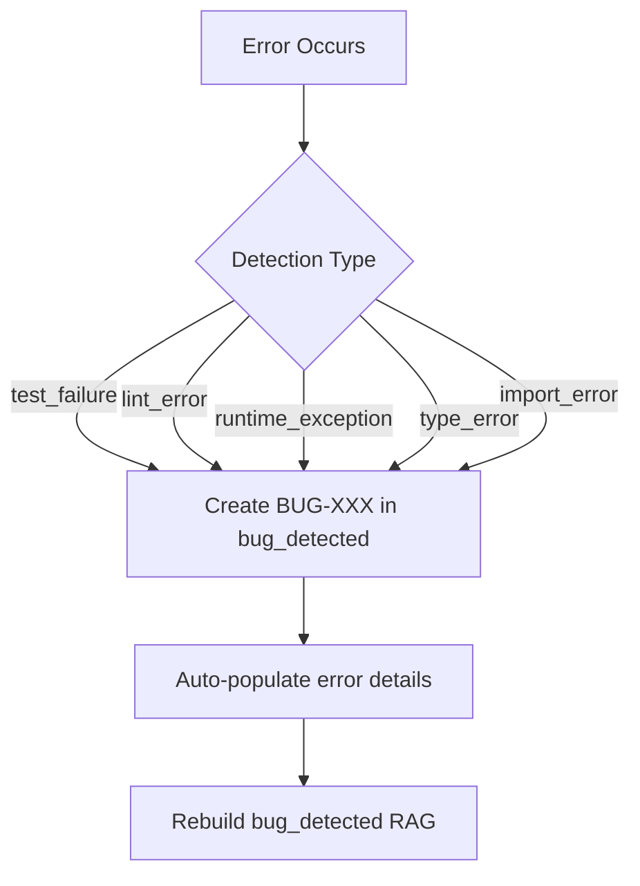

# Bug Detection and RAG Documentation Process

> **Navigation:** [STYLE_GUIDE.md](STYLE_GUIDE.md) - Documentation standards | [RAG/README.md](../RAG/README.md) - RAG system overview

This document defines the process for detecting bugs, documenting them in the RAG system, and ensuring continuous improvement of tools, agents, and plans.

---

## Definition of "Bug"

A **bug** is any issue that prevents the system from functioning correctly or producing expected outputs. Bugs include:

| Bug Type | Description | Detection Method |
|----------|-------------|------------------|
| **test_failure** | pytest test fails | Automated |
| **lint_error** | ruff/mypy error | Automated |
| **runtime_exception** | Unhandled exception | Automated |
| **type_error** | Type mismatch | Automated |
| **import_error** | Module not found | Automated |
| **prompt_quality_issue** | Prompt produces unclear, verbose, or incorrect outputs | Manual/Review |

### Prompt Quality as a Bug

A prompt is considered to have a **quality bug** when it:

1. **Produces incorrect outputs** - The response is factually wrong or misleading
2. **Fails format requirements** - Output doesn't match expected structure
3. **Is ambiguous** - Multiple interpretations lead to inconsistent results
4. **Lacks context** - Missing information causes poor responses
5. **Is verbose** - Unnecessary length reduces clarity and increases token cost
6. **Is unclear** - Users or agents struggle to understand the intent

---

## Bug Detection Process

### Automated Detection

The following triggers automatically create entries in `RAG/bug_detected/`:



### Manual Detection (Prompt Quality)

Prompt quality issues require manual review:

1. **Identify** - During testing, review, or usage
2. **Document** - Create bug file using template below
3. **Classify** - Tag with `prompt_quality_issue`
4. **Link** - Connect to affected tool/agent/plan

---

## Bug Documentation Template

When documenting a bug in `RAG/bug_detected/RAG/errors/`, use this template:

```markdown
# BUG-XXX: [Brief Title]

## Type
- [ ] test_failure
- [ ] lint_error
- [ ] runtime_exception
- [ ] type_error
- [ ] import_error
- [ ] prompt_quality_issue

## Severity
- [ ] Critical - System unusable
- [ ] High - Major functionality broken
- [ ] Medium - Feature partially working
- [ ] Low - Minor issue, workaround available

## Symptoms

What the user/agent observes.

## Root Cause

Why this happens.

## Affected Components

| Component | File/Location | Impact |
|-----------|---------------|--------|
| Tool | `path/to/file.py` | Description |
| Agent | `agent_name` | Description |
| Plan | `PLAN_NAME.md` | Description |

## Solution

Step-by-step fix.

## Prevention

How to avoid in the future.

## Related Errors

- ERR-XXX: Related error
- BUG-YYY: Similar bug

## Metadata

- **Detected**: YYYY-MM-DD
- **Resolved**: YYYY-MM-DD or "Open"
- **Detection Method**: Automated/Manual
```

---

## RAG Integration

### Directory Structure

```
RAG/
├── bug_detected/
│   ├── config.json              # Detection configuration
│   └── RAG/
│       ├── bug_detected-RAG/    # Generated RAG index
│       ├── README-RAG.md        # RAG documentation
│       ├── errors/              # Individual bug records
│       │   ├── BUG-001-*.md
│       │   └── BUG-002-*.md
│       └── solutions/           # Linked solutions
└── troubleshooting/
    ├── errors/                  # Known error types (ERR-XXX)
    ├── patterns/                # Diagnosis patterns
    └── workflows/               # Troubleshooting workflows
```

### Bug vs Error Distinction

| Type | Prefix | Location | Purpose |
|------|--------|----------|---------|
| **Error** | ERR-XXX | `RAG/troubleshooting/errors/` | Known error patterns with solutions |
| **Bug** | BUG-XXX | `RAG/bug_detected/RAG/errors/` | Specific instances of issues detected |

### Rebuilding RAG Index

After adding new bug documentation:

```bash
# Rebuild bug_detected RAG
opencode rag create bug_detected --source RAG/bug_detected/RAG/errors

# Or rebuild all RAGs
opencode rag rebuild --all
```

---

## Process Checklist

When a bug is detected:

- [ ] Identify bug type and severity
- [ ] Create bug file in `RAG/bug_detected/RAG/errors/`
- [ ] Fill in all template sections
- [ ] Link to affected components
- [ ] If prompt quality issue, include original and improved prompt
- [ ] Rebuild RAG index
- [ ] Update related documentation if needed

---

## Prompt Quality Bug Example

```markdown
# BUG-015: Ambiguous file search prompt

## Type
- [x] prompt_quality_issue

## Severity
- [ ] Critical
- [ ] High
- [x] Medium
- [ ] Low

## Symptoms

The prompt "Find the file" produces inconsistent results:
- Sometimes searches current directory only
- Sometimes searches recursively
- Returns different file types each time

## Root Cause

The prompt lacks:
1. Scope specification (current dir vs recursive)
2. File type filter
3. Search pattern

## Affected Components

| Component | File/Location | Impact |
|-----------|---------------|--------|
| Tool | `tools/search.py` | Inconsistent behavior |
| Agent | `code` | Wasted tokens |

## Solution

**Original Prompt:**
```
Find the file
```

**Improved Prompt:**
```
Search recursively from the current directory for Python files 
(*.py) containing the pattern "def main". Return the top 5 matches 
with file paths and line numbers.
```

## Prevention

Always include in search prompts:
- Scope (current/recursive)
- File type filter
- Search pattern
- Result limit
- Output format

## Metadata

- **Detected**: 2026-02-25
- **Resolved**: Open
- **Detection Method**: Manual review
```

---

## Related Documentation

- [RAG/README.md](../RAG/README.md) - RAG system overview
- [RAG/troubleshooting/](../RAG/troubleshooting/) - Error documentation
- [STYLE_GUIDE.md](STYLE_GUIDE.md) - Documentation standards

---

*Last updated: 2026-02-25*
