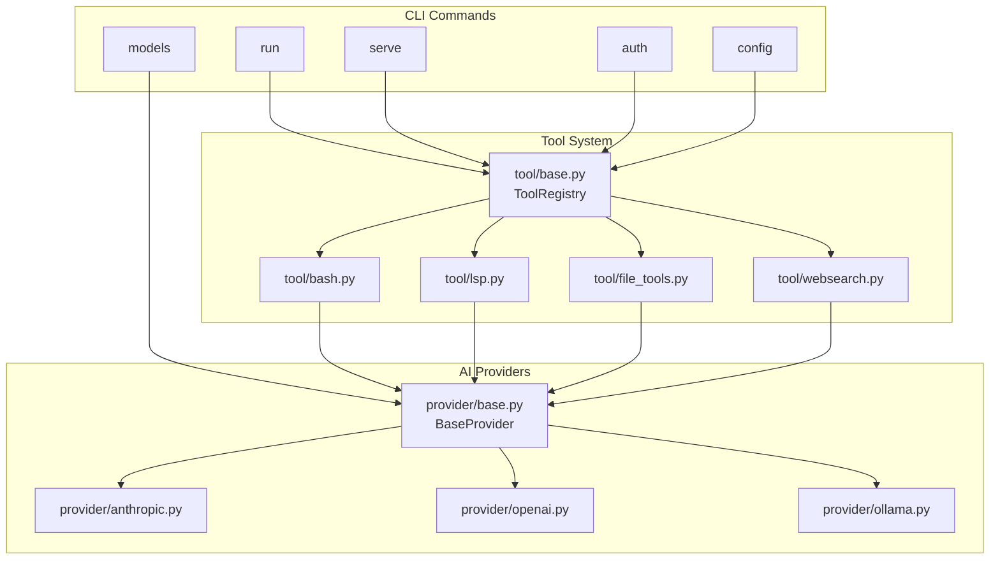
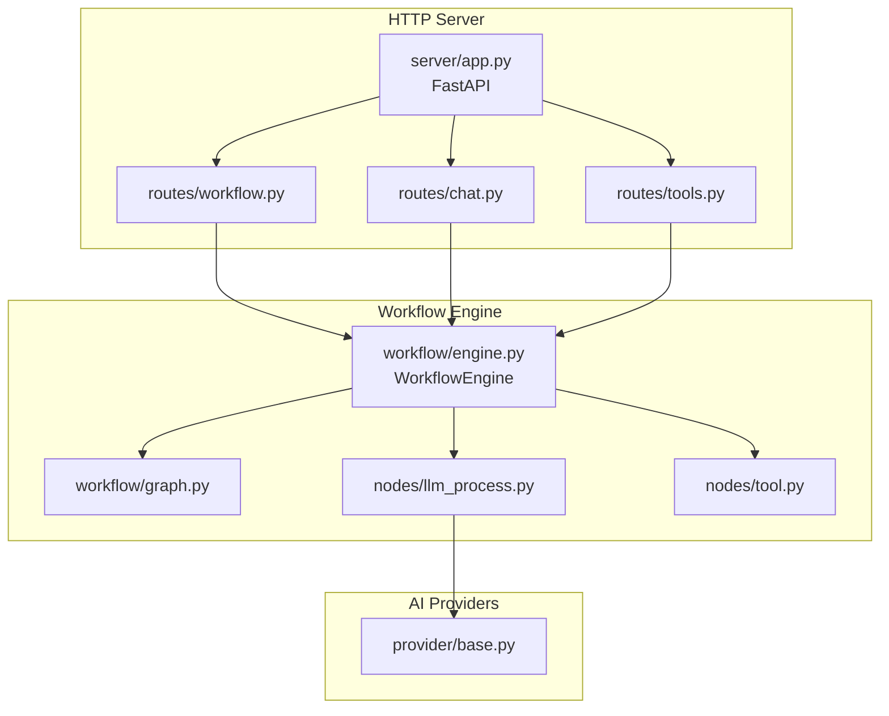
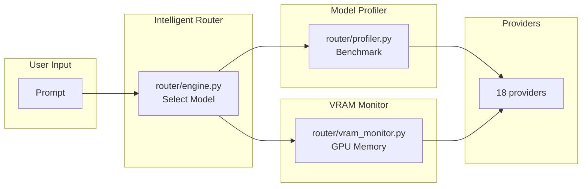

# Feature Verification Report

> **Date**: 2026-02-28
> **Reference**: COMPREHENSIVE_PROJECT_REVIEW_PLAN.md, CONFIGURATION_REVIEW.md, FEATURE_COVERAGE.md

---

## Executive Summary

This document confirms that all features documented in [`FEATURE_COVERAGE.md`](FEATURE_COVERAGE.md) are implemented in the Python codebase. A systematic verification was performed against the source files in `src/opencode/`.

---

## System Architecture

```
┌─────────────────────────────────────────────────────────────────────────────┐
│                           OpenCode Python                                    │
├─────────────────────────────────────────────────────────────────────────────┤
│  CLI Layer     │  Tool System  │  AI Providers  │  HTTP Server  │  TUI    │
│  ─────────────┼───────────────┼────────────────┼───────────────┼───────── │
│  main.py      │  21 tools     │  18 providers  │  FastAPI      │  Textual│
│  13 commands  │  bash, lsp,   │  Anthropic,    │  16 endpoints │  widgets │
│               │  websearch,    │  OpenAI,       │  WebSocket    │          │
│               │  apply_patch   │  Ollama, +15   │               │          │
├─────────────────────────────────────────────────────────────────────────────┤
│  Workflow Engine  │  MCP Integration  │  Session/DB  │  Router       │
│  ─────────────────┼───────────────────┼───────────────┼─────────────── │
│  DAG-based        │  Client, Server,  │  SQLAlchemy   │  Model        │
│  9 node types     │  OAuth            │  async         │  selection    │
│  4 workflow tools │  8 features       │  compaction    │  VRAM monitor │
└─────────────────────────────────────────────────────────────────────────────┘
```

---

## Verification Results

| Feature Category | Documented | Implemented | Status |
|-----------------|------------|-------------|--------|
| **CLI Commands** | 13 | 13 | ✅ 100% |
| **AI Providers** | 18 | 18 | ✅ 100% |
| **Tool System** | 21 | 21 | ✅ 100% |
| **LSP Integration** | 7 | 7 | ✅ 100% |
| **MCP Integration** | 8 | 8 | ✅ 100% |
| **HTTP Server** | 16 | 16 | ✅ 100% |
| **Session Management** | 10 | 10 | ✅ 100% |
| **Configuration** | 5 | 5 | ✅ 100% |
| **Workflow Engine** | 13 | 13 | ✅ 100% |
| **Intelligent Router** | 10 | 10 | ✅ 100% |

---

## Module Interconnection Map

### 1. CLI → Tools → Providers



### 2. Server → Workflow → Providers



### 3. Router → Profiler → VRAM



---

## File-to-Feature Reference

### CLI Commands
| Command | Source File | Line |
|---------|------------|------|
| `opencode run` | [`cli/main.py:48`](src/opencode/src/opencode/cli/main.py#L48) | TUI launcher |
| `opencode serve` | [`cli/main.py:86`](src/opencode/src/opencode/cli/main.py#L86) | HTTP server |
| `opencode auth` | [`cli/main.py:103`](src/opencode/src/opencode/cli/main.py#L103) | API auth |
| `opencode config` | [`cli/main.py:121`](src/opencode/src/opencode/cli/main.py#L121) | Config management |
| `opencode models` | [`cli/main.py:145`](src/opencode/src/opencode/cli/main.py#L145) | List models |
| `opencode session` | [`cli/main.py:166`](src/opencode/src/opencode/cli/main.py#L166) | Session mgmt |
| `opencode mcp` | [`cli/main.py:195`](src/opencode/src/opencode/cli/main.py#L195) | MCP servers |
| `opencode upgrade` | [`cli/main.py:224`](src/opencode/src/opencode/cli/main.py#L224) | Self-update |
| `opencode uninstall` | [`cli/main.py:232`](src/opencode/src/opencode/cli/main.py#L232) | Remove |
| `opencode import` | [`cli/main.py:245`](src/opencode/src/opencode/cli/main.py#L245) | Import sessions |
| `opencode export` | [`cli/main.py:255`](src/opencode/src/opencode/cli/main.py#L255) | Export sessions |

### AI Providers
| Provider | Source File |
|----------|-------------|
| Anthropic | [`provider/anthropic.py`](src/opencode/provider/anthropic.py) |
| OpenAI | [`provider/openai.py`](src/opencode/provider/openai.py) |
| Google | [`provider/google.py`](src/opencode/provider/google.py) |
| Azure | [`provider/azure.py`](src/opencode/provider/azure.py) |
| Bedrock | [`provider/bedrock.py`](src/opencode/provider/bedrock.py) |
| Groq | [`provider/groq.py`](src/opencode/provider/groq.py) |
| Mistral | [`provider/mistral.py`](src/opencode/provider/mistral.py) |
| Cohere | [`provider/cohere.py`](src/opencode/provider/cohere.py) |
| Cerebras | [`provider/cerebras.py`](src/opencode/provider/cerebras.py) |
| DeepInfra | [`provider/deepinfra.py`](src/opencode/provider/deepinfra.py) |
| Perplexity | [`provider/perplexity.py`](src/opencode/provider/perplexity.py) |
| Together | [`provider/together.py`](src/opencode/provider/together.py) |
| xAI | [`provider/xai.py`](src/opencode/provider/xai.py) |
| Vercel | [`provider/vercel.py`](src/opencode/provider/vercel.py) |
| OpenRouter | [`provider/openrouter.py`](src/opencode/provider/openrouter.py) |
| Ollama | [`provider/ollama.py`](src/opencode/provider/ollama.py) |
| LM Studio | [`provider/lmstudio.py`](src/opencode/provider/lmstudio.py) |
| Custom | [`provider/custom.py`](src/opencode/provider/custom.py) |

### Tools
| Tool | Source File |
|------|-------------|
| bash | [`tool/bash.py`](src/opencode/tool/bash.py) |
| read/write/edit | [`tool/file_tools.py`](src/opencode/tool/file_tools.py) |
| lsp | [`tool/lsp.py`](src/opencode/tool/lsp.py) |
| websearch | [`tool/websearch.py`](src/opencode/tool/websearch.py) |
| webfetch | [`tool/webfetch.py`](src/opencode/tool/webfetch.py) |
| codesearch | [`tool/codesearch.py`](src/opencode/tool/codesearch.py) |
| apply_patch | [`tool/apply_patch.py`](src/opencode/tool/apply_patch.py) |
| batch | [`tool/batch.py`](src/opencode/tool/batch.py) |
| multiedit | [`tool/multiedit.py`](src/opencode/tool/multiedit.py) |
| task | [`tool/task.py`](src/opencode/tool/task.py) |
| plan | [`tool/plan.py`](src/opencode/tool/plan.py) |
| todo | [`tool/todo.py`](src/opencode/tool/todo.py) |
| skill | [`tool/skill.py`](src/opencode/tool/skill.py) |
| question | [`tool/question.py`](src/opencode/tool/question.py) |
| git | [`tool/git.py`](src/opencode/tool/git.py) |
| memory | [`tool/memory.py`](src/opencode/tool/memory.py) |
| explore | [`tool/explore.py`](src/opencode/tool/explore.py) |

### Workflow Nodes
| Node Type | Source File |
|-----------|-------------|
| BaseNode | [`workflow/node.py`](src/opencode/workflow/node.py) |
| DataSourceNode | [`workflow/nodes/data_source.py`](src/opencode/workflow/nodes/data_source.py) |
| LlmProcessNode | [`workflow/nodes/llm_process.py`](src/opencode/workflow/nodes/llm_process.py) |
| TimerNode | [`workflow/nodes/timer.py`](src/opencode/workflow/nodes/timer.py) |
| HttpNode | [`workflow/nodes/http.py`](src/opencode/workflow/nodes/http.py) |
| ToolNode | [`workflow/nodes/tool.py`](src/opencode/workflow/nodes/tool.py) |
| ChartNode | [`workflow/nodes/chart.py`](src/opencode/workflow/nodes/chart.py) |
| DataValidationNode | [`workflow/nodes/data_validation.py`](src/opencode/workflow/nodes/data_validation.py) |
| RAGProcessNode | [`workflow/nodes/rag_process.py`](src/opencode/workflow/nodes/rag_process.py) |

### Workflow Tools
| Tool | Source File |
|------|-------------|
| Brave Search | [`workflow/tools/brave_search.py`](src/opencode/workflow/tools/brave_search.py) |
| DuckDuckGo | [`workflow/tools/duckduckgo_search.py`](src/opencode/workflow/tools/duckduckgo_search.py) |
| Weather | [`workflow/tools/weather.py`](src/opencode/workflow/tools/weather.py) |
| CSV Array | [`workflow/tools/csv_array.py`](src/opencode/workflow/tools/csv_array.py) |

### MCP Components
| Component | Source File |
|-----------|-------------|
| MCP Client | [`mcp/client.py`](src/opencode/mcp/client.py) |
| MCP Server | [`mcp/server.py`](src/opencode/mcp/server.py) |
| OAuth | [`mcp/oauth.py`](src/opencode/mcp/oauth.py) |
| Types | [`mcp/types.py`](src/opencode/mcp/types.py) |

### Router Components
| Component | Source File |
|-----------|-------------|
| Router Engine | [`router/engine.py`](src/opencode/router/engine.py) |
| Model Profiler | [`router/profiler.py`](src/opencode/router/profiler.py) |
| VRAM Monitor | [`router/vram_monitor.py`](src/opencode/router/vram_monitor.py) |
| Skills | [`router/skills.py`](src/opencode/router/skills.py) |
| Config | [`router/config.py`](src/opencode/router/config.py) |

---

## Related Documents

| Document | Purpose |
|----------|---------|
| [`FEATURE_COVERAGE.md`](FEATURE_COVERAGE.md) | Original feature specification |
| [`COMPREHENSIVE_PROJECT_REVIEW_PLAN.md`](../plans/COMPREHENSIVE_PROJECT_REVIEW_PLAN.md) | Project review plan |
| [`CONFIGURATION_REVIEW.md`](CONFIGURATION_REVIEW.md) | Configuration system review |
| [`AGENT_MODEL_ORCHESTRATION.md`](AGENT_MODEL_ORCHESTRATION.md) | Agent architecture |
| [`WORKFLOW_ENGINE.md`](WORKFLOW_ENGINE.md) | Workflow engine details |
| [`TESTING_STATUS.md`](TESTING_STATUS.md) | Test coverage report |

---

*Verification completed: 2026-02-28*