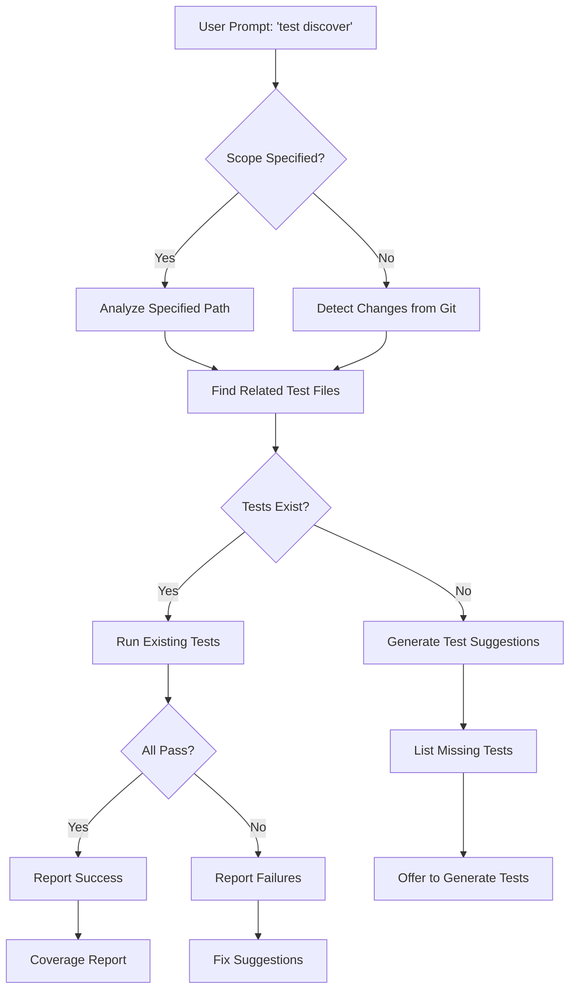

# Test Discovery for New Code & Features

> **Navigation:** [TESTING_PLAN.md](../plans/TESTING_PLAN.md) - Main testing strategy overview

This document describes the test discovery system that automatically finds and tests new code or added features. Users can initiate a full or specific test search with a simple prompt.

---

## Simple Prompt Interface

### CLI Commands

```bash
# Run all tests for new/modified code
opencode test discover

# Run tests for specific files or modules
opencode test discover --path src/opencode/core/session.py

# Run tests for recently added features
opencode test discover --recent

# Run tests with specific focus
opencode test discover --focus unit
opencode test discover --focus integration
opencode test discover --focus coverage
```

### TUI Integration

In the TUI, users can type:
- `/test discover` - Discover and run tests for new code
- `/test recent` - Test recently modified files
- `/test coverage` - Check coverage for new code

---

## Discovery Process



---

## Implementation

### Discovery Command

```python
# src/opencode/cli/commands/test_discover.py

"""
Test discovery commands for finding and running tests for new code.
"""

import typer
from rich.console import Console
from rich.table import Table
from pathlib import Path
import subprocess
import os

app = typer.Typer(name="test-discover", help="Test discovery commands")
console = Console()


@app.command("discover")
def discover_tests(
    path: str = typer.Option(None, "--path", "-p", help="Specific file or directory to test"),
    recent: bool = typer.Option(False, "--recent", "-r", help="Test recently modified files"),
    focus: str = typer.Option("all", "--focus", "-f", help="Test focus: unit, integration, coverage, all"),
    generate: bool = typer.Option(False, "--generate", "-g", help="Generate missing tests"),
):
    """
    Discover and run tests for new or modified code.
    
    Examples:
        opencode test discover                    # Auto-detect changes
        opencode test discover --path session.py  # Test specific file
        opencode test discover --recent           # Test recent changes
        opencode test discover --focus coverage   # Coverage focus
        opencode test discover --generate         # Generate missing tests
    """
    console.print("[cyan]🔍 Discovering tests...[/cyan]")
    
    # Determine scope
    if path:
        target_path = Path(path)
        test_files = _find_tests_for_path(target_path)
    elif recent:
        test_files = _find_tests_for_recent_changes()
    else:
        test_files = _find_tests_for_all_changes()
    
    if not test_files:
        console.print("[yellow]No test files found for the specified scope.[/yellow]")
        if generate:
            _offer_generate_tests(path or ".")
        return
    
    # Display discovered tests
    table = Table(title="Discovered Tests")
    table.add_column("Test File", style="cyan")
    table.add_column("Related Source", style="green")
    table.add_column("Status", style="yellow")
    
    for test_file, source_file in test_files:
        table.add_row(str(test_file), str(source_file), "Pending")
    
    console.print(table)
    
    # Run tests
    console.print(f"\n[cyan]Running {len(test_files)} test files...[/cyan]")
    _run_discovered_tests(test_files, focus)


@app.command("suggest")
def suggest_tests(
    path: str = typer.Argument(".", help="Path to analyze for missing tests"),
):
    """
    Suggest tests for code without test coverage.
    
    Analyzes the specified path and identifies functions, classes,
    and modules that lack test coverage.
    """
    console.print(f"[cyan]Analyzing {path} for missing tests...[/cyan]")
    
    missing = _analyze_missing_tests(Path(path))
    
    if not missing:
        console.print("[green]All code has test coverage! 🎉[/green]")
        return
    
    table = Table(title="Missing Test Coverage")
    table.add_column("Source", style="cyan")
    table.add_column("Type", style="yellow")
    table.add_column("Name", style="green")
    table.add_column("Suggested Test", style="magenta")
    
    for item in missing:
        table.add_row(
            str(item["source"]),
            item["type"],
            item["name"],
            item["suggested_test"]
        )
    
    console.print(table)
    console.print(f"\n[yellow]Found {len(missing)} items without test coverage[/yellow]")


@app.command("coverage")
def coverage_report(
    path: str = typer.Option(None, "--path", "-p", help="Specific path to check"),
    min_coverage: int = typer.Option(70, "--min", "-m", help="Minimum coverage threshold"),
):
    """
    Generate coverage report for new or modified code.
    
    Shows coverage specifically for files that have been added or
    modified, helping ensure new code meets coverage standards.
    """
    console.print("[cyan]Generating coverage report for new code...[/cyan]")
    
    # Run coverage
    cmd = ["python", "-m", "pytest", "--cov=src/opencode", "--cov-report=term-missing"]
    if path:
        cmd.extend(["--cov-fail-under", str(min_coverage)])
    
    result = subprocess.run(cmd, capture_output=True, text=True)
    console.print(result.stdout)
    
    if result.returncode != 0:
        console.print(f"[red]Coverage below {min_coverage}% threshold[/red]")
    else:
        console.print(f"[green]Coverage meets {min_coverage}% threshold ✅[/green]")


def _find_tests_for_path(path: Path) -> list[tuple[Path, Path]]:
    """Find test files related to a source file."""
    tests = []
    
    # Map source file to test file
    if path.is_file():
        test_name = f"test_{path.stem}.py"
        test_path = path.parent / "tests" / test_name
        if test_path.exists():
            tests.append((test_path, path))
    else:
        # Directory - find all tests
        for source_file in path.rglob("*.py"):
            if "test_" in source_file.name:
                continue
            test_name = f"test_{source_file.stem}.py"
            test_path = source_file.parent / "tests" / test_name
            if test_path.exists():
                tests.append((test_path, source_file))
    
    return tests


def _find_tests_for_recent_changes() -> list[tuple[Path, Path]]:
    """Find tests for recently modified files (last 7 days)."""
    import time
    from datetime import datetime, timedelta
    
    tests = []
    cutoff = datetime.now() - timedelta(days=7)
    
    for source_file in Path("src/opencode").rglob("*.py"):
        if "test_" in source_file.name:
            continue
        
        mtime = datetime.fromtimestamp(source_file.stat().st_mtime)
        if mtime > cutoff:
            test_name = f"test_{source_file.stem}.py"
            test_path = source_file.parent / "tests" / test_name
            if test_path.exists():
                tests.append((test_path, source_file))
    
    return tests


def _find_tests_for_all_changes() -> list[tuple[Path, Path]]:
    """Find tests for all git-tracked changes."""
    tests = []
    
    # Get changed files from git
    try:
        result = subprocess.run(
            ["git", "diff", "--name-only", "HEAD"],
            capture_output=True,
            text=True,
        )
        changed_files = result.stdout.strip().split("\n")
        
        for file_path in changed_files:
            if file_path.endswith(".py") and "test_" not in file_path:
                source_file = Path(file_path)
                test_name = f"test_{source_file.stem}.py"
                test_path = source_file.parent / "tests" / test_name
                if test_path.exists():
                    tests.append((test_path, source_file))
    except Exception:
        # Fall back to recent changes
        tests = _find_tests_for_recent_changes()
    
    return tests


def _run_discovered_tests(test_files: list[tuple[Path, Path]], focus: str):
    """Run the discovered test files."""
    for test_file, source_file in test_files:
        console.print(f"\n[cyan]Testing: {test_file}[/cyan]")
        
        cmd = ["python", "-m", "pytest", str(test_file), "-v"]
        
        if focus == "coverage":
            cmd.extend(["--cov", str(source_file.parent), "--cov-report=term-missing"])
        
        result = subprocess.run(cmd)
        
        if result.returncode == 0:
            console.print(f"[green]✅ {test_file} passed[/green]")
        else:
            console.print(f"[red]❌ {test_file} failed[/red]")


def _analyze_missing_tests(path: Path) -> list[dict]:
    """Analyze code for missing test coverage."""
    missing = []
    
    for source_file in path.rglob("*.py"):
        if "test_" in source_file.name or "__pycache__" in str(source_file):
            continue
        
        # Check for corresponding test file
        test_name = f"test_{source_file.stem}.py"
        test_path = source_file.parent / "tests" / test_name
        
        if not test_path.exists():
            missing.append({
                "source": source_file.relative_to(path),
                "type": "module",
                "name": source_file.stem,
                "suggested_test": str(test_path),
            })
    
    return missing


def _offer_generate_tests(path: str):
    """Offer to generate tests for uncovered code."""
    console.print("\n[yellow]Would you like to generate test scaffolds? [y/N][/yellow]")
    # This would integrate with the AI to generate test scaffolds
```

---

## Usage Examples

### Full Test Discovery

```bash
# Discover and run all tests for changed code
$ opencode test discover

🔍 Discovering tests...
┏━━━━━━━━━━━━━━━━━━━━━━━━━━┳━━━━━━━━━━━━━━━━━━━━━━━━┳━━━━━━━━━┓
│ Test File                │ Related Source         │ Status  │
┡━━━━━━━━━━━━━━━━━━━━━━━━━━╇━━━━━━━━━━━━━━━━━━━━━━━━╇━━━━━━━━━┩
│ test_session.py          │ session.py             │ Pending │
│ test_rag_manager.py      │ rag_manager.py         │ Pending │
└──────────────────────────┴────────────────────────┴─────────┘

Running 2 test files...
✅ test_session.py passed
✅ test_rag_manager.py passed
```

### Specific Path Testing

```bash
# Test a specific module
$ opencode test discover --path src/opencode/core/session.py

🔍 Analyzing session.py...
Found 1 test file: test_session.py

Running tests with coverage...
TOTAL coverage: 85%
✅ Coverage meets 70% threshold
```

### Recent Changes Testing

```bash
# Test files modified in the last 7 days
$ opencode test discover --recent

🔍 Finding recently modified files...
Found 3 files modified in the last 7 days:
  - core/session.py (2 days ago)
  - provider/base.py (5 days ago)
  - tui/app.py (1 day ago)

Running tests...
✅ All tests passed for recent changes
```

### Missing Test Suggestions

```bash
# Find code without tests
$ opencode test suggest src/opencode/core/

Analyzing src/opencode/core/ for missing tests...
┏━━━━━━━━━━━━━━━━━━┳━━━━━━━┳━━━━━━━━━━━━━━━━┳━━━━━━━━━━━━━━━━━━━━━━━━┓
│ Source           │ Type  │ Name           │ Suggested Test         │
┡━━━━━━━━━━━━━━━━━━╇━━━━━━━╇━━━━━━━━━━━━━━━━╇━━━━━━━━━━━━━━━━━━━━━━━━┩
│ context/new.py   │ module│ new            │ tests/test_new.py      │
│ utils/helper.py  │ module│ helper         │ tests/test_helper.py   │
└──────────────────┴───────┴────────────────┴────────────────────────┘

Found 2 items without test coverage
```

---

## Integration with Development Workflow

### Pre-Commit Hook

```yaml
# .pre-commit-config.yaml
repos:
  - repo: local
    hooks:
      - id: test-discover
        name: Test Discovery
        entry: opencode test discover --recent
        language: system
        pass_filenames: false
        stages: [commit]
```

### CI/CD Integration

```yaml
# .github/workflows/test-discovery.yml
name: Test Discovery

on:
  push:
    branches: [main, develop]
  pull_request:

jobs:
  discover:
    runs-on: ubuntu-latest
    steps:
      - uses: actions/checkout@v4
      
      - name: Set up Python
        uses: actions/setup-python@v5
        with:
          python-version: '3.12'
      
      - name: Install dependencies
        run: pip install -e .[dev]
      
      - name: Discover and run tests
        run: opencode test discover --coverage
      
      - name: Check coverage threshold
        run: opencode test coverage --min 70
```

---

## TUI Slash Commands

| Command | Description |
|---------|-------------|
| `/test discover` | Auto-discover and run tests for new code |
| `/test recent` | Test recently modified files |
| `/test path <file>` | Test specific file or directory |
| `/test coverage` | Show coverage for new code |
| `/test suggest` | Suggest missing tests |
| `/test generate` | Generate test scaffolds |

---

## Related Documentation

- [TESTING_INFRASTRUCTURE.md](TESTING_INFRASTRUCTURE.md) - Test directory structure and configuration
- [CI_CD_TESTING.md](CI_CD_TESTING.md) - CI/CD configuration
- [TEST_MAINTENANCE_GUIDE.md](TEST_MAINTENANCE_GUIDE.md) - Test maintenance guidelines
