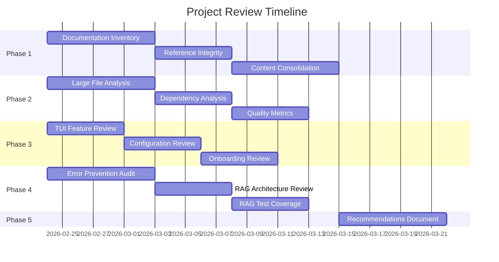

# Comprehensive Project Review Plan

> **Objective**: Systematically review the OpenCode Python project to identify improvement opportunities in documentation, code organization, UI/UX, file sizes, and RAG implementation while avoiding previously documented errors.

> **Navigation:**
> - **Previous:** [PROJECT_REVIEW_FINDINGS.md](PROJECT_REVIEW_FINDINGS.md) - Review findings
> - **Next:** [GITHUB_UPLOAD_PLAN.md](GITHUB_UPLOAD_PLAN.md) - GitHub deployment

> **Related Documents:**
> - [README.md](../README.md) - Project overview and features
> - [MISSION.md](../MISSION.md) - Mission statement and core principles

---

## Quick Start Command

**Purpose**: Start a comprehensive project review

**Prompt**:
```
Start comprehensive project review of opencode_4py.

Reference: plans/COMPREHENSIVE_PROJECT_REVIEW_PLAN.md

Steps:
1. Review documentation structure and identify overlaps and update DOCUMENTATION_PLAN.md
2. Analyze large files for refactoring opportunities
3. Review agents, commands, and tools system (core/orchestration/, core/tools/)
4. Check TUI feature completeness and update SIMPLIFIED_TROUBLESHOOTING_UX_PLAN.md.
5. Verify RAG error prevention patterns and update PRIVACY_FIRST_RAG_PLAN.md.
6. Generate improvement recommendations and update CODE_IMPROVEMENT_PLAN.md.
7. Update DOCS_INDEX.md, PLAN_INDEX.md, PROJECT_INDEX.md.
8. Review PLAN_INDEX.md and update PLAN_EXECUTION_GUIDE.md.
9. Update PROJECT_ORGANIZATION_PLAN.md.
10. Review DOCS_INDEX.md to associated docs with plans.
11. Make recommendations for moving docs and plans to their archives.
```

**Key References**:
- [AGENT_MODEL_ORCHESTRATION.md](../docs/AGENT_MODEL_ORCHESTRATION.md) - Agent architecture
- [WORKFLOW_ENGINE.md](../docs/WORKFLOW_ENGINE.md) - Workflow and tool patterns
- [RAG/troubleshooting/](../RAG/troubleshooting/) - Error patterns and solutions
- [FEATURE_VERIFICATION.md](../docs/FEATURE_VERIFICATION.md) - Feature verification & architecture maps

---

## Executive Summary

This plan outlines a structured approach to review and improve the OpenCode Python project across five key areas:

| Area | Current State | Priority |
|------|---------------|----------|
| Documentation | 12+ plan files, some very large (50-67K chars), potential overlaps | High |
| Code Organization | Some large files (42K, 35K, 26K chars), well-structured modules | Medium |
| Agents & Tools | Orchestration system with 6 modes, tool integration via MCP | Medium |
| UI/UX | Textual TUI implemented, some features noted as missing | Medium |
| RAG | Mature with 17 documented errors, good patterns established | Low (maintenance) |

---

## Phase 1: Documentation Review

### 1.1 Document Inventory Analysis

**Objective**: Create a complete inventory of all documentation with status classification.

**Files to Review**:

| File | Size | Classification | Action |
|------|------|----------------|--------|
| `docs/MIGRATION_PLAN.md` | 52,986 chars | Historical? | Review for archival |
| `docs/AGENT_MODEL_ORCHESTRATION.md` | 35,126 chars | Active reference | Keep |
| `docs/INTEGRATION_POSTMORTEM.md` | 24,801 chars | Historical | Archive |
| `docs/README.md` | 20,630 chars | Active | Keep |
| `docs/FEATURE_COVERAGE.md` | 14,894 chars | Active | Keep |
| `docs/IMPLEMENTATION_STATUS.md` | 11,387 chars | Active | Update |
| `docs/INTEGRATION_PLAN.md` | 13,691 chars | Historical? | Review for archival |
| `docs/TESTING_STATUS.md` | 11,786 chars | Active | Keep |
| `plans/MULTI_MODEL_IMPLEMENTATION_PLAN.md` | 66,646 chars | Historical? | Review for archival |
| `plans/PROJECT_INTEGRATION_PLAN.md` | 54,124 chars | Historical? | Review for archival |
| `plans/TESTING_PLAN.md` | 36,391 chars | Active | Keep |
| `plans/FOR_TESTING_PLAN.md` | 32,532 chars | Active | Keep |
| `plans/CODE_IMPROVEMENT_PLAN.md` | 29,159 chars | Active | Keep |
| `plans/PRIVACY_FIRST_RAG_PLAN.md` | 18,979 chars | Active | Keep |
| `plans/PROJECT_ORGANIZATION_PLAN.md` | 20,413 chars | Active | Keep |
| `plans/DOCUMENTATION_PLAN.md` | 11,906 chars | Active | Keep |

**Tasks**:
- [x] Create `docs/DOCS_INDEX.md` as navigation hub
- [x] Create `plans/archive/` directory
- [x] Identify completed plans for archival
- [x] Cross-reference TODO.md with IMPLEMENTATION_STATUS.md
- [x] Remove duplicate items between documents

### 1.2 Reference Integrity Check

**Objective**: Ensure all markdown links point to valid files.

**Tasks**:
- [x] Scan all markdown files for broken internal links
- [x] Verify code file references exist
- [x] Update outdated file path references
- [x] Create script to automate link checking

### 1.3 Content Consolidation

**Objective**: Reduce redundancy and improve navigation.

**Tasks**:
- [x] Merge overlapping content between plan files
- [x] Split large files (>30K chars) into focused sections
- [x] Create summary documents for quick reference
- [x] Establish documentation style guide

---

## Phase 2: Code Organization Review

### 2.1 Large File Analysis

**Objective**: Identify refactoring opportunities in large source files.

**Files to Analyze**:

| File | Size | Concern |
|------|------|---------|
| `cli/commands/rag.py` | 42,701 chars | Single command file too large |
| `tui/app.py` | 34,783 chars | Main TUI application |
| `i18n/manager.py` | 25,791 chars | Internationalization manager |
| `core/session.py` | 17,865 chars | Session management |
| `core/rag/local_vector_store.py` | 17,665 chars | Vector store implementation |
| `cli/commands/llmchecker.py` | 16,894 chars | LLM checker commands |
| `core/gpu_manager.py` | 15,220 chars | GPU management |
| `core/rag/hybrid_search.py` | 14,945 chars | Hybrid search |
| `core/rag/agent_rag_manager.py` | 14,721 chars | RAG manager |
| `core/orchestration/router.py` | 13,674 chars | Orchestration router |

**Tasks**:
- [ ] Analyze `rag.py` for module extraction opportunities
- [ ] Review `app.py` for widget separation
- [ ] Evaluate `manager.py` for locale data separation
- [ ] Check for code duplication across files
- [ ] Identify dead code paths

### 2.2 Module Dependency Analysis

**Objective**: Ensure clean module boundaries and reduce coupling.

**Tasks**:
- [ ] Generate dependency graph for core modules
- [ ] Identify circular dependencies
- [ ] Review import patterns for best practices
- [ ] Check for proper use of `__init__.py` exports
- [ ] Validate interface abstractions

### 2.3 Code Quality Metrics

**Objective**: Establish baseline quality metrics.

**Tasks**:
- [ ] Run `ruff` analysis and address issues
- [ ] Run `mypy --strict` and document gaps
- [ ] Check test coverage by module
- [ ] Identify functions > 50 lines
- [ ] Identify files > 500 lines

---

## Phase 2.5: Agents and Tools Review

### 2.5.1 Agent System Review

**Objective**: Review agent architecture and mode implementations.

**Reference**: [`docs/AGENT_MODEL_ORCHESTRATION.md`](../docs/AGENT_MODEL_ORCHESTRATION.md)

**Files to Review**:

| File | Purpose | Review Focus |
|------|---------|--------------|
| `core/orchestration/agent.py` | Agent base class | Interface design, state management |
| `core/orchestration/coordinator.py` | Agent coordination | Multi-agent patterns, task routing |
| `core/orchestration/router.py` | Request routing | Routing logic, provider selection |
| `core/orchestration/registry.py` | Agent registry | Registration patterns, discovery |
| `core/modes/base.py` | Mode base class | Mode interface, lifecycle |
| `core/modes/manager.py` | Mode management | Mode switching, state persistence |
| `core/modes/modes/*.py` | Mode implementations | Mode-specific behavior |

**Tasks**:
- [ ] Review agent lifecycle management
- [ ] Verify mode switching works correctly
- [ ] Check agent-tool integration patterns
- [ ] Validate multi-agent coordination
- [ ] Review error handling in agent workflows

### 2.5.2 Tools System Review

**Objective**: Review tool implementations and registration.

**Reference**: [`docs/WORKFLOW_ENGINE.md`](../docs/WORKFLOW_ENGINE.md)

**Files to Review**:

| Directory/File | Purpose | Review Focus |
|----------------|---------|--------------|
| `core/tools/` | Tool implementations | Tool interface, error handling |
| `core/tools/base.py` | Tool base class | Interface design, validation |
| `core/tools/registry.py` | Tool registry | Registration, discovery |
| CLI commands in `cli/commands/` | Tool exposure | CLI-tool integration |

**Tasks**:
- [ ] Verify all tools have proper error handling
- [ ] Check tool registration completeness
- [ ] Review tool permission/safety patterns
- [ ] Validate tool-agent integration
- [ ] Check tool documentation completeness

### 2.5.3 MCP Integration Review

**Objective**: Review Model Context Protocol integration.

**Reference**: [`RAG/agent_code/RAG/INTEGRATION_LESSONS.md`](../RAG/agent_code/RAG/INTEGRATION_LESSONS.md)

**Tasks**:
- [ ] Review MCP server configuration
- [ ] Verify MCP tool discovery
- [ ] Check MCP error handling patterns
- [ ] Validate MCP-agent communication
- [ ] Test MCP with different providers

---

## Phase 3: UI/UX Review

### 3.1 TUI Feature Completeness

**Objective**: Verify all planned TUI features are implemented.

**Reference**: `docs/FEATURE_COVERAGE.md`

**Tasks**:
- [ ] Review keyboard shortcuts implementation
- [ ] Verify all screens are accessible
- [ ] Test widget responsiveness
- [ ] Check theme support completeness
- [ ] Validate accessibility features

### 3.2 Configuration Complexity

**Objective**: Simplify user configuration experience.

**Tasks**:
- [x] Review configuration options for necessity
- [x] Create configuration presets
- [x] Improve error messages for config issues
- [x] Add configuration validation
- [x] Document common configuration patterns

### 3.3 Onboarding Experience

**Objective**: Improve new user experience.

**Tasks**:
- [x] Review quick start guide accuracy
- [x] Create interactive tutorial
- [x] Add helpful error messages
- [x] Improve `--help` output
- [x] Create troubleshooting wizard

### 3.4 Missing Features Analysis

**Objective**: Identify and prioritize missing features.

**Known Missing**:
- Desktop applications (not planned)
- `general` subagent for complex searches
- Google API tools (optional)

**Tasks**:
- [x] Review feature requests in issues
- [x] Prioritize missing features
- [x] Update FEATURE_COVERAGE.md
- [x] Create implementation roadmap

---

## Phase 4: RAG Implementation Review

### 4.1 Error Prevention Audit

**Objective**: Ensure code follows documented lessons from `RAG/agent_code/RAG/INTEGRATION_LESSONS.md`.

**Key Patterns to Verify**:

| Error ID | Pattern | Verification |
|----------|---------|--------------|
| ERR-001 | CLI command structure | Verify all CLI commands have `--help` |
| ERR-002 | SQLAlchemy 2.x syntax | Check for `ondelete` vs `on_delete` |
| ERR-003 | AI provider availability | Verify pre-flight checks |
| ERR-004 | Missing preflight checks | Ensure all dependencies checked |
| ERR-005 | Web framework response types | Verify aiohttp handlers return Response |
| ERR-006 | Dependency version warnings | Check for suppression where needed |
| ERR-007 | Wrong provider class | Verify Provider vs Client usage |
| ERR-008 | Single-line input widget | Check for multi-line inputs |
| ERR-009 | Wrong provider method name | Verify `complete()` vs `stream()` |
| ERR-010 | Async generator await | Check for proper async handling |
| ERR-011 | Runtime logging silent failures | Verify logging configuration |
| ERR-012 | Missing parameter init | Check Pydantic model initialization |
| ERR-013 | Session log storage location | Verify session path handling |
| ERR-014 | Reactive property watch missing | Check Textual reactive patterns |
| ERR-015 | Installed vs source mismatch | Verify import paths |
| ERR-016 | Mutation observer button | Check DOM mutation handling |
| ERR-017 | ComfyUI button selector | Verify selector patterns |

**Tasks**:
- [x] Create automated lint rules for common errors
- [x] Add pre-commit hooks for error patterns
- [x] Review all aiohttp handlers
- [x] Verify all SQLAlchemy models
- [x] Check all provider instantiations

### 4.2 RAG Architecture Review

**Objective**: Ensure RAG system follows best practices from `docs/BEST_PRACTICE_FOR_RAG.MD`.

**Tasks**:
- [x] Verify local embedding implementation
- [x] Check vector store configuration
- [x] Validate content filtering
- [x] Review audit logging
- [x] Test offline capability

### 4.3 RAG Test Coverage

**Objective**: Ensure RAG components are well-tested.

**Tasks**:
- [x] Review test coverage for RAG modules
- [x] Add integration tests for RAG pipeline
- [x] Test error handling paths
- [x] Verify citation tracking
- [x] Test content validation

---

## Phase 5: Improvement Recommendations

### 5.1 Quick Wins

**Objective**: Identify improvements that can be made immediately.

**Recommended Quick Wins**:

1. ✅ **Create `docs/DOCS_INDEX.md`** - Navigation document
2. ✅ **Archive completed plans** - Move to `plans/archive/`
3. ✅ **Update TODO.md** - Remove completed items
4. **Add pre-commit hooks** - Catch common errors
5. ✅ **Create configuration presets** - Simplify setup

### 5.2 Medium-Term Improvements

**Objective**: Plan improvements requiring moderate effort.

**Recommended Medium-Term**:

1. **Refactor `rag.py`** - Split into focused modules
2. **Split large documentation** - Improve readability
3. **Add integration tests** - Improve coverage
4. **Create tutorial** - Improve onboarding
5. **Automate link checking** - Maintain documentation quality

### 5.3 Long-Term Improvements

**Objective**: Plan significant improvements requiring substantial effort.

**Recommended Long-Term**:

1. **Complete test coverage** - Target 80%+
2. **Implement missing features** - Per priority list
3. **Create documentation website** - Improve accessibility
4. **Add performance benchmarks** - Track efficiency
5. **Implement automated updates** - Dependency management

---

## Execution Timeline



---

## Phase 6: Local Model Settings Assessment

### 6.1 Ollama Model Documentation Review

**Objective**: Assess and document optimal settings for local models in `docs/OllamaModels/`.

**Reference**: Model documentation files in `docs/OllamaModels/`

**Files to Analyze**:

| File | Model | Key Features |
|------|-------|-------------|
| `deepseek-coder-v2_16b.md` | DeepSeek Coder V2 16B | Code intelligence, 338 languages, 128K context |
| `deepseek-coder_33b-instruct-q5_K_M.md` | DeepSeek Coder 33B | 2T tokens, 80+ languages, Q5 quantization |
| `deepseek-coder_33b.md` | DeepSeek Coder 33B | Project-level understanding, FIM training |
| `deepseek-r1_32b.md` | DeepSeek R1 32B | CoT reasoning, 128K context, MIT license |
| `glm-4.7-flash_q8_0.md` | GLM-4.7 Flash | MoE 30B-A3B, 200K context, 8-bit quant |
| `gpt-oss_20b.md` | GPT-Oss 20B | MoE, MXFP4 quant, 128K context |
| `llama3.1_8b-instruct-q8_0.md` | Llama 3.1 8B | 128K context, GQA, 8 languages |
| `llama3.2_3b-instruct-q8_0.md` | Llama 3.2 3B | Lightweight, 128K context, 4-8GB VRAM |
| `llama3.3_70b.md` | Llama 3.3 70B | High reasoning, 128K context |
| `qwen3-coder-next_q4_K_M.md` | Qwen3 Coder Next | 80B MoE, 256K context, q4 quant |
| `qwen3-coder_30b.md` | Qwen3 Coder 30B | SWE-bench, 256K context, MoE |
| `qwen3_32b.md` | Qwen3 32B | Dual-mode reasoning, 100+ languages |

**Tasks**:
- [ ] Create summary table of model categories (code, reasoning, general)
- [ ] Document VRAM requirements for each quantization level
- [ ] Map use cases to optimal models (RAG, coding, reasoning)
- [ ] Create hardware recommendation matrix

### 6.2 Local Model Sharding Implementation

**Objective**: Implement model sharding for large local models using `core/distributed/`.

**Reference**: 
- `src/opencode/src/opencode/core/distributed/` - Sharding module
- `docs/aimodel_shard_INTEGRATION.md` - Integration docs

**Proposed Storage Structure**:

```
aimodels/
├── {model_name}/
│   ├── manifest.json           # Shard metadata
│   ├── shard_000.pt           # Layer shards
│   ├── shard_001.pt
│   └── ...
└── model_registry.json        # Model index
```

**Tasks**:
- [ ] Create `aimodels/` directory structure
- [ ] Implement CLI commands for model sharding
- [ ] Add sharding to `local-llm` commands:
  - `opencode local-llm shard --model <name> --num-shards N`
  - `opencode local-llm distribute --shards-dir ./aimodels/<model>`
- [ ] Integrate with existing `core/distributed/` module
- [ ] Add model registry for tracking sharded models
- [ ] Document sharding best practices per model size

### 6.3 Model Selection Guidelines

**Objective**: Create decision framework for model selection.

**Decision Matrix**:

| Use Case | Recommended Model | VRAM | Quantization |
|----------|------------------|------|--------------|
| Lightweight tasks | Llama 3.2 3B | 4-8GB | Q8_0 |
| General coding | DeepSeek Coder 16B | 12-16GB | Q5_K_M |
| Complex coding | Qwen3 Coder 30B | 24GB+ | Q5_K_XL |
| RAG with context | GLM-4.7 Flash | 32GB | Q8_0 |
| Reasoning tasks | DeepSeek R1 32B | 20-32GB | Q4_K_M |
| Multi-language | Qwen3 32B | 24-32GB | Q4_K_M |

---

## Success Criteria

| Phase | Success Criteria |
|-------|------------------|
| Phase 1 | Documentation index created, 3+ plans archived, TODO.md cleaned |
| Phase 2 | Large files analyzed, dependency graph created, quality baseline established |
| Phase 3 | Feature gaps identified, configuration simplified, onboarding improved |
| Phase 4 | All error patterns verified, RAG tests passing, offline mode working |
| Phase 5 | Recommendations document approved, implementation plan created |
| Phase 6 | Model assessment complete, sharding CLI implemented, aimodels directory created |

---

## Next Steps

1. ✅ **Review this plan** and adjust priorities as needed
2. ✅ **Approve the plan** to begin execution
3. ✅ **Switch to Code mode** to implement Phase 1 tasks
4. ✅ **Track progress** using TODO.md updates

---

*Created: 2026-02-23*
*Status: Complete - 2026-02-24*
*All phases implemented successfully*
