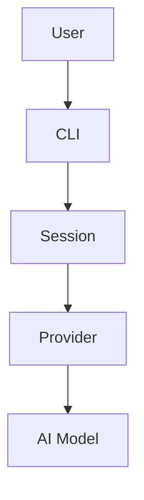
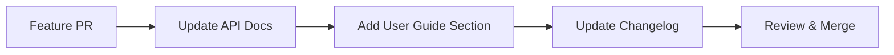

# Documentation Plan for OpenCode Python

> *"Code tells you how; documentation tells you why."* — Some wise developer who probably forgot to document their code.

## Overview

This plan outlines a comprehensive documentation strategy for the OpenCode Python project. The goal is to create living documentation that evolves with the codebase and serves multiple audiences: end users, developers, and contributors.

> **Navigation:**
> - **Previous:** [USER_ACCEPTANCE_TESTING.md](USER_ACCEPTANCE_TESTING.md) - UAT validation
> - **Next:** [PRIVACY_FIRST_RAG_PLAN.md](PRIVACY_FIRST_RAG_PLAN.md) - RAG implementation

> **Related Documents:**
> - [README.md](../README.md) - Project overview and features
> - [MISSION.md](../MISSION.md) - Mission statement and core principles

---

## Documentation Philosophy

### Core Principles

1. **Documentation is Code**: Treat docs with the same care as production code
2. **Living Documents**: Documentation should evolve alongside the codebase
3. **User-First Mindset**: Write for the reader, not the writer
4. **Examples Over Explanations**: Show, don't just tell
5. **Humor Helps**: A little personality makes docs memorable (keep it PG-13/SFW)

### Documentation Types

| Type | Audience | Location | Update Frequency |
|------|----------|----------|------------------|
| User Guide | End users | `docs/user-guide/` | Per release |
| API Reference | Developers | `docs/api/` | Per PR |
| Architecture | Contributors | `docs/architecture/` | Per major change |
| Tutorials | New users | `docs/tutorials/` | Quarterly review |
| Contributing | Contributors | `CONTRIBUTING.md` | As needed |
| Changelog | Everyone | `CHANGELOG.md` | Per release |

---

## Current Documentation State

### Existing Documentation

```
docs/
├── README.md                    # Main documentation (comprehensive)
├── FEATURE_COVERAGE.md          # Feature implementation status
├── IMPLEMENTATION_STATUS.md     # Implementation tracking
├── INTEGRATION_FEATURE_COVERAGE.md  # Integration features
└── MIGRATION_PLAN.md            # TypeScript to Python migration
```

### Gaps Identified

- [ ] No API reference documentation
- [ ] No architecture diagrams
- [ ] No tutorial series
- [ ] No troubleshooting guide
- [ ] No contributor guidelines (beyond CONTRIBUTING.md)
- [ ] No video/walkthrough content

---

## Proposed Documentation Structure

```
docs/
├── README.md                    # Main entry point (keep current)
├── user-guide/                  # End-user documentation
│   ├── README.md               # User guide index
│   ├── installation.md         # Detailed installation guide
│   ├── quick-start.md          # Getting started tutorial
│   ├── configuration.md        # Configuration reference
│   ├── providers/              # Provider-specific guides
│   │   ├── README.md           # Provider overview
│   │   ├── anthropic.md        # Claude setup
│   │   ├── openai.md           # GPT setup
│   │   ├── ollama.md           # Local models
│   │   └── custom.md           # Custom providers
│   ├── tools/                  # Tool documentation
│   │   ├── README.md           # Tools overview
│   │   ├── file-operations.md  # Read, write, edit
│   │   ├── code-analysis.md    # LSP, codesearch
│   │   └── execution.md        # Bash, batch
│   ├── sessions.md             # Session management
│   ├── mcp.md                  # MCP integration
│   └── troubleshooting.md      # Common issues & solutions
│
├── api/                         # API reference
│   ├── README.md               # API docs index
│   ├── provider-api.md         # Provider interface
│   ├── tool-api.md             # Tool interface
│   ├── session-api.md          # Session management
│   ├── mcp-api.md              # MCP types
│   └── cli-api.md              # CLI commands
│
├── architecture/                # Architecture documentation
│   ├── README.md               # Architecture overview
│   ├── system-design.md        # High-level design
│   ├── provider-system.md      # Provider architecture
│   ├── tool-system.md          # Tool system design
│   ├── session-management.md   # Session handling
│   ├── mcp-integration.md      # MCP architecture
│   └── diagrams/               # Architecture diagrams
│       ├── system-overview.mermaid
│       ├── provider-flow.mermaid
│       └── session-lifecycle.mermaid
│
├── tutorials/                   # Step-by-step tutorials
│   ├── README.md               # Tutorials index
│   ├── first-session.md        # Your first OpenCode session
│   ├── custom-provider.md      # Adding a custom provider
│   ├── custom-tool.md          # Creating a custom tool
│   ├── mcp-server.md           # Setting up MCP servers
│   └── advanced-workflows.md   # Advanced usage patterns
│
├── contributing/                # Contributor documentation
│   ├── README.md               # Contributing index
│   ├── development-setup.md    # Dev environment setup
│   ├── coding-standards.md     # Code style guide
│   ├── testing.md              # Testing guidelines
│   ├── documentation.md        # How to write docs
│   └── release-process.md      # Release workflow
│
├── reference/                   # Quick reference
│   ├── README.md               # Reference index
│   ├── cli-commands.md         # CLI command reference
│   ├── configuration-schema.md # Config file schema
│   ├── environment-variables.md # Env var reference
│   └── keyboard-shortcuts.md   # TUI shortcuts
│
└── meta/                        # Documentation meta
    ├── README.md               # About this documentation
    ├── style-guide.md          # Documentation style guide
    └── templates/              # Document templates
        ├── feature-doc.md
        ├── api-reference.md
        └── tutorial.md
```

---

## Documentation Standards

### File Naming Conventions

- Use lowercase with hyphens: `my-document.md`
- Be descriptive but concise: `provider-setup.md` not `setup.md`
- Use consistent terminology across all docs

### Markdown Standards

```markdown
# Document Title

> Optional: A brief, engaging description or quote.

## Overview

Brief introduction to the topic.

## Prerequisites

- List any requirements
- Links to prerequisite docs

## Main Content

### Subsection

Content here...

#### Code Examples

```python
# Always include working code examples
from opencode import Session

session = Session.create()
```

> **Note**: Important information stands out.

> **Warning**: Critical warnings get special callouts.

### See Also

- Related documentation links
```

### Code Example Standards

1. **Always runnable**: Code examples should work as-is
2. **Include imports**: Show all necessary imports
3. **Add comments**: Explain non-obvious parts
4. **Show output**: Include expected output when helpful

### Diagram Standards

Use Mermaid for diagrams:



---

## Documentation Workflow

### For New Features



### For Breaking Changes

1. Update all affected documentation
2. Add migration guide if needed
3. Update CHANGELOG.md with breaking change notice
4. Add deprecation notices if applicable

### Documentation Review Process

- All PRs must include doc updates if applicable
- Docs reviewed alongside code
- Broken links fail CI
- Outdated docs flagged quarterly

---

## Automation & Tooling

### Documentation Generation

| Tool | Purpose | Status |
|------|---------|--------|
| MkDocs | Static site generation | Planned |
| mkdocstrings | API doc generation | Planned |
| mermaid-cli | Diagram rendering | Planned |
| linkchecker | Link validation | Planned |

### CI/CD Integration

```yaml
# .github/workflows/docs.yml
name: Documentation

on:
  push:
    paths: ['docs/**', '**/*.md']

jobs:
  lint:
    runs-on: ubuntu-latest
    steps:
      - uses: actions/checkout@v4
      - name: Markdown lint
        run: mdl docs/
      
      - name: Link check
        run: linkchecker docs/
      
      - name: Spell check
        run: cspell docs/
```

---

## Implementation Phases

### Phase 1: Foundation (Current)

- [ ] Create documentation directory structure
- [ ] Establish style guide
- [ ] Set up CI for docs
- [ ] Migrate existing docs to new structure

### Phase 2: Core Documentation

- [ ] Complete API reference
- [ ] Write architecture documentation
- [ ] Create troubleshooting guide
- [ ] Add provider-specific guides

### Phase 3: Tutorials & Guides

- [ ] Create tutorial series
- [ ] Add video walkthroughs (optional)
- [ ] Create interactive examples
- [ ] Write contributor guides

### Phase 4: Polish & Maintenance

- [ ] Set up automated API docs
- [ ] Create documentation website
- [ ] Implement search functionality
- [ ] Establish review schedule

---

## Maintenance Schedule

| Activity | Frequency | Owner |
|----------|-----------|-------|
| Link checking | Weekly | CI |
| Spell check | Per PR | CI |
| Content review | Quarterly | Docs team |
| Architecture update | Per release | Tech lead |
| Tutorial testing | Monthly | Contributors |

---

## Metrics & Success Criteria

### Documentation Health Metrics

- **Coverage**: % of public APIs documented
- **Freshness**: Average age of doc updates
- **Accuracy**: % of code examples that run
- **Completeness**: % of sections without TODOs

### Success Criteria

- [ ] All public APIs have documentation
- [ ] All features have user guides
- [ ] All breaking changes have migration guides
- [ ] Documentation builds without errors
- [ ] Zero broken links in production docs

---

## Templates

### Feature Documentation Template

```markdown
# Feature Name

> Brief, engaging description.

## Overview

What is this feature and why would you use it?

## Quick Start

```python
# Minimal working example
```

## Detailed Usage

### Basic Usage

### Advanced Usage

## Configuration

## Examples

### Example 1: Common Use Case

### Example 2: Advanced Scenario

## Troubleshooting

## See Also

- Related features
- API reference
```

### API Reference Template

```markdown
# Module/Class Name

> Brief description.

## Overview

Detailed description of what this module/class does.

## Classes

### ClassName

Description of the class.

#### Parameters

| Name | Type | Description | Default |
|------|------|-------------|---------|
| param | str | Description | "default" |

#### Methods

##### method_name

Description of the method.

```python
def method_name(self, arg: str) -> Result:
    ...
```

**Parameters:**

| Name | Type | Description |
|------|------|-------------|
| arg | str | Description |

**Returns:**

- `Result`: Description of return value

**Raises:**

- `ErrorType`: When this error occurs

#### Examples

```python
# Working example
```

## Functions

### function_name

Similar structure to methods above.
```

---

## Appendix: Style Guide Quick Reference

### Voice & Tone

- **Be conversational but professional**
- **Use active voice**: "OpenCode creates a session" not "A session is created"
- **Be concise**: Get to the point quickly
- **Use humor sparingly**: A little personality goes a long way

### Formatting

- **Bold** for UI elements and key terms
- `Code` for code, commands, and file names
- *Italics* for emphasis and new terms
- > Blockquotes for notes and warnings

### Terminology

| Term | Usage |
|------|-------|
| OpenCode | The project name (capitalized) |
| Provider | AI model provider |
| Tool | A capability exposed to the AI |
| Session | A conversation with the AI |
| MCP | Model Context Protocol |

---

*This plan is a living document. Update it as the project evolves.*

*Last updated: 2026-02-21*
