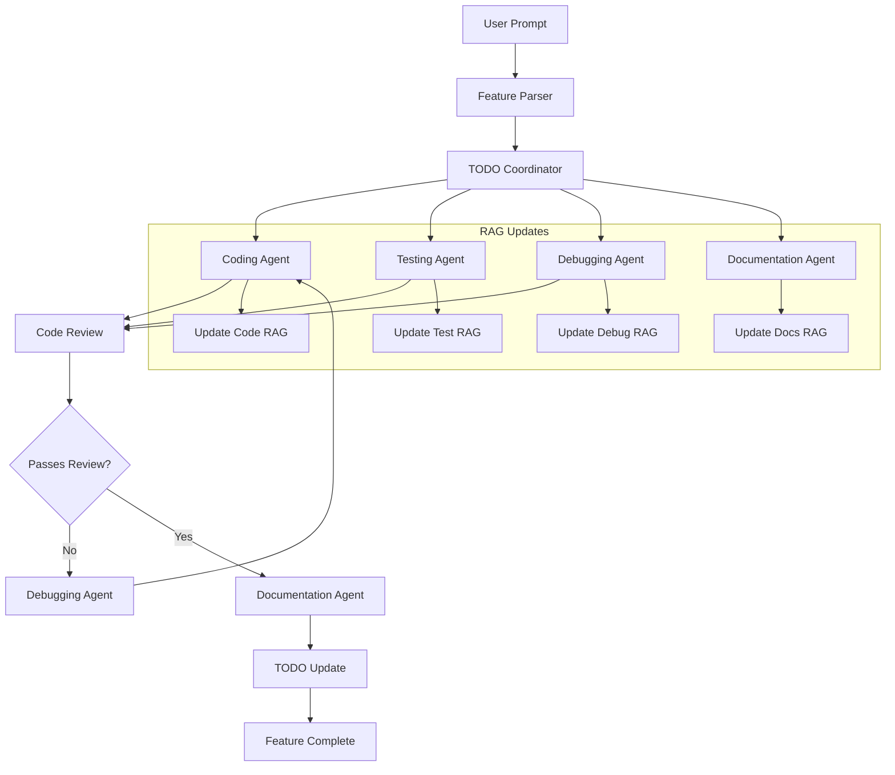

# Feature Generation Plan for OpenCode Python

> *"Give me a feature, and I shall code it."* — Every developer, right before realizing they should have asked more questions.

## Overview

This plan enables users to start adding features and generating code with simple, natural language prompts. The system coordinates multiple agents (coding, debugging, testing, documenting) to deliver complete, tested, and documented features.

> **Navigation:**
> - **Previous:** [PLAN_INDEX.md](PLAN_INDEX.md) - Plans navigation hub
> - **Next:** [CODE_IMPROVEMENT_PLAN.md](CODE_IMPROVEMENT_PLAN.md) - Code quality standards

> **Related Documents:**
> - [README.md](../README.md) - Project overview and features
> - [MISSION.md](../MISSION.md) - Mission statement and core principles
> - [TODO.md](../TODO.md) - Task tracking and pending work

---

## Simple Prompt Interface

### Supported Prompts

Users can initiate feature generation with natural language:

| Prompt Pattern | Example | Action |
|----------------|---------|--------|
| `add a feature {description}` | `add a feature to export sessions to JSON` | Full feature workflow |
| `generate code for {description}` | `generate code for a rate limiter` | Code generation focus |
| `make code for {description}` | `make code for user authentication` | Code generation focus |
| `I want {description}` | `I want dark mode in the TUI` | Full feature workflow |

### CLI Commands

```bash
# Natural language prompts
opencode "add a feature to export sessions to JSON"
opencode "generate code for a rate limiter"
opencode "I want dark mode in the TUI"

# Explicit commands
opencode feature add "export sessions to JSON"
opencode feature generate "rate limiter"
opencode feature create "dark mode for TUI"
```

### TUI Integration

```
/add feature: export sessions to JSON
/generate code for: rate limiter
/make: dark mode in the TUI
```

---

## Agent Coordination System

### Agent Workflow



### Agent Responsibilities

| Agent | Responsibilities | RAG Operations |
|-------|------------------|----------------|
| **Coding** | Generate, read, update, delete code | CRUD on code patterns |
| **Testing** | Create, read, update test files | CRUD on test patterns |
| **Debugging** | Analyze, fix, verify code | CRUD on error patterns |
| **Documentation** | Create, update docs with humor | CRUD on doc patterns |
| **Python Essentials** | Python best practices for AI agents | Query `RAG/agent_python_essentials/` |

---

## TODO List Integration

### Automatic TODO Updates

When a feature is initiated, the system automatically:

1. **Creates TODO entries** for each phase
2. **Updates status** as agents complete work
3. **Links related tasks** for traceability

### TODO Entry Template

```markdown
## Feature: {feature_name}

**Status:** In Progress
**Started:** {timestamp}
**Prompt:** "{original_prompt}"

### Tasks
- [ ] Design: {design_task}
- [ ] Code: {coding_task}
- [ ] Test: {testing_task}
- [ ] Debug: {debugging_task}
- [ ] Document: {documentation_task}

### Agent Progress
| Agent | Status | RAG Updated |
|-------|--------|-------------|
| Coding | Pending | No |
| Testing | Pending | No |
| Debugging | Pending | No |
| Documentation | Pending | No |
```

---

## RAG CRUD Operations

### Purpose

Each agent maintains a RAG (Retrieval-Augmented Generation) system for:
- **Accuracy improvement** through learned patterns
- **Speed optimization** via cached solutions
- **Knowledge sharing** between agents

### CRUD Operations by Agent

#### Coding Agent RAG

| Operation | Trigger | Content |
|-----------|---------|---------|
| **Create** | New pattern discovered | Code template, best practices |
| **Read** | Starting code generation | Similar patterns, context |
| **Update** | Better solution found | Improved template, edge cases |
| **Delete** | Code proven wrong | Remove incorrect patterns |

```python
# Example: Coding RAG Entry
{
    "pattern_id": "rate_limiter_001",
    "pattern_type": "concurrency",
    "code_template": "class RateLimiter...",
    "best_practices": ["Use semaphore", "Handle timeout"],
    "edge_cases": ["Burst traffic", "Resource exhaustion"],
    "created_from": "feature: rate limiter",
    "proven_correct": true
}
```

#### Python Essentials RAG

The Coding and Testing agents can query the **Python Essentials RAG** for best practices from the YouTube video "Python Essentials for AI Agents":

| Agent | RAG Location | Query Use Case |
|-------|--------------|----------------|
| Coding | `RAG/agent_python_essentials/` | Python syntax, best practices, patterns |
| Testing | `RAG/agent_python_essentials/` | Python testing patterns, pytest usage |

```python
# Example: Query Python Essentials RAG
from opencode.core.rag.agent_rag_manager import AgentRAGManager

manager = AgentRAGManager()
results = await manager.query(
    agent="python_essentials",
    query="How to use async/await in Python?"
)
```

#### Testing Agent RAG

| Operation | Trigger | Content |
|-----------|---------|---------|
| **Create** | New test pattern | Test template, assertions |
| **Read** | Starting test generation | Similar tests, fixtures |
| **Update** | Better test found | Coverage improvements |
| **Delete** | Test obsolete | Remove outdated tests |

#### Debugging Agent RAG

| Operation | Trigger | Content |
|-----------|---------|---------|
| **Create** | New error discovered | Error pattern, fix |
| **Read** | Error encountered | Similar errors, solutions |
| **Update** | Better fix found | Improved solution |
| **Delete** | Error pattern invalid | Remove incorrect fixes |

```python
# Example: Debugging RAG Entry
{
    "error_id": "ERR-RATE-001",
    "error_pattern": "RateLimiter: deadlock on high load",
    "symptoms": ["Timeout", "Frozen threads"],
    "root_cause": "Missing timeout in semaphore acquire",
    "fix": "Add timeout parameter to acquire()",
    "prevention": "Always use timeout with semaphores",
    "proven_fix": true
}
```

#### Documentation Agent RAG

| Operation | Trigger | Content |
|-----------|---------|---------|
| **Create** | New feature documented | Doc template, examples |
| **Read** | Starting documentation | Similar docs, style guide |
| **Update** | Feature changed | Updated examples, notes |
| **Delete** | Feature removed | Archive old docs |

> **Note:** Documentation updates should include PG-13/SFW humor where appropriate. Because who said technical docs can't have a personality?

---

## Feature Generation Workflow

### Phase 1: Analysis

```python
async def analyze_feature_request(prompt: str) -> FeatureSpec:
    """
    Parse natural language prompt into structured feature specification.
    """
    # 1. Extract feature type
    feature_type = classify_feature(prompt)
    
    # 2. Identify affected modules
    modules = identify_modules(prompt)
    
    # 3. Check RAG for similar features
    similar = await coding_rag.read_similar(feature_type)
    
    # 4. Generate specification
    spec = FeatureSpec(
        name=extract_name(prompt),
        description=prompt,
        type=feature_type,
        modules=modules,
        similar_patterns=similar,
        estimated_complexity=assess_complexity(prompt)
    )
    
    return spec
```

### Phase 2: TODO Creation

```python
async def create_feature_todo(spec: FeatureSpec) -> TODOEntry:
    """
    Create TODO entries for the feature.
    """
    todo = TODOEntry(
        title=f"Feature: {spec.name}",
        status="In Progress",
        tasks=[
            Task("Design", "Design feature architecture"),
            Task("Code", f"Implement {spec.name}"),
            Task("Test", f"Create tests for {spec.name}"),
            Task("Debug", "Fix any issues found"),
            Task("Document", f"Document {spec.name}"),
        ]
    )
    
    await todo_manager.create(todo)
    return todo
```

### Phase 3: Code Generation

```python
async def generate_code(spec: FeatureSpec) -> GeneratedCode:
    """
    Generate code for the feature using coding agent.
    """
    # 1. Read similar patterns from RAG
    patterns = await coding_rag.read(spec.type)
    
    # 2. Generate code
    code = await coding_agent.generate(
        spec=spec,
        patterns=patterns,
        style_guide=load_style_guide()
    )
    
    # 3. Create new RAG entry if novel pattern
    if code.is_novel_pattern:
        await coding_rag.create(
            pattern_type=spec.type,
            code_template=code.template,
            best_practices=code.practices
        )
    
    return code
```

### Phase 4: Testing

```python
async def generate_tests(code: GeneratedCode) -> TestSuite:
    """
    Generate tests for the code using testing agent.
    """
    # 1. Read test patterns from RAG
    patterns = await testing_rag.read(code.type)
    
    # 2. Generate tests
    tests = await testing_agent.generate(
        code=code,
        patterns=patterns,
        coverage_target=0.80
    )
    
    # 3. Run tests
    results = await run_tests(tests)
    
    # 4. Update RAG with new test patterns
    if tests.is_novel_pattern:
        await testing_rag.create(
            test_type=code.type,
            test_template=tests.template,
            coverage_areas=tests.coverage
        )
    
    return TestSuite(tests=tests, results=results)
```

### Phase 5: Debugging

```python
async def debug_issues(test_results: TestResults) -> DebugReport:
    """
    Debug any issues found during testing.
    """
    issues = []
    
    for failure in test_results.failures:
        # 1. Check RAG for known error patterns
        known_fix = await debugging_rag.read(failure.error)
        
        if known_fix:
            # Apply known fix
            fix = await debugging_agent.apply_fix(
                error=failure.error,
                fix=known_fix
            )
        else:
            # Debug new error
            fix = await debugging_agent.debug(
                error=failure.error,
                context=failure.context
            )
            
            # Create new RAG entry
            await debugging_rag.create(
                error_pattern=failure.error.pattern,
                fix=fix.solution,
                prevention=fix.prevention
            )
        
        issues.append(DebugIssue(
            error=failure.error,
            fix=fix,
            resolved=True
        ))
    
    return DebugReport(issues=issues)
```

### Phase 6: Documentation

```python
async def document_feature(
    spec: FeatureSpec,
    code: GeneratedCode,
    tests: TestSuite
) -> Documentation:
    """
    Document the feature using documentation agent.
    """
    # 1. Read doc patterns from RAG
    patterns = await docs_rag.read(spec.type)
    
    # 2. Generate documentation with appropriate humor
    docs = await documentation_agent.generate(
        spec=spec,
        code=code,
        tests=tests,
        style="professional_with_personality",
        humor_level="pg13"  # Keep it family-friendly
    )
    
    # 3. Update RAG
    await docs_rag.create(
        doc_type=spec.type,
        template=docs.template,
        examples=docs.examples
    )
    
    return docs
```

---

## Linked Plan References

This plan is part of a linked list of planning documents:

### Previous Plans

| Plan | Relationship | Key Connection |
|------|--------------|----------------|
| [PLAN_INDEX.md](PLAN_INDEX.md) | Navigation hub | Index of all plans |
| [PROJECT_ORGANIZATION_PLAN.md](PROJECT_ORGANIZATION_PLAN.md) | Structure | Where new features go |
| [PRIVACY_FIRST_RAG_PLAN.md](PRIVACY_FIRST_RAG_PLAN.md) | RAG system | RAG CRUD operations |

### Next Plans

| Plan | Relationship | Key Connection |
|------|--------------|----------------|
| [CODE_IMPROVEMENT_PLAN.md](CODE_IMPROVEMENT_PLAN.md) | Code quality | Standards for generated code |
| [TESTING_PLAN.md](TESTING_PLAN.md) | Testing | Test generation strategy |
| [DOCUMENTATION_PLAN.md](DOCUMENTATION_PLAN.md) | Documentation | Doc generation standards |

### Related Plans

| Plan | Relationship | Key Connection |
|------|--------------|----------------|
| [SIMPLIFIED_TROUBLESHOOTING_UX_PLAN.md](SIMPLIFIED_TROUBLESHOOTING_UX_PLAN.md) | Debugging | Error handling UX |
| [GITHUB_UPLOAD_PLAN.md](GITHUB_UPLOAD_PLAN.md) | Deployment | Commit message guidelines |

---

## Implementation Checklist

### Phase 1: Core Infrastructure

- [ ] Create feature parser for natural language prompts
- [ ] Implement TODO coordinator
- [ ] Set up agent communication system
- [ ] Create RAG CRUD interfaces

### Phase 2: Agent Implementation

- [ ] Implement coding agent with RAG integration
- [ ] Implement testing agent with RAG integration
- [ ] Implement debugging agent with RAG integration
- [ ] Implement documentation agent with RAG integration

### Phase 3: CLI Integration

- [ ] Add `opencode feature` commands
- [ ] Add natural language prompt handling
- [ ] Add progress reporting
- [ ] Add TODO synchronization

### Phase 4: TUI Integration

- [ ] Add `/add`, `/generate`, `/make` commands
- [ ] Add progress visualization
- [ ] Add agent status display
- [ ] Add TODO panel integration

---

## Success Criteria

| Criterion | Measurement |
|-----------|-------------|
| **Prompt Success Rate** | 90%+ features generated correctly from first prompt |
| **Code Quality** | Generated code passes linting and type checking |
| **Test Coverage** | 80%+ coverage for generated code |
| **Documentation** | All features documented with PG-13 humor |
| **RAG Accuracy** | 95%+ correct patterns in RAG |
| **Speed** | Feature generation under 5 minutes for simple features |

---

## Example Usage

### Simple Feature Request

```bash
$ opencode "add a feature to export sessions to JSON"

🔍 Analyzing feature request...
   Feature: Session Export
   Type: data_export
   Complexity: Low
   Affected modules: core/session, cli/commands

📝 Creating TODO entries...
   ✓ Design: Session export architecture
   ✓ Code: Implement session export
   ✓ Test: Create tests for session export
   ✓ Debug: Fix any issues found
   ✓ Document: Document session export

💻 Generating code...
   ✓ Created: src/opencode/core/session_export.py
   ✓ Updated: src/opencode/cli/commands/export.py

🧪 Generating tests...
   ✓ Created: tests/test_session_export.py
   ✓ Coverage: 85%

🐛 Debugging...
   ✓ No issues found

📚 Documenting...
   ✓ Updated: docs/sessions/README.md
   ✓ Added: examples/session_export.py

✅ Feature complete: Session Export
   Files created: 3
   Files updated: 2
   Test coverage: 85%
   Time: 2m 34s
```

### Complex Feature Request

```bash
$ opencode "I want a rate limiter for API calls"

🔍 Analyzing feature request...
   Feature: API Rate Limiter
   Type: concurrency
   Complexity: Medium
   Affected modules: core/, provider/, server/

📝 Creating TODO entries...
   [Progress shown in real-time]

💻 Generating code...
   ⚠ Found similar pattern in RAG (rate_limiter_001)
   ✓ Using cached pattern with modifications
   ✓ Created: src/opencode/core/rate_limiter.py
   ✓ Updated: src/opencode/provider/base.py

🧪 Generating tests...
   ✓ Created: tests/test_rate_limiter.py
   ✓ Coverage: 82%

🐛 Debugging...
   ⚠ Found 1 issue: Potential deadlock on high load
   ✓ Applied fix from RAG (ERR-RATE-001)
   ✓ Re-running tests... passed

📚 Documenting...
   ✓ Updated: docs/architecture/rate_limiting.md
   ✓ Added: examples/rate_limiter_usage.py
   💡 "Because even APIs need to catch their breath sometimes."

✅ Feature complete: API Rate Limiter
   Files created: 2
   Files updated: 3
   Test coverage: 82%
   Time: 4m 12s
```

---

*Last updated: 2026-02-24*
*Status: Active*
