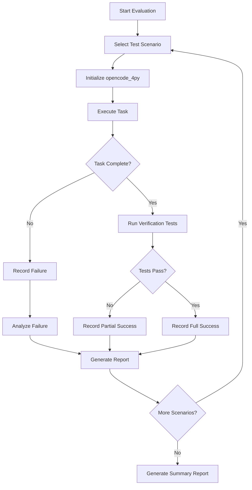

# for_testing Directory Plan

This document outlines the plan for creating and using the `for_testing/` directory to test opencode_4py's capabilities with external projects.

> **Related Documents:**
> - [README.md](../README.md) - Project overview and features
> - [MISSION.md](../MISSION.md) - Mission statement and core principles

---

## Executive Summary

The `for_testing/` directory serves as a testing ground for opencode_4py with two distinct purposes:

| Purpose | Description | Test Focus |
|---------|-------------|------------|
| **Purpose 1** | Integrate opencode_4py INTO a project | Library/API integration, dependency management |
| **Purpose 2** | Use opencode_4py to MODIFY a project | AI coding capabilities, tool effectiveness |

---

## Directory Structure

```
for_testing/
├── README.md                          # Overview and usage instructions
├── as_dependency/                     # Purpose 1: Projects integrating opencode_4py
│   ├── README.md                      # Integration testing guide
│   ├── simple_python_app/             # Basic Python project
│   │   ├── pyproject.toml             # Includes opencode-ai as dependency
│   │   ├── src/
│   │   │   └── app.py                 # Uses opencode programmatically
│   │   └── tests/
│   │       └── test_opencode_integration.py
│   ├── fastapi_project/               # FastAPI project using opencode
│   │   ├── pyproject.toml
│   │   ├── src/
│   │   │   ├── main.py                # FastAPI app
│   │   │   └── opencode_client.py     # opencode integration
│   │   └── tests/
│   ├── cli_extension/                 # CLI tool extending opencode
│   │   ├── pyproject.toml
│   │   └── src/
│   │       └── custom_cli.py          # Custom CLI using opencode core
│   └── templates/                     # Integration templates
│       ├── minimal_integration/       # Minimal opencode integration
│       └── full_integration/          # Full-featured integration
│
└── as_tool/                           # Purpose 2: Projects modified by opencode_4py
    ├── README.md                      # AI coding test guide
    ├── sample_projects/               # Projects for opencode to modify
    │   ├── python_cli_tool/           # Simple CLI tool to enhance
    │   │   ├── README.md              # Tasks for opencode to complete
    │   │   ├── pyproject.toml
    │   │   └── src/
    │   ├── web_api/                   # REST API project
    │   │   ├── README.md              # Enhancement tasks
    │   │   └── src/
    │   ├── data_pipeline/             # Data processing project
    │   │   ├── README.md              # Refactoring tasks
    │   │   └── src/
    │   └── legacy_codebase/           # Code needing modernization
    │       ├── README.md              # Modernization tasks
    │       └── src/
    ├── test_scenarios/                # Standardized test scenarios
    │   ├── bug_fix_scenarios/         # Bug fixing tests
    │   ├── feature_addition/          # Feature implementation tests
    │   ├── refactoring/               # Code refactoring tests
    │   └── documentation/             # Documentation generation tests
    └── evaluation/                    # Evaluation framework
        ├── metrics.py                 # Success metrics
        ├── test_runner.py             # Automated test execution
        └── results/                   # Test results storage
```

---

## Purpose 1: Integration Testing - as_dependency/

### Overview

This subfolder contains projects that integrate opencode_4py as a library dependency. The goal is to test:

1. **Package Installation**: Does `pip install opencode-ai` work correctly?
2. **API Stability**: Are the public APIs stable and usable?
3. **Dependency Conflicts**: Are there any dependency conflicts?
4. **Programmatic Usage**: Can developers use opencode programmatically?

### Test Projects

#### 1.1 simple_python_app

A minimal Python application that uses opencode_4py as a library.

**Test Cases:**
- Import opencode modules without errors
- Initialize configuration programmatically
- Create and manage sessions via API
- Use providers programmatically
- Execute tools via API calls

**Example Usage:**
```python
from opencode.core.config import Config
from opencode.core.session import Session
from opencode.provider.openai import OpenAIProvider

# Initialize programmatically
config = Config.from_dict({
    "provider": {"default": "openai"},
    "tools": {"bash": True, "read": True}
})

# Create session
session = Session(config=config)

# Use provider directly
provider = OpenAIProvider(api_key="...")
response = await provider.complete(messages=[...])
```

#### 1.2 fastapi_project

A FastAPI web application that integrates opencode_4py for AI-powered features.

**Test Cases:**
- Use opencode as a background task processor
- Expose opencode features via REST API
- Handle concurrent requests with opencode
- Integrate with FastAPI dependency injection

#### 1.3 cli_extension

A custom CLI tool that extends opencode_4py's functionality.

**Test Cases:**
- Extend opencode CLI with custom commands
- Use opencode's core modules for custom functionality
- Integrate custom tools into opencode

### Integration Test Matrix

| Test Case | simple_python_app | fastapi_project | cli_extension |
|-----------|-------------------|-----------------|---------------|
| Package import | ✅ | ✅ | ✅ |
| Config initialization | ✅ | ✅ | ✅ |
| Provider usage | ✅ | ✅ | ✅ |
| Tool execution | ✅ | ✅ | ✅ |
| Session management | ✅ | ✅ | ✅ |
| Concurrent usage | - | ✅ | - |
| Custom commands | - | - | ✅ |
| Background tasks | - | ✅ | - |

---

## Purpose 2: Feature Usage Testing - as_tool/

### Overview

This subfolder contains projects that opencode_4py will modify. The goal is to test:

1. **Code Understanding**: Can opencode understand the codebase?
2. **Code Generation**: Can opencode generate correct code?
3. **Code Modification**: Can opencode modify existing code correctly?
4. **Tool Effectiveness**: Are the tools effective for real-world tasks?

### Test Projects

#### 2.1 python_cli_tool

A simple Python CLI tool with intentional issues for opencode to fix.

**Project Characteristics:**
- ~500 lines of Python code
- Uses typer for CLI
- Has intentional bugs and missing features
- Needs documentation

**Test Scenarios:**
| Scenario | Description | Expected Outcome |
|----------|-------------|------------------|
| Bug Fix | Fix a specific bug in the code | Bug is fixed, tests pass |
| Feature Add | Add a new CLI command | Command works correctly |
| Refactor | Improve code structure | Functionality preserved |
| Document | Add docstrings and README | Documentation complete |

#### 2.2 web_api

A REST API project with FastAPI.

**Project Characteristics:**
- ~1000 lines of Python code
- Multiple endpoints
- Missing error handling
- Needs tests

**Test Scenarios:**
| Scenario | Description | Expected Outcome |
|----------|-------------|------------------|
| Add Endpoint | Create new API endpoint | Endpoint works correctly |
| Error Handling | Add proper error handling | Errors handled gracefully |
| Add Tests | Write unit tests | Tests pass |
| Security | Add authentication | Auth works correctly |

#### 2.3 data_pipeline

A data processing project.

**Project Characteristics:**
- ~800 lines of Python code
- ETL-style processing
- Performance issues
- Needs type hints

**Test Scenarios:**
| Scenario | Description | Expected Outcome |
|----------|-------------|------------------|
| Optimize | Improve performance | Faster execution |
| Type Hints | Add type annotations | mypy passes |
| Add Logging | Implement logging | Logs are useful |
| Error Recovery | Add retry logic | Handles failures |

#### 2.4 legacy_codebase

A project needing modernization.

**Project Characteristics:**
- ~2000 lines of Python code
- Older Python patterns
- Missing type hints
- Outdated dependencies

**Test Scenarios:**
| Scenario | Description | Expected Outcome |
|----------|-------------|------------------|
| Modernize | Update to modern Python | Code is modern |
| Add Types | Add type hints | mypy passes |
| Update Deps | Update dependencies | No conflicts |
| Refactor | Improve architecture | Better structure |

### Test Scenario Templates

Each test scenario should include:

```markdown
# Scenario: [Name]

## Objective
[What opencode should accomplish]

## Starting State
- Files to examine: [list]
- Current behavior: [description]

## Expected Outcome
- Files modified: [list]
- New behavior: [description]
- Tests to pass: [list]

## Success Criteria
- [ ] Code compiles/runs
- [ ] Tests pass
- [ ] No regressions
- [ ] Code quality maintained

## Evaluation
- Time taken: [measurement]
- Attempts needed: [count]
- Quality score: [1-5]
```

---

## Evaluation Framework

### Metrics to Track

| Metric | Description | Measurement Method |
|--------|-------------|-------------------|
| **Success Rate** | Percentage of tasks completed successfully | Pass/fail count |
| **Time to Complete** | Time taken to complete a task | Timer measurement |
| **Code Quality** | Quality of generated/modified code | Linting, type checking |
| **Test Coverage** | Coverage of generated tests | pytest-cov |
| **Iteration Count** | Number of attempts needed | Conversation turns |
| **Error Rate** | Errors encountered during task | Error count |

### Evaluation Process



### Success Criteria

| Level | Criteria |
|-------|----------|
| **Full Success** | Task completed, all tests pass, no regressions |
| **Partial Success** | Task completed, some tests fail or minor regressions |
| **Failure** | Task not completed or major regressions introduced |

---

## Implementation Steps

### Phase 1: Directory Setup

1. Create `for_testing/` directory structure
2. Create README files for each subfolder
3. Set up evaluation framework

### Phase 2: Purpose 1 Projects

1. Create `simple_python_app` with basic integration tests
2. Create `fastapi_project` with API integration
3. Create `cli_extension` with custom commands
4. Write integration test suite

### Phase 3: Purpose 2 Projects

1. Create `python_cli_tool` with intentional issues
2. Create `web_api` project with missing features
3. Create `data_pipeline` with performance issues
4. Create `legacy_codebase` with outdated patterns
5. Write test scenarios for each

### Phase 4: Evaluation Framework

1. Implement metrics collection
2. Create automated test runner
3. Set up results storage
4. Create reporting dashboard

### Phase 5: Documentation

1. Document all test projects
2. Create usage guides
3. Document evaluation methodology
4. Create contribution guidelines

---

## Test Project Selection Criteria

### For Purpose 1 - as_dependency/

| Criterion | Requirement |
|-----------|-------------|
| **Complexity** | Varies from minimal to moderate |
| **Dependencies** | Should not conflict with opencode |
| **Python Version** | 3.12+ compatible |
| **Purpose** | Demonstrate integration patterns |

### For Purpose 2 - as_tool/

| Criterion | Requirement |
|-----------|-------------|
| **Size** | 500-2000 lines of code |
| **Complexity** | Moderate, understandable by AI |
| **Issues** | Has intentional issues to fix |
| **Tests** | Has test suite for verification |
| **Documentation** | Has clear task descriptions |

---

## Usage Instructions

### Running Purpose 1 Tests

```bash
# Navigate to integration test project
cd for_testing/as_dependency/simple_python_app

# Install dependencies
pip install -e .

# Run integration tests
pytest tests/

# Test specific integration
pytest tests/test_opencode_integration.py -v
```

### Running Purpose 2 Tests

```bash
# Start opencode in the test project
cd for_testing/as_tool/sample_projects/python_cli_tool
opencode

# Give opencode a task
> Read the README.md and complete the tasks listed

# After opencode completes, run verification
pytest tests/
```

### Running Evaluation

```bash
# Run full evaluation suite
cd for_testing/as_tool/evaluation
python test_runner.py --all

# Run specific scenario
python test_runner.py --scenario bug_fix_scenarios

# Generate report
python test_runner.py --report
```

---

## Maintenance

### Adding New Test Projects

1. Create project in appropriate subfolder
2. Add README with task descriptions
3. Create verification tests
4. Update evaluation framework
5. Document in this plan

### Updating Existing Projects

1. Reset project to initial state after testing
2. Update task descriptions as needed
3. Ensure tests remain valid
4. Update documentation

### Version Control

- Each test project should be in its own git history or use git reset
- Consider using git branches for different test states
- Tag successful test states for comparison

---

## Appendix: Sample Test Project Structure

### python_cli_tool Example

```
python_cli_tool/
├── README.md                    # Tasks for opencode to complete
├── pyproject.toml               # Project configuration
├── src/
│   └── cli_tool/
│       ├── __init__.py
│       ├── main.py              # CLI entry point (has bug)
│       ├── commands.py          # Command implementations (incomplete)
│       └── utils.py             # Utility functions (needs tests)
└── tests/
    ├── __init__.py
    ├── test_commands.py         # Existing tests (some failing)
    └── test_utils.py            # Empty test file to fill
```

### README.md Template for Test Projects

```markdown
# [Project Name]

## Overview
[Brief description of the project]

## Tasks for opencode_4py

### Task 1: [Name]
- **File**: [file path]
- **Issue**: [description of issue]
- **Expected**: [expected outcome]
- **Verification**: [how to verify]

### Task 2: [Name]
...

## Running Tests
```bash
pytest tests/
```

## Success Criteria
- All tests pass
- No regressions
- Code quality maintained
```

---

## Lessons Learned from ComfyUI Integration (2026-02-23)

### Troubleshooting RAG

All integration errors are now documented in individual files for the **Troubleshooting RAG**. This enables AI-powered troubleshooting using semantic search.

**Location:** [`RAG/troubleshooting/`](../RAG/troubleshooting/)

**Structure:**
```
RAG/troubleshooting/
├── README.md                    # Usage guide
├── errors/                      # Individual error documents
│   ├── ERR-010-async-generator-await.md
│   ├── ERR-014-reactive-property-watch-missing.md
│   ├── ERR-015-installed-vs-source-mismatch.md
│   ├── ERR-016-mutation-observer-button.md
│   └── ERR-017-comfyui-button-selector.md
├── patterns/                    # Troubleshooting patterns
└── workflows/                   # Diagnosis workflows
```

### Quick Reference: Critical Errors

| Error ID | Symptom | Root Cause |
|----------|---------|------------|
| ERR-010 | TUI stalls at "Thinking..." | `await` on async generator |
| ERR-014 | UI not updating with response | Missing `watch_` method for reactive property |
| ERR-015 | Fixes don't appear in app | Editing source instead of installed location |
| ERR-016 | Button not appearing | Target button loads dynamically |
| ERR-017 | Can't find button in JS | Generic selector doesn't match DOM structure |

### Using the Troubleshooting RAG

```bash
# Query the troubleshooting RAG
opencode rag query --agent troubleshooting "TUI stalls at Thinking"

# Add new error document
opencode rag add --agent troubleshooting ./errors/ERR-018-new-error.md

# Rebuild the RAG index
opencode rag rebuild --agent troubleshooting
```

### Required Pre-Integration Steps

Before any integration, opencode_4py should:

1. **Verify CLI Structure**
   ```bash
   python -m opencode --help
   python -m opencode run --help
   ```

2. **Check ORM Version**
   ```bash
   python -c "import sqlalchemy; print(sqlalchemy.__version__)"
   ```

3. **Verify AI Provider**
   ```bash
   # Check Ollama
   curl http://localhost:11434/api/tags
   
   # Or check for remote provider API keys
   echo $OPENAI_API_KEY
   echo $ANTHROPIC_API_KEY
   ```

4. **Run Pre-flight Check**
   ```bash
   python check_prerequisites.py
   ```

### Post-Integration Verification

After integration, always:

1. Run all launch scripts to verify they work
2. Test with actual Ollama models (not development-only models)
3. Verify no warnings or errors in output
4. Document any issues in the Troubleshooting RAG
5. **Copy all documents and plans to target location** (see below)

#### Document and Plan Copying Requirements

After successful integration, copy all relevant documents and plans from the main opencode_4py project to the target location's folder. This ensures the target project has access to all planning and documentation context.

**Plans to Copy:**

Copy from `opencode_4py/plans/` to `{target_project}/plans/`:

| Plan File | Purpose | Required |
|-----------|---------|----------|
| `FOR_TESTING_PLAN.md` | Testing framework and procedures | ✅ Required |
| `UPDATE_UPGRADE_TROUBLESHOOTING_SUBPLAN.md` | Troubleshooting procedures | ✅ Required |
| `PROJECT_INTEGRATION_PLAN.md` | Integration patterns reference | Optional |
| `TESTING_PLAN.md` | Testing strategy reference | Optional |
| `DOCUMENTATION_PLAN.md` | Documentation standards | Optional |
| `CODE_IMPROVEMENT_PLAN.md` | Code quality standards | Optional |
| `PRIVACY_FIRST_RAG_PLAN.md` | RAG implementation guide | Optional |
| `MULTI_MODEL_IMPLEMENTATION_PLAN.md` | Multi-model patterns | Optional |
| `PROJECT_ORGANIZATION_PLAN.md` | Project structure guide | Optional |
| `SIMPLIFIED_TROUBLESHOOTING_UX_PLAN.md` | Troubleshooting UX | Optional |
| `PLAN_ACTIVATION.md` | Plan activation guide | Optional |
| `INTEGRATION_STATUS.md` | Integration status tracking | Optional |

**Documents to Copy:**

Copy from `opencode_4py/docs/` to `{target_project}/docs/opencode/`:

| Doc File | Purpose | Required |
|----------|---------|----------|
| `README.md` | Main documentation | ✅ Required |
| `INTEGRATION_PLAN.md` | Integration procedures | ✅ Required |
| `INTEGRATION_POSTMORTEM.md` | Lessons learned | ✅ Required |
| `COMFYUI_INTEGRATION_ANALYSIS.md` | Target analysis template | Optional |
| `IMPLEMENTATION_STATUS.md` | Implementation tracking | Optional |
| `FEATURE_COVERAGE.md` | Feature reference | Optional |
| `TESTING_STATUS.md` | Testing status template | Optional |
| `WORKFLOW_ENGINE.md` | Workflow documentation | Optional |
| `AGENT_MODEL_ORCHESTRATION.md` | Orchestration guide | Optional |
| `BEST_PRACTICE_FOR_RAG.MD` | RAG best practices | Optional |
| `FILE_SYSTEM_SANDBOXING.md` | Security documentation | Optional |
| `RAG_SHARING.md` | RAG sharing guide | Optional |
| `MIGRATION_PLAN.md` | Migration reference | Optional |

**Copy Commands (Example for ComfyUI Integration):**

```bash
# Set target paths
TARGET_ROOT="for_testing/as_dependency/ComfyUI_windows_portable"
TARGET_PLANS="$TARGET_ROOT/plans"
TARGET_DOCS="$TARGET_ROOT/docs/opencode"

# Create directories if they don't exist
mkdir -p "$TARGET_PLANS"
mkdir -p "$TARGET_DOCS"

# Copy required plans
cp plans/FOR_TESTING_PLAN.md "$TARGET_PLANS/"
cp plans/UPDATE_UPGRADE_TROUBLESHOOTING_SUBPLAN.md "$TARGET_PLANS/"

# Copy required documents
cp docs/README.md "$TARGET_DOCS/"
cp docs/INTEGRATION_PLAN.md "$TARGET_DOCS/"
cp docs/INTEGRATION_POSTMORTEM.md "$TARGET_DOCS/"

# Copy optional plans (recommended)
cp plans/PROJECT_INTEGRATION_PLAN.md "$TARGET_PLANS/"
cp plans/TESTING_PLAN.md "$TARGET_PLANS/"
cp plans/DOCUMENTATION_PLAN.md "$TARGET_PLANS/"

# Copy optional documents (recommended)
cp docs/COMFYUI_INTEGRATION_ANALYSIS.md "$TARGET_DOCS/"
cp docs/IMPLEMENTATION_STATUS.md "$TARGET_DOCS/"
cp docs/FEATURE_COVERAGE.md "$TARGET_DOCS/"
```

**Verification Checklist:**

After copying, verify:

- [ ] All required plans are present in `{target_project}/plans/`
- [ ] All required documents are present in `{target_project}/docs/opencode/`
- [ ] File permissions allow read access
- [ ] No broken internal links in copied documents
- [ ] Target-specific README.md is updated with integration details
- [ ] Troubleshooting RAG is updated with any new error documents

### Additional Errors Documented in Troubleshooting RAG

The following errors are documented in individual files in [`RAG/troubleshooting/errors/`](../RAG/troubleshooting/errors/):

| Error ID | Title | File |
|----------|-------|------|
| ERR-001 | CLI Command Structure | `ERR-001-cli-command-structure.md` |
| ERR-002 | SQLAlchemy Syntax | `ERR-002-sqlalchemy-syntax.md` |
| ERR-003 | AI Provider Availability | `ERR-003-ai-provider-availability.md` |
| ERR-004 | Missing Pre-flight Checks | `ERR-004-missing-preflight-checks.md` |
| ERR-005 | Web Framework Response Types | `ERR-005-web-framework-response-types.md` |
| ERR-006 | Dependency Version Warnings | `ERR-006-dependency-version-warnings.md` |
| ERR-007 | Wrong Provider Class | `ERR-007-wrong-provider-class.md` |
| ERR-008 | Single-line Input Widget | `ERR-008-single-line-input-widget.md` |
| ERR-009 | Wrong Provider Method Name | `ERR-009-wrong-provider-method-name.md` |
| ERR-010 | Async Generator Await Error | `ERR-010-async-generator-await.md` |
| ERR-011 | Runtime Logging Silent Failures | `ERR-011-runtime-logging-silent-failures.md` |
| ERR-012 | Missing Parameter in __init__ | `ERR-012-missing-parameter-init.md` |
| ERR-013 | Session and Log Storage Location | `ERR-013-session-log-storage-location.md` |
| ERR-014 | Reactive Property Watch Missing | `ERR-014-reactive-property-watch-missing.md` |
| ERR-015 | Installed vs Source Mismatch | `ERR-015-installed-vs-source-mismatch.md` |
| ERR-016 | MutationObserver Button Positioning | `ERR-016-mutation-observer-button.md` |
| ERR-017 | ComfyUI Button Selector Specificity | `ERR-017-comfyui-button-selector.md` |

---

## OpenCode_4py Storage Location Requirements

### Overview

OpenCode_4py has specific requirements for where different types of files should be stored. This ensures consistency across integrations and makes it easy to find and manage generated files.

### Storage Location Rules

| Content Type | Main OpenCode_4py Location | Target Project Location |
|--------------|---------------------------|------------------------|
| **Plans** | `opencode_4py/plans/` | `{target_project}/plans/` |
| **Documents** | `opencode_4py/docs/` | `{target_project}/docs/opencode/` |
| **Sessions** | `opencode_4py/docs/sessions/` | `{target_project}/docs/opencode/sessions/` |
| **Logs** | `opencode_4py/docs/opencode/logs/` | `{target_project}/docs/opencode/logs/` |
| **Configuration** | `opencode_4py/opencode.toml` | `{target_project}/opencode.toml` |

> **Note:** When no `--project` flag is provided, sessions and logs default to `~/.local/share/opencode/`.

### Plans Folder Structure

**Main OpenCode_4py Plans (`opencode_4py/plans/`):**
- Contains all planning documents for OpenCode_4py itself
- Includes integration plans, feature plans, troubleshooting sub-plans
- These are the "source of truth" for OpenCode_4py development

**Target Project Plans (`{target_project}/plans/`):**
- Contains plans specific to the target project integration
- Includes modification records, integration-specific notes
- Should receive a copy of relevant sub-plans (e.g., `UPDATE_UPGRADE_TROUBLESHOOTING_SUBPLAN.md`)

### Docs Folder Structure

**Main OpenCode_4py Docs (`opencode_4py/docs/`):**
- Contains all documentation for OpenCode_4py itself
- Includes API docs, integration guides, feature documentation
- Sub-folders:
  - `sessions/` - Chat session files (when running with `--project` flag)
  - `opencode/logs/` - Debug and runtime logs

**Target Project Docs (`{target_project}/docs/opencode/`):**
- Contains all OpenCode_4py generated files for the target project
- Sub-folders:
  - `sessions/` - Chat session files (JSON format, named `session_{datetime}_{id}.json`)
  - `logs/` - Debug and runtime logs
  - `*.md` - Integration-specific documentation

### Session File Details

**Filename Format:** `session_{YYYY-MM-DD_HH-MM-SS}_{short_id}.json`

**Example:** `session_2026-02-23_12-07-27_ea99a867.json`

**Session File Location Logic:**
```python
# In config.py - data_dir determines session location
if project_dir:
    config.data_dir = project_dir / "docs" / "opencode"
else:
    config.data_dir = Path.home() / ".local" / "share" / "opencode"

# In session.py - sessions stored in data_dir/sessions/
self.sessions_dir = data_dir / "sessions"
```

**Default Locations:**
| Setting | Session Location |
|---------|-----------------|
| `project_dir` configured in `opencode.toml` | `{project_dir}/docs/opencode/sessions/` |
| Running from project root | `./docs/sessions/` |
| No `project_dir` setting | `~/.local/share/opencode/sessions/` |

### Implementation Requirements

When OpenCode_4py is run with a `--project` flag:

1. **Plans** should be stored in `{project_dir}/plans/`
2. **Documents, Sessions, Logs** should be stored in `{project_dir}/docs/opencode/`

```python
# In config.py
if project_dir:
    # Plans go to project's plans folder
    config.plans_dir = project_dir / "plans"
    # Docs, sessions, logs go to project's docs/opencode folder
    config.data_dir = project_dir / "docs" / "opencode"
```

### Deployment Checklist

When deploying OpenCode_4py to a target project:

- [ ] Copy `UPDATE_UPGRADE_TROUBLESHOOTING_SUBPLAN.md` to `{target}/plans/`
- [ ] Create `{target}/docs/opencode/` directory structure
- [ ] Create `{target}/docs/opencode/sessions/` directory
- [ ] Create `{target}/docs/opencode/logs/` directory
- [ ] Verify `opencode.toml` is in target root directory

### Files Created During Integration

| File | Purpose |
|------|---------|
| `check_prerequisites.py` | Pre-flight verification |
| `opencode.toml` | Full provider configuration |
| `run_opencode_4py.bat` | Launch script |
| `run_opencode_4py_server.bat` | Server mode launch |
| `run_comfyui_with_opencode.bat` | Combined launch |
| `test_opencode.py` | Integration tests |
| `OPENCODE_4PY_README.md` | User guide |

> **Note:** The `ComfyUI/custom_nodes/ComfyUI-OpenCode_4py/` custom node directory was initially created but has been removed. OpenCode_4py integrates as a standalone tool alongside ComfyUI, not as a custom node inside ComfyUI. This approach:
> - Keeps OpenCode_4py independent of ComfyUI's internal architecture
> - Avoids potential conflicts with ComfyUI updates
> - Simplifies the integration and maintenance
> - Allows OpenCode_4py to be used with any project, not just ComfyUI

### Reference Documents

- [`docs/INTEGRATION_POSTMORTEM.md`](../docs/INTEGRATION_POSTMORTEM.md) - Detailed issue analysis (15 issues documented)
- [`docs/INTEGRATION_PLAN.md`](../docs/INTEGRATION_PLAN.md) - Step-by-step integration plan
- [`docs/COMFYUI_INTEGRATION_ANALYSIS.md`](../docs/COMFYUI_INTEGRATION_ANALYSIS.md) - Target analysis for RAG
- [`RAG/agent_code/RAG/INTEGRATION_LESSONS.md`](../RAG/agent_code/RAG/INTEGRATION_LESSONS.md) - Lessons for future integrations

---

## Integration Modification Recording Requirement

### Overview

When integrating opencode_4py into a target project, all modifications must be recorded. This is a mandatory condition of the integration plan.

### Recording Requirements

1. **Minimal Target Changes**: opencode_4py should integrate into the target with minimal (if any) changes to the target's original code.

2. **Bypass Modifications**: Any modification that bypasses the target's original code (before changing the original code) must be recorded.

3. **Documentation Location**: All recorded modifications must be stored in the target's opencode_4py location `docs/` folder.

4. **Purpose**: The recorded modifications serve to:
   - Plan for target updates or upgrade features
   - Troubleshoot issues when updates/upgrades cause problems in original code
   - Quickly identify conflicts between opencode_4py and target changes
   - Provide change history for debugging integration issues

### Modification Record Template

Each modification record should include:

```markdown
## Modification: [Name/ID]

### Date
[YYYY-MM-DD]

### Target File(s)
- Original: [path to original file]
- Modified: [path to modified file, if different]

### Modification Type
- [ ] Bypass original code
- [ ] Patch/hotfix
- [ ] Configuration change
- [ ] Dependency override
- [ ] Other: [specify]

### Reason
[Why this modification was necessary]

### Original Code
```[language]
[Original code snippet]
```

### Modified Code
```[language]
[Modified code snippet]
```

### Impact
- Affected functionality: [description]
- Potential conflicts: [list any known conflicts]
- Reversibility: [Yes/No - how to reverse if needed]

### Related Issues
- Issue tracker: [link]
- Related modifications: [links to other modification records]
```

### Change History Usage

When an update or upgrade causes problems:

1. Check the modification records in `docs/` folder
2. Identify which modifications might be affected
3. Compare original vs modified code
4. Determine if modification needs to be:
   - Re-applied after update
   - Modified for compatibility
   - Removed due to upstream fix

### Example: ComfyUI Integration Modifications

| Modification ID | File | Type | Reason |
|-----------------|------|------|--------|
| MOD-001 | `run_opencode_4py.bat` | New file | Launch script for opencode_4py |
| MOD-002 | `opencode.toml` | New file | Provider configuration |

> **Note:** OpenCode_4py integrates as a standalone tool alongside the target project, not as a plugin/extension inside it. This keeps the integration clean and maintainable.

### Update/Upgrade Troubleshooting Sub-Plan

A detailed sub-plan for handling update and upgrade issues is available:

**Document:** [`UPDATE_UPGRADE_TROUBLESHOOTING_SUBPLAN.md`](./UPDATE_UPGRADE_TROUBLESHOOTING_SUBPLAN.md)

**Purpose:** Provides systematic procedures for diagnosing and resolving issues when:
- Target project updates cause problems in original code
- Upgrades create conflicts with opencode_4py integration
- Both target and opencode_4py experience issues after changes

**Deployment Requirement:** This sub-plan MUST be copied to the opencode_4py installation location's `plans/` folder within the target project. This ensures troubleshooting procedures are available alongside opencode_4py when issues occur.

```bash
# During integration, copy the sub-plan to opencode_4py's location in target
# Example for site-packages installation:
cp plans/UPDATE_UPGRADE_TROUBLESHOOTING_SUBPLAN.md [TARGET_PYTHON]/Lib/site-packages/opencode/plans/

# Example for ComfyUI integration:
cp plans/UPDATE_UPGRADE_TROUBLESHOOTING_SUBPLAN.md ComfyUI_windows_portable/python_embeded/Lib/site-packages/opencode/plans/
```

**Sub-Plan Contents:**
- Problem type identification (original code, integration, hybrid)
- Conflict resolution procedures (code, dependency, configuration)
- Rollback procedures (partial and full)
- Documentation requirements
- Prevention strategies
- Quick reference card

---

## Conclusion

This plan provides a comprehensive framework for testing opencode_4py's capabilities both as an integrated library and as an AI coding assistant. The structured approach ensures consistent evaluation and measurable improvements over time.

**Important:** Always run pre-flight checks and verify CLI structure before attempting integration. See the lessons learned section above for details.
