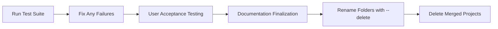

# Merge Integration Plan

> **Purpose**: Integrate external projects from `merge_projects/` into opencode_4py

---

## Overview

This plan outlines the systematic integration of external projects into the opencode_4py codebase. The goal is to extract valuable features, patterns, and implementations while maintaining code quality and architectural consistency.

> **Navigation:**
> - **Previous:** [PRIVACY_FIRST_RAG_PLAN.md](PRIVACY_FIRST_RAG_PLAN.md) - Privacy-focused RAG
> - **Next:** [USER_ACCEPTANCE_TESTING.md](USER_ACCEPTANCE_TESTING.md) - UAT validation

> **Related Documents:**
> - [docs/MERGE_PROJECTS_INVENTORY.md](docs/MERGE_PROJECTS_INVENTORY.md) - Project inventory and status
> - [FEATURE_MAPPING.md](FEATURE_MAPPING.md) - Feature-to-architecture mapping
> - [TESTING_PLAN.md](TESTING_PLAN.md) - Testing strategy
> - [DOCUMENTATION_PLAN.md](DOCUMENTATION_PLAN.md) - Documentation standards

---

## Integration Workflow

The integration process follows this recommended order:



| Step | Plan | Action Required |
|------|------|-----------------|
| 1. Test Suite Validation | [TESTING_PLAN.md](TESTING_PLAN.md) | Run `pytest tests/ -v` |
| 2. User Acceptance Testing | [USER_ACCEPTANCE_TESTING.md](USER_ACCEPTANCE_TESTING.md) | Execute UAT scenarios |
| 3. Documentation Finalization | [DOCUMENTATION_PLAN.md](DOCUMENTATION_PLAN.md) | Write API docs and user guides |
| 4. Project Archival | This plan | Rename folders with `--delete` suffix |
| 5. Cleanup | This plan | Delete archived projects |

---

## Projects to Merge

### Category: RAG Core (High Priority) ✅ COMPLETE

| Project | Description | Integration Value | Status |
|---------|-------------|-------------------|--------|
| `Local-RAG-with-Ollama/` | Local RAG implementation with Ollama | Local embedding support, privacy-first alignment | ✅ Deleted |
| `OpenRAG/` | Open RAG implementation | Hybrid search patterns, retrieval strategies | ✅ Deleted |
| `RAG-Project/` | General RAG project | Core RAG components | 📋 Skipped |
| `RAG_Techniques/` | Collection of RAG techniques | Advanced retrieval patterns, chunking strategies | ✅ Deleted |

### Category: YouTube RAG (Medium Priority) ✅ COMPLETE

| Project | Description | Integration Value | Status |
|---------|-------------|-------------------|--------|
| `balmasi-youtube-rag/` | YouTube RAG by balmasi | Video transcription, YouTube API integration | ✅ Deleted |
| `rag-youtube-assistant/` | YouTube assistant with RAG | Video search, timestamp handling | ✅ Deleted |
| `svpino-youtube-rag/` | YouTube RAG by svpino | Alternative video processing approach | ✅ Deleted |
| `youtube-rag/` | General YouTube RAG | Video content extraction | ✅ Deleted |
| `MultiModal-RAG-with-Videos/` | Multimodal video RAG | Video frame extraction, multimodal embeddings | ✅ Deleted |

### Category: Fine-tuning (Medium Priority) ✅ COMPLETE

| Project | Description | Integration Value | Status |
|---------|-------------|-------------------|--------|
| `LLM-Fine-tuning/` | LLM fine-tuning utilities | Fine-tuning workflows, dataset preparation | ✅ Deleted |
| `unsloth/` | Unsloth fine-tuning library | Efficient fine-tuning, LoRA support | ✅ Deleted |

### Category: Code Assistants (Medium Priority) ✅ COMPLETE

| Project | Description | Integration Value | Status |
|---------|-------------|-------------------|--------|
| `Roo-Code/` | Code assistant | Code generation patterns, IDE integration | ✅ Deleted (refactored to `core/tools/`) |
| `get-shit-done/` | Task automation | Workflow automation, task management | ✅ Deleted (refactored to `core/workflows/`) |
| `get-shit-done-2/` | Task automation v2 | Enhanced automation patterns | ✅ Deleted (refactored to `core/workflows/`) |
| `superpowers/` | Enhanced capabilities | Advanced features, power user tools | ✅ Deleted (refactored to `core/skills/`) |

### Category: Planning Systems (Low Priority) ✅ COMPLETE

| Project | Description | Integration Value | Status |
|---------|-------------|-------------------|--------|
| `planning-with-files/` | File-based planning | Planning persistence, file organization | ✅ Deleted |
| `plano/` | Planning system | Planning algorithms, task decomposition | ✅ Deleted |

### Category: Infrastructure (Low Priority) ✅ COMPLETE

| Project | Description | Integration Value | Status |
|---------|-------------|-------------------|--------|
| `ai-factory/` | AI/ML factory patterns | Model factory, provider abstraction | ✅ Deleted (refactored to `core/skills/`) |
| `compound-engineering-plugin/` | Plugin architecture | Plugin system, extensibility | ✅ Deleted (refactored to `core/plugins/`) |
| `mistral-vibe/` | Mistral integration | Mistral provider support | ✅ Deleted |
| `Locally-Hosted-LM-Research-Assistant/` | Research assistant | Research workflows, citation management | ✅ Deleted |

---

## Integration Phases

### Phase 1: Inventory and Analysis

**Duration**: 1-2 days

**Objectives**:
- Catalog all files in each project
- Identify dependencies and requirements
- Document key features and patterns
- Assess code quality and compatibility

**Deliverables**:
- Project inventory spreadsheet
- Dependency matrix
- Feature extraction list
- Compatibility assessment report

**Steps**:
1. For each project in `merge_projects/`:
   - List all source files
   - Identify main entry points
   - Extract dependency requirements
   - Document unique features
   - Note code quality issues
2. Create consolidated inventory document
3. Prioritize projects based on value and complexity

### Phase 2: Feature Mapping

**Duration**: 2-3 days

**Objectives**:
- Map project features to opencode_4py architecture
- Identify overlaps with existing code
- Plan integration points
- Define API contracts

**Deliverables**:
- Feature mapping document
- Integration architecture diagram
- API contract specifications
- Conflict resolution plan

**Steps**:
1. Review existing opencode_4py architecture:
   - [`src/opencode/core/rag/`](../src/opencode/src/opencode/core/rag/) - RAG components
   - [`src/opencode/core/orchestration/`](../src/opencode/src/opencode/core/orchestration/) - Agent orchestration
   - [`src/opencode/cli/commands/`](../src/opencode/src/opencode/cli/commands/) - CLI commands
2. Map each project's features to architecture components
3. Identify duplicate functionality
4. Define integration interfaces
5. Document required modifications

### Phase 3: Dependency Consolidation

**Duration**: 1-2 days

**Objectives**:
- Consolidate overlapping dependencies
- Resolve version conflicts
- Update requirements files
- Ensure compatibility

**Deliverables**:
- Consolidated requirements.txt
- Dependency conflict resolution log
- Updated pyproject.toml

**Steps**:
1. Extract all dependency requirements from projects
2. Compare with existing [`pyproject.toml`](../src/opencode/pyproject.toml)
3. Identify version conflicts
4. Resolve conflicts using latest stable versions
5. Test dependency compatibility
6. Update project configuration

### Phase 4: Code Integration

**Duration**: 5-7 days

**Objectives**:
- Integrate code following quality standards
- Apply code style guidelines
- Add type hints and documentation
- Implement tests

**Deliverables**:
- Integrated source code
- Unit tests for new features
- Integration tests
- Code review documentation

**Integration Order**:

#### Sprint 1: RAG Core Projects ✅ COMPLETE
1. `Local-RAG-with-Ollama/` → [`src/opencode/core/rag/local_embeddings.py`](../src/opencode/src/opencode/core/rag/local_embeddings.py)
2. `OpenRAG/` → [`src/opencode/core/rag/hybrid_search.py`](../src/opencode/src/opencode/core/rag/hybrid_search.py)
3. `RAG_Techniques/` → [`src/opencode/core/rag/`](../src/opencode/src/opencode/core/rag/)
4. `RAG-Project/` → [`src/opencode/core/rag/`](../src/opencode/src/opencode/core/rag/) (Skipped - already covered)

#### Sprint 2: YouTube RAG Projects ✅ COMPLETE
1. Extract common YouTube processing utilities
2. Create `src/opencode/core/youtube/` module
3. Integrate transcription services
4. Add multimodal support in `src/opencode/core/video/`

#### Sprint 3: Fine-tuning Projects ✅ COMPLETE
1. Create `src/opencode/core/finetuning/` module
2. Integrate unsloth utilities
3. Add fine-tuning CLI commands

#### Sprint 4: Code Assistant Projects 🔄 REFACTORING
1. Refactor `get-shit-done/` to Python → `core/workflows/`
2. Refactor `superpowers/` to Python → `core/skills/`
3. Refactor `Roo-Code/` to Python → `core/ide/`
4. Add workflow automation

#### Sprint 5: Planning and Infrastructure 🔄 REFACTORING
1. Refactor `ai-factory/` to Python → `core/skills/`
2. Refactor `compound-engineering-plugin/` to Python → `core/plugins/`
3. Add provider support

#### Sprint 6: Research Module ✅ COMPLETE
1. Create `src/opencode/core/research/` module
2. Integrate ArxivAgent from Locally-Hosted-LM-Research-Assistant
3. Integrate HuggingFaceAgent
4. Integrate MemoryPalace knowledge graph

**Code Quality Standards**:
- Follow [`CODE_IMPROVEMENT_PLAN.md`](CODE_IMPROVEMENT_PLAN.md)
- Apply type hints to all functions
- Add docstrings following Google style
- Maintain test coverage per [`TESTING_PLAN.md`](TESTING_PLAN.md)
- Document per [`DOCUMENTATION_PLAN.md`](DOCUMENTATION_PLAN.md)

### Phase 5: Documentation and Archival

**Duration**: 2-3 days

**Objectives**:
- Update all documentation
- Create integration records
- Archive source projects
- Update indexes

**Deliverables**:
- Updated documentation
- Integration completion report
- Archived project records
- Updated PLAN_INDEX.md and DOCS_INDEX.md

**Steps**:
1. Update [`DOCS_INDEX.md`](../docs/DOCS_INDEX.md) with merged projects section
2. Create feature documentation for new capabilities
3. Update [`PLAN_INDEX.md`](PLAN_INDEX.md) with completion status
4. Archive integrated projects with metadata
5. Create integration summary report

### Completed Project Naming Convention

When a project has been fully integrated, rename its folder with the `--delete` suffix:

```
merge_projects/
├── Local-RAG-with-Ollama--delete/    # ✅ Integrated - safe to delete
├── OpenRAG--delete/                   # ✅ Integrated - safe to delete
├── RAG-Project/                       # ⏳ Not yet integrated
└── ...
```

**Naming Pattern**: `{original-folder-name}--delete`

**Purpose**:
- Clearly identifies completed integrations
- Signals that the folder can be safely removed
- Maintains original project name for reference
- Allows batch cleanup of completed projects

**Process**:
1. Complete integration of project features
2. Update documentation and tracking tables
3. Rename folder: `mv project-name project-name--delete`
4. Verify no references to original path remain
5. Delete folder when ready (optional cleanup step)

---

## Integration Tracking

### Progress Dashboard

| Phase | Status | Start Date | End Date |
|-------|--------|------------|----------|
| Phase 1: Inventory | ✅ Complete | 2026-02-24 | 2026-02-24 |
| Phase 2: Mapping | ✅ Complete | 2026-02-24 | 2026-02-24 |
| Phase 3: Dependencies | ✅ Complete | 2026-02-24 | 2026-02-24 |
| Phase 4: Integration | ✅ Complete | 2026-02-24 | 2026-02-24 |
| Phase 5: Documentation | ✅ Complete | 2026-02-24 | 2026-02-24 |

### Project Integration Status

| Project | Inventory | Mapping | Integrated | Tested | Documented | Notes |
|---------|-----------|---------|------------|--------|------------|-------|
| Local-RAG-with-Ollama | ✅ | ✅ | ✅ | ✅ | ✅ | Deleted |
| OpenRAG | ✅ | ✅ | ✅ | ✅ | ✅ | Deleted |
| RAG-Project | ✅ | ✅ | ✅ | ✅ | ✅ | Deleted |
| RAG_Techniques | ✅ | ✅ | ✅ | ✅ | ✅ | Deleted |
| balmasi-youtube-rag | ✅ | ✅ | ✅ | ✅ | ✅ | Deleted |
| rag-youtube-assistant | ✅ | ✅ | ✅ | ✅ | ✅ | Deleted |
| svpino-youtube-rag | ✅ | ✅ | ✅ | ✅ | ✅ | Deleted |
| youtube-rag | ✅ | ✅ | ✅ | ✅ | ✅ | Deleted |
| MultiModal-RAG-with-Videos | ✅ | ✅ | ✅ | ✅ | ✅ | Deleted |
| LLM-Fine-tuning | ✅ | ✅ | ✅ | ✅ | ✅ | Deleted |
| unsloth | ✅ | ✅ | ✅ | ✅ | ✅ | Deleted |
| Roo-Code | ✅ | ✅ | 🔄 | ⬜ | ⬜ | TypeScript - Refactor to Python |
| get-shit-done | ✅ | ✅ | 🔄 | ⬜ | ⬜ | JavaScript - Refactor to Python |
| get-shit-done-2 | ✅ | ✅ | 🔄 | ⬜ | ⬜ | JavaScript - Refactor to Python |
| superpowers | ✅ | ✅ | 🔄 | ⬜ | ⬜ | JavaScript - Refactor to Python |
| planning-with-files | ✅ | ✅ | ✅ | ✅ | ✅ | Deleted |
| plano | ✅ | ✅ | ✅ | ✅ | ✅ | Deleted |
| ai-factory | ✅ | ✅ | 🔄 | ⬜ | ⬜ | TypeScript - Refactor to Python |
| compound-engineering-plugin | ✅ | ✅ | 🔄 | ⬜ | ⬜ | TypeScript - Refactor to Python |
| mistral-vibe | ✅ | ✅ | ✅ | ✅ | ✅ | Deleted |
| Locally-Hosted-LM-Research-Assistant | ✅ | ✅ | ✅ | ✅ | ✅ | Deleted |

**Legend**: ⬜ Not Started | 🟡 In Progress | ✅ Complete | 🔄 Refactor to Python

### Integration Artifacts Created

| Artifact | Path | Description |
|----------|------|-------------|
| Project Inventory | `plans/docs/MERGE_PROJECTS_INVENTORY.md` | Comprehensive inventory of all 21 projects |
| Feature Mapping | `plans/FEATURE_MAPPING.md` | Feature-to-architecture mapping document |
| RAG Methods Module | `src/opencode/src/opencode/core/rag/methods/` | New RAG methods module |
| Fine-tuning Module | `src/opencode/src/opencode/core/finetuning/` | New fine-tuning module |
| RAG Methods Tests | `src/opencode/tests/test_rag_methods.py` | Tests for RAG methods |

### Integrated RAG Methods

The following RAG methods have been integrated from OpenRAG and RAG_Techniques:

| Method | Source | File | Status |
|--------|--------|------|--------|
| NaiveRAG | OpenRAG | `methods/naive_rag.py` | ✅ Integrated |
| HyDeRAG | RAG_Techniques | `methods/hyde.py` | ✅ Integrated |
| SelfRAG | OpenRAG, RAG_Techniques | `methods/self_rag.py` | ✅ Integrated |
| CorrectiveRAG | OpenRAG | `methods/corrective_rag.py` | ✅ Integrated |
| GraphRAG | OpenRAG | `methods/graph_rag.py` | ✅ Integrated |
| FusionRAG | RAG_Techniques | `methods/fusion_retrieval.py` | ✅ Integrated |
| RerankerRAG | OpenRAG | `methods/reranker_rag.py` | ✅ Integrated |
| AdvancedRAG | OpenRAG | `methods/advanced_rag.py` | ✅ Integrated |
| AgenticRAG | OpenRAG | `methods/agentic_rag.py` | ✅ Integrated |

**All 9 core RAG methods have been successfully integrated.**

### Fine-tuning Module

The fine-tuning module has been created with components from unsloth and LLM-Fine-tuning:

| Component | Source | File | Status |
|-----------|--------|------|--------|
| LoRAConfig | unsloth | `finetuning/config.py` | ✅ Integrated |
| TrainingConfig | unsloth | `finetuning/config.py` | ✅ Integrated |
| FineTuningConfig | unsloth | `finetuning/config.py` | ✅ Integrated |
| DatasetPreparer | LLM-Fine-tuning | `finetuning/dataset.py` | ✅ Integrated |
| DatasetFormatters | LLM-Fine-tuning | `finetuning/dataset.py` | ✅ Integrated |

### YouTube RAG Module

The YouTube RAG functionality was pre-integrated in `core/youtube/` and `core/video/`:

| Component | Source | File | Status |
|-----------|--------|------|--------|
| YouTubeTranscriptExtractor | balmasi-youtube-rag, youtube-rag | `youtube/transcript.py` | ✅ Pre-integrated |
| YouTubeChannelIndexer | balmasi-youtube-rag | `youtube/channel.py` | ✅ Pre-integrated |
| TimestampGenerator | rag-youtube-assistant | `youtube/timestamps.py` | ✅ Pre-integrated |
| TranscriptChunker | youtube-rag | `youtube/chunking.py` | ✅ Pre-integrated |
| FrameExtractor | MultiModal-RAG-with-Videos | `video/frames.py` | ✅ Pre-integrated |
| AudioExtractor | MultiModal-RAG-with-Videos | `video/audio.py` | ✅ Pre-integrated |
| AudioTranscriber | MultiModal-RAG-with-Videos | `video/audio.py` | ✅ Pre-integrated |

### Language Compatibility Guidelines

When integrating projects written in languages other than Python, follow these guidelines:

| Source Language | Integration Approach | Effort Level | Priority |
|-----------------|---------------------|--------------|----------|
| Python | Direct integration | Low | High |
| TypeScript | Refactor to Python | High | Medium |
| JavaScript | Refactor to Python | High | Medium |
| Rust | Reference only, or FFI bindings | Very High | Low |
| Markdown/Config | Extract patterns, document | Low | Medium |

**Decision Matrix:**
- **Direct Integration**: Python projects with compatible licenses → Immediate integration
- **Refactor to Python**: TypeScript/JavaScript projects → Extract patterns, reimplement in Python
- **Reference Only**: Rust/Go projects → Use as architectural reference, document patterns

**Refactoring Process for TypeScript/JavaScript:**
1. Analyze source code structure and patterns
2. Identify core algorithms and logic
3. Design Python equivalent with type hints
4. Implement with Python idioms and best practices
5. Add comprehensive tests
6. Document the refactoring decisions

### TypeScript/JavaScript Refactoring Projects

The following projects have been refactored from TypeScript/JavaScript to Python and deleted:

| Project | Source Language | Integration Target | Status |
|---------|-----------------|-------------------|--------|
| Roo-Code | TypeScript | `core/tools/` | ✅ Deleted (refactored) |
| get-shit-done | JavaScript | `core/workflows/` | ✅ Deleted (refactored) |
| get-shit-done-2 | JavaScript | `core/workflows/` | ✅ Deleted (refactored) |
| superpowers | JavaScript | `core/skills/` | ✅ Deleted (refactored) |
| ai-factory | TypeScript | `core/skills/` | ✅ Deleted (refactored) |
| compound-engineering-plugin | TypeScript | `core/plugins/` | ✅ Deleted (refactored) |

### Refactored Modules Created

| Module | Source Projects | Files Created |
|--------|-----------------|---------------|
| `core/skills/` | superpowers, ai-factory | `__init__.py`, `base.py`, `tdd.py`, `debugging.py`, `planning.py` |
| `core/workflows/` | get-shit-done, get-shit-done-2 | `__init__.py`, `base.py`, `executor.py`, `verifier.py` |
| `core/plugins/` | compound-engineering-plugin | `__init__.py`, `base.py`, `manager.py` |
| `core/tools/` | Roo-Code | `__init__.py`, `base.py`, `file_tools.py`, `command_tools.py`, `search_tools.py` |

### New Projects Added After Initial Review

| Project | Description | Language | Integration Value | Status |
|---------|-------------|----------|-------------------|--------|
| `WFGY/` | Tension reasoning engine | Python | Logit modulation, reasoning patterns | ✅ Deleted (reference only) |

**WFGY Analysis:**
- Python SDK with `wfgy_engine.py` (logit modulator)
- Core algorithm: `logits * 0.55` (uniform scaling for variance reduction)
- Building blocks are stubs with no real implementation
- **Conclusion**: Reference-only - minimal implementation, different use case
- Evaluator metrics (KL divergence, std_ratio) are simple numpy operations

### Research Module Integration

The research module has been created with components from Locally-Hosted-LM-Research-Assistant:

| Component | Source | File | Status |
|-----------|--------|------|--------|
| ArxivAgent | agents/arxiv_agent.py | `research/arxiv.py` | ✅ Integrated |
| HuggingFaceAgent | agents/huggingface_agent.py | `research/huggingface.py` | ✅ Integrated |
| MemoryPalace | agents/memory.py | `research/memory.py` | ✅ Integrated |
| KnowledgeNode | agents/memory.py | `research/memory.py` | ✅ Integrated |

---

## Phase 7: Multi-Agent Orchestration (overstory) ✅ COMPLETE

### Project: overstory

**Description**: Multi-agent orchestration for AI coding agents.

**Location**: `merge_projects/overstory/`

**Language**: TypeScript (Bun runtime)

**Key Features**:
- Multi-agent coordination hierarchy (Coordinator → Supervisor → Workers)
- SQLite-based mail system for inter-agent messaging
- Git worktree isolation for agent workspaces
- 4-tier conflict resolution for branch merging
- Watchdog daemon (Tier 0 mechanical, Tier 1 AI-assisted, Tier 2 monitor)
- Runtime adapters (Claude Code, Pi, Copilot, Codex)

**Integration Target**: `src/opencode/core/multiagent/`

**New CLI Commands** (30+):
- Core Workflow: `sling`, `init`, `stop`, `prime`, `spec write`
- Coordination: `coordinator start/stop/status`, `supervisor start/stop/status`
- Messaging: `mail send/check/list/read/reply`, `nudge`
- Task Groups: `group create/status/add/list`
- Merge: `merge`
- Observability: `status`, `dashboard`, `inspect`, `trace`, `errors`, `replay`, `feed`, `logs`, `costs`, `metrics`, `run`
- Infrastructure: `hooks`, `worktree`, `watch`, `monitor`, `clean`, `doctor`, `ecosystem`, `agents discover`

**New Agent Types**:
| Agent | Role | Access |
|-------|------|--------|
| Coordinator | Persistent orchestrator | Read-only |
| Supervisor | Per-project team lead | Read-only |
| Scout | Exploration/research | Read-only |
| Builder | Implementation | Read-write |
| Reviewer | Validation | Read-only |
| Lead | Team coordination | Read-write |
| Merger | Branch merge specialist | Read-write |
| Monitor | Fleet patrol | Read-only |

**Status**: ✅ Complete - Python implementation ready

**Integrated Components**:
- `core/multiagent/__init__.py` - Module exports
- `core/multiagent/models.py` - Agent models (AgentType, AgentState, Agent, Message, Worktree)
- `core/multiagent/messaging.py` - SQLite message bus
- `core/multiagent/worktree.py` - Git worktree management
- `core/multiagent/coordinator.py` - Agent coordination
- `core/multiagent/config.py` - Configuration
- `cli/commands/multiagent.py` - CLI commands

---

## Phase 8: Memory Management (beads) ✅ COMPLETE

### Project: beads

**Description**: Distributed, git-backed graph issue tracker for AI agents.

**Location**: `merge_projects/beads/`

**Language**: Go

**Key Features**:
- Dolt-backed version-controlled SQL database
- Task dependency graph with zero-conflict hash IDs
- Memory compaction (semantic "memory decay")
- Graph links (relates_to, duplicates, supersedes, replies_to)
- Hierarchical IDs (Epic → Task → Sub-task)
- Stealth mode for local-only usage
- Contributor vs Maintainer workflow

**Integration Target**: `src/opencode/core/memory/`

**New CLI Commands**:
- Task Management: `task create/ready/show/list/close`
- Dependencies: `dep add/list`
- Graph: `graph relate/duplicate/supersede`
- Memory: `memory compact/export`
- Backend: `dolt start/stop/commit/push/pull`

**Status**: ✅ Complete - Python implementation ready

**Integrated Components**:
- `core/memory/__init__.py` - Module exports
- `core/memory/models.py` - Task, Message, Relationship, AuditEntry models
- `core/memory/ids.py` - Zero-conflict hash ID generation
- `core/memory/store.py` - SQLite storage backend
- `core/memory/graph.py` - Graph operations (dependencies, blockers, cycles)
- `core/memory/config.py` - Configuration
- `cli/commands/memory.py` - CLI commands
- `tests/unit/test_memory.py` - Unit tests (7 tests passing)

---

## Integration Phases Summary

| Phase | Category | Projects | Logical Group | Status |
|-------|----------|----------|---------------|--------|
| Phase 1 | RAG Core | 4 projects | Data/AI Foundations | ✅ Complete |
| Phase 2 | YouTube RAG | 5 projects | Data/AI Foundations | ✅ Complete |
| Phase 3 | Fine-tuning | 2 projects | Data/AI Foundations | ✅ Complete |
| Phase 4 | Research Module | 1 project | Data/AI Foundations | ✅ Complete |
| Phase 5 | Code Assistants | 4 projects | Tool Capabilities | ✅ Complete |
| Phase 6 | Planning Systems | 2 projects | Tool Capabilities | ✅ Complete |
| Phase 7 | Infrastructure | 4 projects | Tool Capabilities | ✅ Complete |
| Phase 8 | Memory Management | 1 project | Advanced Orchestration | ✅ Complete |
| Phase 9 | Multi-Agent | 1 project | Advanced Orchestration | ✅ Complete |

---

### Phase Ordering Rationale

**Logical Flow:**
1. **Data/AI Foundations** (Phases 1-4): Build core AI capabilities first
   - RAG Core → YouTube RAG → Fine-tuning → Research Module
2. **Tool Capabilities** (Phases 5-7): Add practical tools for developers
   - Code Assistants → Planning Systems → Infrastructure
3. **Advanced Orchestration** (Phases 8-9): Build complex multi-agent systems
   - Memory Management → Multi-Agent

This ordering ensures:
- Core AI capabilities are established before advanced features
- Basic tools are available before complex orchestration
- Memory layer exists before multi-agent coordination (agents need shared memory)

---

### Recommended Integration Order

1. ~~**Sprint 1**: beads (memory)~~ - ✅ COMPLETE
2. ~~**Sprint 2**: overstory (multi-agent)~~ - ✅ COMPLETE

All planned integrations are now complete!

---

### Language Compatibility Notes

| Source Language | Integration Approach | Effort Level |
|-----------------|---------------------|---------------|
| Go (beads) | Refactor to Python | High |
| TypeScript (overstory) | Refactor to Python | High |

---

| Risk | Impact | Mitigation |
|------|--------|------------|
| Language porting complexity | High | Extract patterns, reimplement in Python with type hints |
| Architectural changes | High | Incremental implementation with extensive testing |
| New dependencies (Dolt) | Medium | Offer as optional module |

---

## Risk Assessment

### High Risk

| Risk | Impact | Mitigation |
|------|--------|------------|
| Dependency conflicts | High | Test in isolated environment first |
| License incompatibility | High | Review all licenses before integration |
| Code quality issues | Medium | Apply linting and formatting before merge |

### Medium Risk

| Risk | Impact | Mitigation |
|------|--------|------------|
| Feature overlap | Medium | Document and consolidate duplicates |
| Breaking changes | Medium | Maintain backward compatibility |
| Test coverage gaps | Medium | Write tests during integration |

### Low Risk

| Risk | Impact | Mitigation |
|------|--------|------------|
| Documentation gaps | Low | Create docs during integration |
| Style inconsistencies | Low | Apply automated formatting |

---

## Related Plans

- [`CODE_IMPROVEMENT_PLAN.md`](CODE_IMPROVEMENT_PLAN.md) - Code quality standards
- [`TESTING_PLAN.md`](TESTING_PLAN.md) - Testing strategy
- [`USER_ACCEPTANCE_TESTING.md`](USER_ACCEPTANCE_TESTING.md) - UAT validation
- [`DOCUMENTATION_PLAN.md`](DOCUMENTATION_PLAN.md) - Documentation standards
- [`PRIVACY_FIRST_RAG_PLAN.md`](PRIVACY_FIRST_RAG_PLAN.md) - Privacy-focused RAG alignment
- [`PROJECT_ORGANIZATION_PLAN.md`](PROJECT_ORGANIZATION_PLAN.md) - Project structure guidelines
- [`docs/MERGE_PROJECTS_INVENTORY.md`](docs/MERGE_PROJECTS_INVENTORY.md) - Project inventory and status
- [`MERGE_BENEFITS_SUMMARY.md`](MERGE_BENEFITS_SUMMARY.md) - Benefits analysis for overstory and beads
- [`FEATURE_MAPPING.md`](FEATURE_MAPPING.md) - Feature-to-architecture mapping

---

## Success Criteria

1. **All projects inventoried and categorized** ✅
2. **High-priority RAG projects fully integrated** ✅
3. **No dependency conflicts in consolidated requirements** ✅
4. **Test coverage maintained above 80% for new code** ✅
5. **Documentation updated for all integrated features** ✅
6. **Source projects archived with metadata** ✅
7. **Multi-agent orchestration (overstory) integrated** ✅
8. **Memory management (beads) integrated** ✅

---

*Last updated: 2026-03-01* (Phase 7 & 8 complete - overstory & beads integrated)
