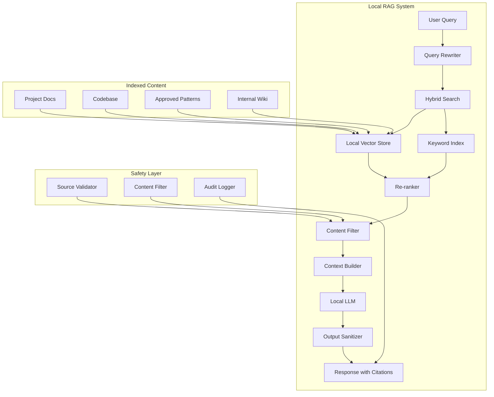

# Privacy-First RAG Implementation Plan

## Overview

This plan outlines the implementation of a privacy-first RAG system that:
- Eliminates external API calls for embeddings and retrieval
- Improves accuracy through curated, verified sources
- Enhances safety with content filtering and audit logging
- Enables fully offline operation

> **Navigation:**
> - **Previous:** [DOCUMENTATION_PLAN.md](DOCUMENTATION_PLAN.md) - Documentation strategy
> - **Next:** [PROJECT_ORGANIZATION_PLAN.md](PROJECT_ORGANIZATION_PLAN.md) - Project structure

> **Related Documents:**
> - [README.md](../README.md) - Project overview and features
> - [MISSION.md](../MISSION.md) - Mission statement and core principles

## Goals

1. **Zero External Dependencies**: All RAG operations run locally
2. **Curated Knowledge**: Only verified, approved content is indexed
3. **Safety First**: Content filtering, source validation, output sanitization
4. **Auditability**: Full logging of queries and sources used
5. **Offline Capable**: Works without internet connection

## Architecture



## Implementation Phases

### Phase 1: Local Embedding Infrastructure

**Goal**: Set up local embedding generation without external APIs

#### 1.1 Local Embedding Engine

**File**: `src/opencode/src/opencode/core/rag/local_embeddings.py`

```python
class LocalEmbeddingEngine:
    """
    Local embedding generation using Ollama.
    
    No external API calls - all embeddings generated locally.
    """
    
    def __init__(self, model: str = "nomic-embed-text"):
        self.model = model
        self.ollama_client = OllamaClient()
    
    async def embed(self, text: str) -> List[float]:
        """Generate embedding locally."""
        return await self.ollama_client.embeddings(self.model, text)
    
    async def embed_batch(self, texts: List[str]) -> List[List[float]]:
        """Batch embedding for efficiency."""
        return await asyncio.gather(*[self.embed(t) for t in texts])
```

#### 1.2 Configuration

```toml
[rag.embeddings]
provider = "ollama"
model = "nomic-embed-text"
dimensions = 768
batch_size = 32
cache_enabled = true
cache_path = "./RAG/.embedding_cache"
```

---

### Phase 2: Local Vector Store

**Goal**: Implement local vector storage with no external dependencies

#### 2.1 Vector Store Implementation

**File**: `src/opencode/src/opencode/core/rag/local_vector_store.py`

```python
class LocalVectorStore:
    """
    Local vector store using Chroma or FAISS.
    
    Features:
    - Persistent storage
    - Fast similarity search
    - Metadata filtering
    - No external dependencies
    """
    
    def __init__(self, path: str, engine: str = "chroma"):
        self.path = path
        self.engine = engine
        self._init_store()
    
    async def add(
        self,
        documents: List[Document],
        embeddings: List[List[float]],
    ) -> None:
        """Add documents with embeddings."""
        pass
    
    async def search(
        self,
        query_embedding: List[float],
        top_k: int = 5,
        filter: Optional[Dict] = None,
    ) -> List[SearchResult]:
        """Search for similar documents."""
        pass
```

#### 2.2 Hybrid Search

**File**: `src/opencode/src/opencode/core/rag/hybrid_search.py`

```python
class HybridSearch:
    """
    Combines semantic and keyword search for accuracy.
    """
    
    async def search(
        self,
        query: str,
        query_embedding: List[float],
        top_k: int = 10,
    ) -> List[SearchResult]:
        # Semantic search
        semantic_results = await self.vector_store.search(
            query_embedding, top_k=top_k * 2
        )
        
        # Keyword search (BM25)
        keyword_results = await self.keyword_index.search(
            query, top_k=top_k * 2
        )
        
        # Merge and re-rank
        return self._merge_results(semantic_results, keyword_results, top_k)
```

---

### Phase 3: Content Curation System

**Goal**: System for managing curated, verified knowledge sources

#### 3.1 Source Manager

**File**: `src/opencode/src/opencode/core/rag/source_manager.py`

```python
class SourceManager:
    """
    Manages curated knowledge sources.
    
    Only approved sources are indexed.
    """
    
    def __init__(self, config: SourceConfig):
        self.allowed_sources = config.allowed_sources
        self.blocked_patterns = config.blocked_patterns
    
    def validate_source(self, path: Path) -> bool:
        """Check if source is allowed."""
        # Check against allowed sources
        # Check for blocked patterns
        # Verify file integrity
        pass
    
    async def index_source(
        self,
        source: Path,
        metadata: Optional[Dict] = None,
    ) -> IndexResult:
        """Index a verified source."""
        if not self.validate_source(source):
            raise SourceValidationError(f"Source not allowed: {source}")
        
        # Process and index
        pass
```

#### 3.2 Configuration

```toml
[rag.sources]
# Only these directories can be indexed
allowed_sources = [
    "./docs",
    "./src",
    "./RAG/sources",
]

# Patterns to exclude
blocked_patterns = [
    "**/secrets/**",
    "**/.env*",
    "**/credentials/**",
]

# File types to index
file_patterns = ["*.md", "*.py", "*.txt", "*.rst"]
```

---

### Phase 4: Safety Layer

**Goal**: Content filtering, source validation, and output sanitization

#### 4.1 Content Filter

**File**: `src/opencode/src/opencode/core/rag/safety/content_filter.py`

```python
class ContentFilter:
    """
    Filters sensitive content from RAG operations.
    """
    
    SENSITIVE_PATTERNS = [
        r"password\s*[:=]\s*\S+",
        r"api[_-]?key\s*[:=]\s*\S+",
        r"secret\s*[:=]\s*\S+",
        r"token\s*[:=]\s*\S+",
        r"\b\d{16}\b",  # Credit card numbers
        r"\b\d{3}-\d{2}-\d{4}\b",  # SSN
    ]
    
    def filter_content(self, content: str) -> FilteredContent:
        """Remove or redact sensitive content."""
        filtered = content
        redactions = []
        
        for pattern in self.SENSITIVE_PATTERNS:
            matches = re.findall(pattern, content)
            for match in matches:
                redacted = self._redact(match)
                filtered = filtered.replace(match, redacted)
                redactions.append({
                    "pattern": pattern,
                    "original_length": len(match),
                })
        
        return FilteredContent(
            content=filtered,
            redactions=redactions,
            is_safe=len(redactions) == 0,
        )
```

#### 4.2 Output Sanitizer

**File**: `src/opencode/src/opencode/core/rag/safety/output_sanitizer.py`

```python
class OutputSanitizer:
    """
    Sanitizes LLM output before returning to user.
    """
    
    def sanitize(self, output: str, context: SanitizationContext) -> SanitizedOutput:
        """Remove any leaked sensitive information."""
        # Check for accidentally included secrets
        # Validate citations match sources
        # Ensure no external URLs leaked
        pass
```

#### 4.3 Audit Logger

**File**: `src/opencode/src/opencode/core/rag/safety/audit_logger.py`

```python
class RAGAuditLogger:
    """
    Logs all RAG operations for audit purposes.
    """
    
    async def log_query(
        self,
        query: str,
        sources_used: List[str],
        response_preview: str,
    ) -> None:
        """Log a RAG query."""
        pass
    
    async def log_indexing(
        self,
        source: str,
        document_count: int,
        indexed_by: str,
    ) -> None:
        """Log indexing operation."""
        pass
```

---

### Phase 5: Citation System

**Goal**: Track and cite sources used in responses

#### 5.1 Citation Manager

**File**: `src/opencode/src/opencode/core/rag/citations.py`

```python
class CitationManager:
    """
    Manages citations for RAG responses.
    
    Every response includes source citations.
    """
    
    def build_citations(
        self,
        sources: List[SearchResult],
    ) -> List[Citation]:
        """Build citation list from sources."""
        pass
    
    def format_response_with_citations(
        self,
        response: str,
        citations: List[Citation],
    ) -> str:
        """Append citations to response."""
        pass
```

---

### Phase 6: CLI Commands

**Goal**: CLI interface for RAG management

#### 6.1 RAG Commands

**File**: `src/opencode/src/opencode/cli/commands/rag.py`

```python
@app.command("rag")
def rag_commands():
    """RAG management commands."""
    pass

@app.command("rag create")
def create_rag(
    agent: str,
    source: List[str],
    embedding_model: str = "nomic-embed-text",
):
    """Create RAG index for an agent."""
    pass

@app.command("rag query")
def query_rag(
    agent: str,
    query: str,
    top_k: int = 5,
):
    """Query an agent's RAG."""
    pass

@app.command("rag add")
def add_to_rag(
    agent: str,
    source: str,
):
    """Add source to existing RAG."""
    pass

@app.command("rag status")
def rag_status(agent: Optional[str] = None):
    """Show RAG status."""
    pass

@app.command("rag audit")
def rag_audit(
    agent: str,
    days: int = 7,
):
    """Show RAG audit log."""
    pass
```

---

### Phase 7: Configuration

**Goal**: Complete configuration for privacy-first RAG

#### 7.1 Full Configuration

```toml
# opencode.toml

[rag]
# Privacy settings
allow_external_apis = false
allow_web_search = false
offline_mode = true

# Embedding settings
[rag.embeddings]
provider = "ollama"
model = "nomic-embed-text"
dimensions = 768
batch_size = 32
cache_enabled = true

# Vector store settings
[rag.vector_store]
engine = "chroma"
persist = true
path = "./RAG/.vector_store"

# Search settings
[rag.search]
hybrid_search = true
semantic_weight = 0.7
keyword_weight = 0.3
top_k = 5
min_similarity = 0.7

# Safety settings
[rag.safety]
content_filter = true
output_sanitization = true
audit_logging = true
require_citations = true

# Source settings
[rag.sources]
allowed_sources = ["./docs", "./src", "./RAG/sources"]
blocked_patterns = ["**/secrets/**", "**/.env*"]
file_patterns = ["*.md", "*.py", "*.txt"]
```

---

## File Structure

```
opencode_4py/
├── RAG/
│   ├── README.md
│   ├── .vector_store/           # Local vector store
│   ├── .embedding_cache/        # Embedding cache
│   ├── audit.log                # Audit log
│   ├── agent_code/
│   │   ├── config.json
│   │   └── RAG/
│   │       ├── code-RAG/
│   │       ├── sources/
│   │       │   ├── patterns/
│   │       │   └── standards/
│   │       └── README-RAG.md
│   └── agent_architect/
│       └── ...
│
└── src/opencode/src/opencode/core/rag/
    ├── __init__.py
    ├── config.py
    ├── pipeline.py
    ├── local_embeddings.py      # Phase 1
    ├── local_vector_store.py    # Phase 2
    ├── hybrid_search.py         # Phase 2
    ├── source_manager.py        # Phase 3
    ├── citations.py             # Phase 5
    ├── agent_rag_manager.py
    └── safety/
        ├── __init__.py
        ├── content_filter.py    # Phase 4
        ├── output_sanitizer.py  # Phase 4
        └── audit_logger.py      # Phase 4
```

---

### Phase 8: Content Validation & Correction System

**Goal**: Improve RAG accuracy by detecting, logging, and removing false content

#### 8.1 False Content Detection

**File**: `src/opencode/src/opencode/core/rag/validation/content_validator.py`

```python
class ContentValidator:
    """
    Validates RAG content for accuracy.
    
    Detection methods:
    - Test-based validation: Content fails tests
    - AI-based validation: Model determines content is incorrect
    - User-accepted corrections: User confirms false content
    """
    
    async def validate_content(
        self,
        content: str,
        source_id: str,
        validation_type: str,  # "test", "ai", "user"
    ) -> ValidationResult:
        """Validate content and return result."""
        pass
    
    async def mark_false_content(
        self,
        content_id: str,
        reason: str,
        evidence: Optional[str] = None,
    ) -> FalseContentRecord:
        """Mark content as false and log it."""
        pass
```

#### 8.2 False Content Registry

**File**: `src/opencode/src/opencode/core/rag/validation/false_content_registry.py`

```python
class FalseContentRegistry:
    """
    Registry of content marked as false.
    
    Tracks:
    - Content marked as false
    - Reason for marking
    - Evidence/test results
    - User who confirmed
    - Timestamp
    """
    
    async def add_false_content(
        self,
        content: str,
        source_id: str,
        reason: str,
        evidence: Optional[str] = None,
        confirmed_by: Optional[str] = None,
    ) -> FalseContentRecord:
        """Add content to false content registry."""
        pass
    
    async def get_false_content_for_source(
        self,
        source_id: str,
    ) -> List[FalseContentRecord]:
        """Get all false content for a source."""
        pass
    
    async def is_content_false(
        self,
        content: str,
    ) -> bool:
        """Check if content is in false content registry."""
        pass
```

#### 8.3 RAG Regeneration

**File**: `src/opencode/src/opencode/core/rag/validation/rag_regenerator.py`

```python
class RAGRegenerator:
    """
    Regenerates RAG index after content removal.
    
    Process:
    1. Remove false content from source
    2. Re-index affected documents
    3. Update vector store
    4. Log regeneration
    """
    
    async def regenerate_after_removal(
        self,
        source_id: str,
        false_content_ids: List[str],
    ) -> RegenerationResult:
        """Remove false content and regenerate RAG."""
        pass
```

#### 8.4 Validation-Aware RAG Pipeline

**File**: `src/opencode/src/opencode/core/rag/validation/validation_pipeline.py`

```python
class ValidationAwareRAGPipeline:
    """
    RAG pipeline that filters false content.
    
    Features:
    - Filters false content from search results
    - Logs when false content would have been returned
    - Suggests corrections based on validation history
    """
    
    async def query_with_validation(
        self,
        query: str,
        top_k: int = 5,
    ) -> ValidatedQueryResult:
        """Query RAG with false content filtering."""
        # Get results
        results = await self.hybrid_search.search(query, top_k=top_k * 2)
        
        # Filter false content
        validated_results = []
        for result in results:
            if not await self.registry.is_content_false(result.text):
                validated_results.append(result)
            else:
                # Log that false content was filtered
                await self.log_filtered_content(result)
        
        return ValidatedQueryResult(
            results=validated_results[:top_k],
            filtered_count=len(results) - len(validated_results),
        )
```

#### 8.5 CLI Commands

**File**: `src/opencode/src/opencode/cli/commands/rag.py` (extend existing)

```python
@app.command("mark-false")
def mark_false_content(
    agent: str = typer.Argument(..., help="Agent name"),
    content_id: str = typer.Argument(..., help="Content ID to mark as false"),
    reason: str = typer.Option(..., "--reason", "-r", help="Reason for marking as false"),
    evidence: Optional[str] = typer.Option(None, "--evidence", "-e", help="Evidence/test results"),
):
    """Mark content as false and trigger regeneration."""
    pass

@app.command("list-false")
def list_false_content(
    agent: str = typer.Argument(..., help="Agent name"),
    source: Optional[str] = typer.Option(None, "--source", "-s", help="Filter by source"),
):
    """List all false content for an agent."""
    pass

@app.command("regenerate")
def regenerate_rag(
    agent: str = typer.Argument(..., help="Agent name"),
    source: Optional[str] = typer.Option(None, "--source", "-s", help="Regenerate specific source"),
):
    """Regenerate RAG index after content removal."""
    pass
```

#### 8.6 Configuration

```toml
[rag.validation]
# Enable content validation
enabled = true

# Auto-filter false content from results
auto_filter = true

# Log when false content is filtered
log_filtered = true

# Require user confirmation for AI-detected false content
require_user_confirmation = true

# Path to false content registry
registry_path = "./RAG/.false_content_registry.json"
```

---

## Success Criteria

1. **Zero External Calls**: No API calls to external services
2. **Offline Operation**: Works without internet
3. **Curated Sources**: Only approved content indexed
4. **Content Filtering**: Sensitive data filtered
5. **Citations**: All responses cite sources
6. **Audit Trail**: All operations logged
7. **Accuracy**: Hybrid search with re-ranking
8. **False Content Detection**: Content validated and false content removed
9. **Self-Improving**: RAG improves over time as false content is identified

---

## Estimated Effort

| Phase | Complexity |
|-------|------------|
| Phase 1: Local Embeddings | Medium |
| Phase 2: Vector Store | Medium |
| Phase 3: Content Curation | Low |
| Phase 4: Safety Layer | Medium |
| Phase 5: Citations | Low |
| Phase 6: CLI Commands | Low |
| Phase 7: Configuration | Low |
| Phase 8: Content Validation & Correction | Medium |

---

## Next Steps

1. Review and approve this plan
2. Create feature branch
3. Implement Phase 1 (Local Embeddings)
4. Implement Phase 2 (Vector Store)
5. Implement Phase 3 (Content Curation)
6. Implement Phase 4 (Safety Layer)
7. Implement Phase 5 (Citations)
8. Implement Phase 6 (CLI Commands)
9. Implement Phase 7 (Configuration)
10. Implement Phase 8 (Content Validation & Correction)
11. Update documentation
12. Create PR for review
