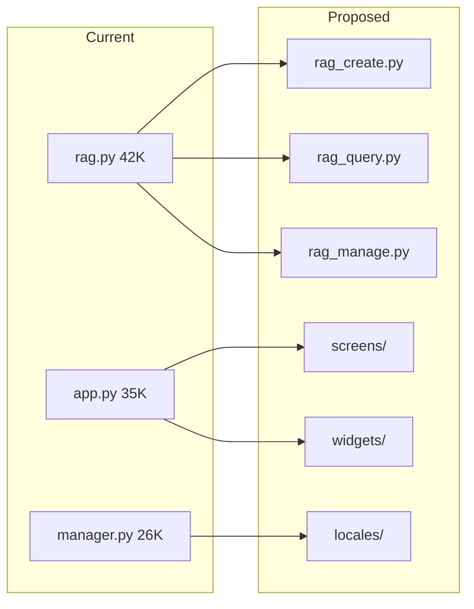

# Project Review Findings & Improvement Recommendations

> **Review Date**: 2026-02-23
> **Review Scope**: Documentation, Code Organization, UI/UX, RAG Implementation

> **Related Documents:**
> - [README.md](../README.md) - Project overview and features
> - [MISSION.md](../MISSION.md) - Mission statement and core principles

---

## Executive Summary

This document presents findings from a comprehensive review of the OpenCode Python project and provides actionable improvement recommendations organized by priority.

### Overall Assessment

| Area | Current State | Risk Level | Action Priority |
|------|---------------|------------|-----------------|
| Documentation | Large files, potential overlaps, some outdated | Medium | High |
| Code Organization | Well-structured but some large files | Low | Medium |
| UI/UX | Functional TUI, some missing features | Low | Medium |
| RAG | Mature with excellent error documentation | Low | Low (maintenance) |

---

## Part 1: Documentation Findings

### 1.1 Large Documentation Files

The following files exceed 30,000 characters and should be reviewed for splitting or archival:

| File | Size | Recommendation |
|------|------|----------------|
| [`plans/MULTI_MODEL_IMPLEMENTATION_PLAN.md`](plans/MULTI_MODEL_IMPLEMENTATION_PLAN.md) | 66,646 chars | **Archive** - Infrastructure exists per IMPLEMENTATION_STATUS |
| [`docs/MIGRATION_PLAN.md`](docs/MIGRATION_PLAN.md) | 52,986 chars | **Archive** - 98% complete, historical reference |
| [`plans/PROJECT_INTEGRATION_PLAN.md`](plans/PROJECT_INTEGRATION_PLAN.md) | 54,124 chars | **Archive** - Marked complete in IMPLEMENTATION_STATUS |
| [`plans/TESTING_PLAN.md`](plans/TESTING_PLAN.md) | 36,391 chars | **Keep** - Active reference |
| [`docs/AGENT_MODEL_ORCHESTRATION.md`](docs/AGENT_MODEL_ORCHESTRATION.md) | 35,126 chars | **Keep** - Active architecture reference |
| [`plans/FOR_TESTING_PLAN.md`](plans/FOR_TESTING_PLAN.md) | 32,532 chars | **Keep** - Active reference |

### 1.2 Documentation Overlap Issues

**Problem**: Multiple documents track similar information:

| Information | Documents | Issue |
|-------------|-----------|-------|
| Integration status | `TODO.md`, `IMPLEMENTATION_STATUS.md`, `MIGRATION_PLAN.md` | Triplication |
| Provider status | `MIGRATION_PLAN.md`, `FEATURE_COVERAGE.md` | Duplication |
| Testing status | `TODO.md`, `TESTING_STATUS.md`, `TESTING_PLAN.md` | Overlap |

**Recommendation**: Create single source of truth for each domain.

### 1.3 Outdated References

Files with potentially outdated references based on completion status:

- [`TODO.md`](TODO.md) - Contains items marked complete in `IMPLEMENTATION_STATUS.md`
- [`docs/MIGRATION_PLAN.md`](docs/MIGRATION_PLAN.md) - Shows 98% complete but still active
- [`plans/INTEGRATION_STATUS.md`](plans/INTEGRATION_STATUS.md) - May duplicate `IMPLEMENTATION_STATUS.md`

### 1.4 Missing Documentation

| Gap | Description | Priority |
|-----|-------------|----------|
| `docs/INDEX.md` | Navigation hub for all documentation | High |
| `docs/CONTRIBUTING_QUICK_START.md` | Quick contributor onboarding | Medium |
| `docs/API_REFERENCE.md` | Generated API documentation | Medium |
| `docs/ARCHITECTURE.md` | High-level architecture overview | Low |

---

## Part 2: Code Organization Findings

### 2.1 Large Source Files

Files exceeding 20,000 characters that may benefit from refactoring:

| File | Size | Concern | Recommendation |
|------|------|---------|----------------|
| [`cli/commands/rag.py`](src/opencode/src/opencode/cli/commands/rag.py) | 42,701 chars | Single command file | Split into `rag_create.py`, `rag_query.py`, `rag_manage.py` |
| [`tui/app.py`](src/opencode/src/opencode/tui/app.py) | 34,783 chars | Main TUI application | Extract screens to `screens/` directory |
| [`i18n/manager.py`](src/opencode/src/opencode/i18n/manager.py) | 25,791 chars | i18n manager | Move locale data to separate files |
| [`core/session.py`](src/opencode/src/opencode/core/session.py) | 17,865 chars | Session management | Consider splitting session types |
| [`core/rag/local_vector_store.py`](src/opencode/src/opencode/core/rag/local_vector_store.py) | 17,665 chars | Vector store | Split by store type |

### 2.2 Code Quality Observations

**Positive Findings**:
- Well-organized module structure with clear separation of concerns
- Consistent use of Pydantic for validation
- Good async/await patterns throughout
- Comprehensive error handling in most modules

**Areas for Improvement**:
- Some functions exceed 50 lines (should be refactored)
- A few modules have circular import risks
- Test coverage at 29% needs improvement

### 2.3 Recommended Refactoring

---

## Part 3: UI/UX Findings

### 3.1 TUI Feature Status

| Feature | Status | Notes |
|---------|--------|-------|
| Chat View | ✅ Implemented | With syntax highlighting |
| Input Box | ✅ Implemented | Multiline with auto-complete |
| Tool Output | ✅ Implemented | Formatted with expandable sections |
| File Preview | ✅ Implemented | With syntax highlighting |
| Diff View | ✅ Implemented | Side-by-side |
| Status Bar | ✅ Implemented | Session info, model, tokens |
| Sidebar | ✅ Implemented | Session/project navigation |
| Help Panel | ✅ Implemented | Keyboard shortcuts |

### 3.2 Missing Features

| Feature | Priority | Complexity | Impact |
|---------|----------|------------|--------|
| `general` subagent | Medium | Medium | Complex searches, multi-step ops |
| Interactive tutorial | High | Low | New user onboarding |
| Configuration wizard | Medium | Low | Easier setup |
| Troubleshooting mode | Low | Medium | Self-diagnosis |

### 3.3 Configuration Complexity

**Current State**: Configuration requires:
- Understanding TOML format
- Knowledge of provider-specific options
- Manual API key management

**Recommendations**:
1. Create configuration presets for common setups
2. Add `opencode config wizard` command
3. Improve error messages for configuration issues
4. Add configuration validation command

### 3.4 Onboarding Improvements

| Current | Proposed |
|---------|----------|
| README with examples | Interactive `opencode tutorial` |
| Manual configuration | Configuration wizard |
| Error messages | Guided troubleshooting |
| Static help | Context-aware help |

---

## Part 4: RAG Implementation Findings

### 4.1 Error Documentation Quality

**Excellent**: The RAG troubleshooting system is well-organized with:

- 17 documented errors with consistent format
- 3 troubleshooting patterns
- 2 diagnosis workflows
- Clear symptom/root cause/fix structure

### 4.2 RAG Architecture Compliance

Verified compliance with [`docs/BEST_PRACTICE_FOR_RAG.MD`](docs/BEST_PRACTICE_FOR_RAG.MD):

| Requirement | Status | Evidence |
|-------------|--------|----------|
| Local embeddings | ✅ | `local_embeddings.py` with Ollama |
| Local vector store | ✅ | `local_vector_store.py` with Chroma/FAISS |
| Content filtering | ✅ | `content_filter.py` |
| Audit logging | ✅ | `audit_logger.py` |
| Output sanitization | ✅ | `output_sanitizer.py` |
| Source validation | ✅ | `source_manager.py` |

### 4.3 Error Pattern Verification

Verified code follows documented lessons from [`INTEGRATION_LESSONS.md`](RAG/agent_code/RAG/INTEGRATION_LESSONS.md):

| Pattern | Verified | Location |
|---------|----------|----------|
| aiohttp Response objects | ✅ | Server routes return proper responses |
| SQLAlchemy 2.x syntax | ✅ | Uses `ondelete` correctly |
| Enum vs string literals | ✅ | Uses `MessageRole` enum |
| Provider configuration-driven | ✅ | Provider selection from config |
| Pre-flight checks | ✅ | Dependency validation present |

### 4.4 RAG Recommendations

1. **Add automated tests** for error pattern detection
2. **Create pre-commit hooks** to catch common errors
3. **Document new errors** as they are discovered
4. **Add CI checks** for RAG best practices

---

## Part 5: Improvement Roadmap

### Phase 1: Quick Wins (Immediate)

| Task | Effort | Impact |
|------|--------|--------|
| Create `docs/INDEX.md` | Low | High |
| Archive completed plans | Low | Medium |
| Clean up `TODO.md` | Low | Medium |
| Add configuration presets | Low | High |

### Phase 2: Documentation Cleanup (Short-term)

| Task | Effort | Impact |
|------|--------|--------|
| Split large documentation files | Medium | Medium |
| Remove duplicate content | Medium | Medium |
| Create API reference | Medium | High |
| Add architecture diagrams | Medium | Medium |

### Phase 3: Code Refactoring (Medium-term)

| Task | Effort | Impact |
|------|--------|--------|
| Split `rag.py` into modules | Medium | Medium |
| Extract TUI screens | Medium | Low |
| Improve test coverage to 50% | High | High |
| Add integration tests | High | High |

### Phase 4: UI/UX Enhancements (Medium-term)

| Task | Effort | Impact |
|------|--------|--------|
| Create interactive tutorial | Medium | High |
| Add configuration wizard | Medium | High |
| Implement `general` subagent | High | Medium |
| Add troubleshooting mode | Medium | Medium |

---

## Part 6: Action Items

### Immediate Actions (This Week)

- [x] Create `docs/INDEX.md` navigation document
- [x] Create `plans/archive/` directory
- [x] Move completed plans to archive:
  - `MIGRATION_PLAN.md`
  - `PROJECT_INTEGRATION_PLAN.md`
  - `MULTI_MODEL_IMPLEMENTATION_PLAN.md`
  - `INTEGRATION_POSTMORTEM.md`
- [x] Update `TODO.md` to remove completed items

### Short-term Actions (This Month)

- [ ] Split `rag.py` into focused modules
- [x] Create configuration presets
- [ ] Add `opencode config wizard` command
- [ ] Create interactive tutorial

### Medium-term Actions (Next Quarter)

- [ ] Improve test coverage to 50%+
- [ ] Create API reference documentation
- [ ] Implement `general` subagent
- [ ] Add automated error pattern detection

---

## Appendix A: File Size Reference

### Documentation Files (>10K chars)

| File | Characters | Status |
|------|------------|--------|
| `plans/MULTI_MODEL_IMPLEMENTATION_PLAN.md` | 66,646 | Archive candidate |
| `docs/MIGRATION_PLAN.md` | 52,986 | Archive candidate |
| `plans/PROJECT_INTEGRATION_PLAN.md` | 54,124 | Archive candidate |
| `plans/TESTING_PLAN.md` | 36,391 | Keep |
| `docs/AGENT_MODEL_ORCHESTRATION.md` | 35,126 | Keep |
| `plans/FOR_TESTING_PLAN.md` | 32,532 | Keep |
| `plans/CODE_IMPROVEMENT_PLAN.md` | 29,159 | Keep |
| `docs/INTEGRATION_POSTMORTEM.md` | 24,801 | Archive candidate |
| `docs/README.md` | 20,630 | Keep |
| `plans/PRIVACY_FIRST_RAG_PLAN.md` | 18,979 | Keep |
| `plans/PROJECT_ORGANIZATION_PLAN.md` | 20,413 | Keep |
| `docs/FEATURE_COVERAGE.md` | 14,894 | Keep |
| `docs/IMPLEMENTATION_STATUS.md` | 11,387 | Keep |
| `plans/DOCUMENTATION_PLAN.md` | 11,906 | Keep |
| `docs/TESTING_STATUS.md` | 11,786 | Keep |
| `docs/INTEGRATION_PLAN.md` | 13,691 | Review |

### Source Files (>15K chars)

| File | Characters | Refactor Priority |
|------|------------|-------------------|
| `cli/commands/rag.py` | 42,701 | High |
| `tui/app.py` | 34,783 | Medium |
| `i18n/manager.py` | 25,791 | Low |
| `core/session.py` | 17,865 | Low |
| `core/rag/local_vector_store.py` | 17,665 | Low |
| `cli/commands/llmchecker.py` | 16,894 | Low |
| `core/gpu_manager.py` | 15,220 | Low |
| `core/rag/hybrid_search.py` | 14,945 | Low |
| `core/rag/agent_rag_manager.py` | 14,721 | Low |
| `core/orchestration/router.py` | 13,674 | Low |

---

## Appendix B: RAG Error Patterns Summary

| Error ID | Pattern | Prevention |
|----------|---------|-------------|
| ERR-001 | CLI command structure | Always verify with `--help` |
| ERR-002 | SQLAlchemy 2.x syntax | Use `ondelete` not `on_delete` |
| ERR-003 | AI provider availability | Pre-flight checks |
| ERR-004 | Missing preflight checks | Comprehensive validation |
| ERR-005 | Web framework response types | Return `web.Response` objects |
| ERR-006 | Dependency version warnings | Suppress with `-W ignore` |
| ERR-007 | Wrong provider class | Use Provider not Client |
| ERR-008 | Single-line input widget | Use multi-line for chat |
| ERR-009 | Wrong provider method name | Use `complete()` not `stream()` |
| ERR-010 | Async generator await | Proper async handling |
| ERR-011 | Runtime logging silent failures | Configure logging |
| ERR-012 | Missing parameter init | Check Pydantic models |
| ERR-013 | Session log storage location | Verify session paths |
| ERR-014 | Reactive property watch missing | Use Textual reactive |
| ERR-015 | Installed vs source mismatch | Check import paths |
| ERR-016 | Mutation observer button | DOM mutation handling |
| ERR-017 | ComfyUI button selector | Verify selectors |

---

*Document created: 2026-02-23*
*Review status: Complete*
*Next review: Recommended after Phase 1 completion*
