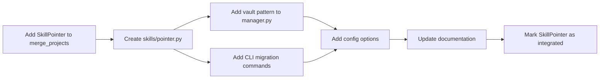

# SkillPointer Merge Benefits Analysis

> **Analysis Date**: 2026-02-28  
> **Source Project**: `merge_projects/SkillPointer`  
> **Target Project**: `opencode_4py`

---

## Executive Summary

This document analyzes the benefits of integrating **SkillPointer** into opencode_4py. SkillPointer is an organizational pattern that solves a specific scaling problem: the "Token Tax" incurred when AI development agents have hundreds or thousands of skills installed.

**Key Finding**: While SkillPointer provides genuine value for large-scale skill libraries, its core functionality **partially overlaps** with opencode_4py's existing skills system architecture. The integration value is **medium** - primarily benefiting users with very large skill collections (500+ skills).

---

## 1. The Problem SkillPointer Solves

### 1.1 The "Token Tax" Problem

AI coding agents like OpenCode and Claude Code use a **3-level progressive disclosure** system to load skills:

| Level | When | What Loads | Token Cost |
|-------|------|-----------|------------|
| **Level 1** | At startup, automatically | `name` + `description` of EVERY skill into `<available_skills>` | ~40 tokens/skill |
| **Level 2** | When AI matches a skill | Full `SKILL.md` body (instructions) | ~200-2000 tokens |
| **Level 3** | When explicitly referenced | Scripts, templates, linked files | Variable |

**The problem is Level 1**: Even though full skill content loads on-demand, the agent still loads the name and description of *every single skill* into the system prompt at startup.

### 1.2 Scaling Impact

| Skills Installed | Level 1 Startup Cost | % of 200K Context Window |
|-----------------|---------------------|--------------------------|
| 50 skills | ~4,000 tokens | ~2% ✅ |
| 500 skills | ~40,000 tokens | ~20% ⚠️ |
| **2,000 skills** | **~80,000 tokens** | **~40%** 🛑 |

Consequences:
- **Slower AI response times** - agent parses thousands of skill descriptions before reasoning
- **Higher API costs** - ~80K tokens consumed every prompt just listing skills
- **Degraded reasoning** - LLMs perform worse with longer contexts ("lost in the middle" problem)

---

## 2. SkillPointer's Solution

### 2.1 Architecture

```
┌─────────────────────────────────────────────────────────────────┐
│                     Traditional Skills                          │
│  ┌─────────┐ ┌─────────┐ ┌─────────┐     ┌─────────┐         │
│  │ Skill 1 │ │ Skill 2 │ │ Skill 3 │ ... │Skill 2000│         │
│  │ ~40tok  │ │ ~40tok  │ │ ~40tok  │     │  ~40tok │         │
│  └─────────┘ └─────────┘ └─────────┘     └─────────┘         │
│                                                                 │
│  Total: ~80,000 tokens at startup ❌                           │
└─────────────────────────────────────────────────────────────────┘

┌─────────────────────────────────────────────────────────────────┐
│                  SkillPointer Architecture                      │
│                                                                 │
│   Active Skills Directory (~35 pointers)                       │
│   ┌──────────────────┐  ┌──────────────────┐                  │
│   │ security-pointer │  │  ai-ml-pointer    │                  │
│   │ (indexes 200)    │  │  (indexes 150)    │                  │
│   └──────────────────┘  └──────────────────┘                  │
│                                                                 │
│   Hidden Vault (~2000 skills)                                   │
│   ┌─────────────────────────────────────────┐                  │
│   │ ~/.opencode-skill-libraries/            │                  │
│   │   ├── security/ (200 skills)            │                  │
│   │   ├── ai-ml/ (150 skills)                │                  │
│   │   ├── web-dev/ (300 skills)             │                  │
│   │   └── ...                                │                  │
│   └─────────────────────────────────────────┘                  │
│                                                                 │
│   Total: ~255 tokens at startup ✅                              │
└─────────────────────────────────────────────────────────────────┘
```

### 2.2 How It Works

1. **Hidden Vault Storage**: Raw skills moved to `~/.opencode-skill-libraries/` - outside the agent's startup scanner path
2. **Category Pointers**: Replace thousands of skills with ~35 lightweight "Pointer Skills" (e.g., `security-category-pointer`)
3. **Dynamic Retrieval**: AI matches relevant category pointer, reads instructions, uses native tools (`list_dir`, `view_file`) to browse the hidden vault

### 2.3 Real Measured Results

From a live environment with 2,004 skills across 34 categories:

| Metric | Without SkillPointer | With SkillPointer |
|--------|---------------------|-------------------|
| Level 1 entries | 2,004 descriptions | 35 pointer descriptions |
| **Startup tokens** | **~80,000** | **~255** |
| Context used | ~40% of 200K window | ~0.1% of 200K window |
| Skills accessible | 2,004 | 2,004 (identical) |
| **Reduction** | - | **99.7%** |

---

## 3. opencode_4py's Existing Skills System

### 3.1 Architecture Overview

opencode_4py already has a sophisticated skills system:

| Component | File | Purpose |
|-----------|------|---------|
| **Skill Discovery** | [`skills/discovery.py`](src/opencode/skills/discovery.py) | Discovers skills from directories |
| **Skill Manager** | [`skills/manager.py`](src/opencode/skills/manager.py) | Executes and manages skills |
| **Skill Models** | [`skills/models.py`](src/opencode/skills/models.py) | Data models (SkillConfig, Skill, etc.) |
| **Skill Tool** | [`tool/skill.py`](src/opencode/tool/skill.py) | Tool interface for AI |

### 3.2 Supported Skill Types

```python
class SkillType(str, Enum):
    PROMPT = "prompt"      # Simple prompt template
    FUNCTION = "function"  # Python function execution
    WORKFLOW = "workflow"  # Workflow execution
    CHAIN = "chain"       # Chain of multiple skills
```

### 3.3 Discovery Sources

```python
DEFAULT_DIRS = [
    ".vibe/skills",
    ".opencode/skills",
    "~/.opencode/skills",
]
```

### 3.4 File Format Support

- **YAML files** (`.yaml`, `.yml`) - Skill configuration
- **Markdown files** (`.md`) - With frontmatter
- **Python files** (`.py`) - With `@skill` decorator

---

## 4. Overlap Analysis

### 4.1 What SkillPointer Adds That opencode_4py Doesn't Have

| Feature | opencode_4py | SkillPointer | Gap? |
|---------|--------------|--------------|------|
| Skill discovery from directories | ✅ | ✅ | None |
| Multiple skill types | ✅ | ❌ (prompt only) | Advantage: opencode_4py |
| Category-based organization | ❌ | ✅ | **Gap** |
| Hidden vault pattern | ❌ | ✅ | **Gap** |
| Token optimization for large libraries | ❌ | ✅ | **Gap** |
| Keyword-based auto-categorization | ❌ | ✅ | **Gap** |

### 4.2 Key Differentiators

**SkillPointer brings:**
1. **Hierarchical pointer architecture** - Category → Subcategory → Skills
2. **Hidden vault storage pattern** - Skills outside scanner path
3. **Domain heuristic engine** - Auto-categorization using keywords
4. **Token optimization** - 99.7% reduction for large libraries

**opencode_4py already has:**
1. **Multi-type skills** - PROMPT, FUNCTION, WORKFLOW, CHAIN
2. **Skill decorators** - Python function-based skills
3. **Slash command triggers** - `/skill` syntax
4. **Skill chaining** - Execute sequences of skills

---

## 5. Benefits of Merging SkillPointer

### 5.1 Primary Benefits

| Benefit | Impact | Effort to Implement |
|---------|--------|---------------------|
| **Token optimization for large skill libraries** | High | Medium |
| **Category-based skill organization** | Medium | Low |
| **Hidden vault pattern** | Medium | Medium |
| **Auto-categorization heuristics** | Medium | Low |
| **Better context management** | High | N/A (architectural) |

### 5.2 Specific Value Propositions

#### Benefit 1: Token Reduction (High Value)

For users with **500+ skills**:
- **Current**: ~40,000+ tokens at every startup
- **With SkillPointer**: ~255 tokens
- **Savings**: 99.7% reduction

This directly translates to:
- Faster AI response times
- Reduced API costs
- Better reasoning (less "lost in the middle")

#### Benefit 2: Organized Skill Library (Medium Value)

SkillPointer's category system helps:
- **Discovery**: Users find relevant skills faster
- **Maintenance**: Adding/removing skills is easier
- **Scaling**: Library grows without token chaos

#### Benefit 3: Auto-Categorization (Medium Value)

The heuristic engine (`setup.py` lines 26-60) provides:
- 35+ domain categories
- Keyword-based classification
- Automatic skill routing

```python
DOMAIN_HEURISTICS = {
    "security": ["attack", "injection", "vulnerability", "xss", ...],
    "ai-ml": ["ai-", "ml-", "llm", "agent", "gpt", ...],
    "web-dev": ["angular", "react", "vue", "tailwind", ...],
    # ... 32 more categories
}
```

### 5.3 User Scenarios

| Scenario | Current opencode_4py | With SkillPointer | Benefit |
|----------|---------------------|-------------------|---------|
| 50 skills | Works fine | Works fine | Minimal |
| 200 skills | Works, ~8K tokens | ~255 tokens | Moderate |
| 500 skills | Slow startup | ~255 tokens | **High** |
| 2000 skills | Very slow, context issues | ~255 tokens | **Very High** |

---

## 6. Integration Considerations

### 6.1 Integration Points

The following opencode_4py components would be enhanced:

```
src/opencode/skills/
├── discovery.py    ← Add category pointer support
├── manager.py      ← Add vault pattern support
└── models.py       ← Add CategoryPointer model

src/opencode/core/
└── config.py       ← Add skill library path config
```

### 6.2 New CLI Commands

```bash
# Convert existing skills to pointer architecture
opencode skills migrate

# Organize skills into categories
opencode skills organize

# List skill categories
opencode skills categories

# Optimize for token usage
opencode skills optimize
```

### 6.3 Configuration Options

```toml
[skills]
# Enable SkillPointer pattern
pointer_mode = true

# Hidden vault location (default)
vault_path = "~/.opencode-skill-libraries"

# Category pointer threshold (default)
threshold = 50  # Use pointers when >50 skills
```

---

## 7. Risks and Limitations

### 7.1 Risks

| Risk | Severity | Mitigation |
|------|----------|------------|
| **Over-engineering for small libraries** | Low | Make optional, auto-detect threshold |
| **Breaking existing skills** | Medium | Maintain backward compatibility |
| **Complex setup** | Medium | Provide migration CLI |
| **Path dependencies** | Medium | Cross-platform path handling (already in setup.py) |

### 7.2 Limitations

1. **Not beneficial for small libraries** (< 50 skills)
2. **Additional complexity** in skill management
3. **Migration required** for existing skills
4. **Directory structure changes** (hidden vault)

### 7.3 When NOT to Use

- Users with < 50 skills
- Users who frequently manually browse skills
- Users who want simple, flat skill organization

---

## 8. Recommendation

### 8.1 Verdict: ✅ MERGE (With Modifications)

**Priority**: Medium  
**Effort**: Medium (2-3 days)  
**Value**: High for users with 500+ skills

### 8.2 Implementation Approach



### 8.3 Suggested Integration Steps

1. **Extract the heuristic engine** → `skills/categorization.py`
2. **Create CategoryPointer model** → `skills/models.py`
3. **Add vault support to discovery** → `skills/discovery.py`
4. **Add migration CLI** → `cli/commands/skills.py`
5. **Update config** → `core/config.py`

### 8.4 Alternative: Reference Only

If the team decides SkillPointer adds too much complexity, an alternative is to:

1. **Document the pattern** in `docs/SKILL_SCALING.md`
2. **Provide setup.py as standalone tool** in `scripts/skillpointer/`
3. **No core integration required**

This maintains option for users who need it without adding complexity to core.

---

## 9. Conclusion

SkillPointer solves a **real problem** that opencode_4py doesn't currently address: **token optimization for large skill libraries**.

| Factor | Assessment |
|--------|------------|
| **Problem Validity** | ✅ Real - affects users with 500+ skills |
| **Solution Elegance** | ✅ Simple - uses native tools, no plugins |
| **Integration Effort** | ⚠️ Medium - requires new modules |
| **Value for Users** | ✅ High for power users |
| **Code Overlap** | ⚠️ Partial - complements existing system |

**Final Recommendation**: Integrate the **category organization** and **heuristic categorization** features, but make the **hidden vault pattern** optional for users who need it. This provides the organization benefits without forcing a complex migration on all users.

---

## Appendix: Files Reference

| File | Purpose |
|------|---------|
| [`merge_projects/SkillPointer/README.md`](merge_projects/SkillPointer/README.md) | SkillPointer documentation |
| [`merge_projects/SkillPointer/setup.py`](merge_projects/SkillPointer/setup.py) | Setup script with heuristic engine |
| [`src/opencode/skills/discovery.py`](src/opencode/skills/discovery.py) | Skill discovery module |
| [`src/opencode/skills/manager.py`](src/opencode/skills/manager.py) | Skill execution manager |
| [`src/opencode/skills/models.py`](src/opencode/skills/models.py) | Skill data models |
| [`src/opencode/tool/skill.py`](src/opencode/tool/skill.py) | Skill tool for AI |
