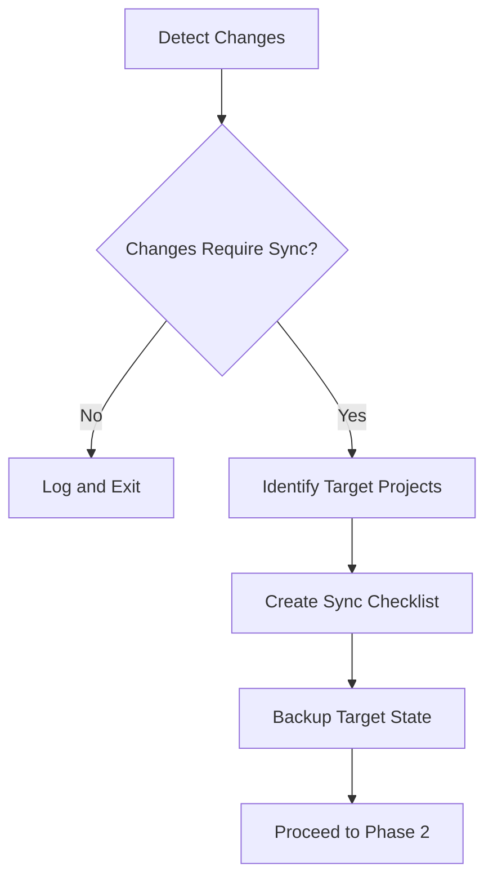
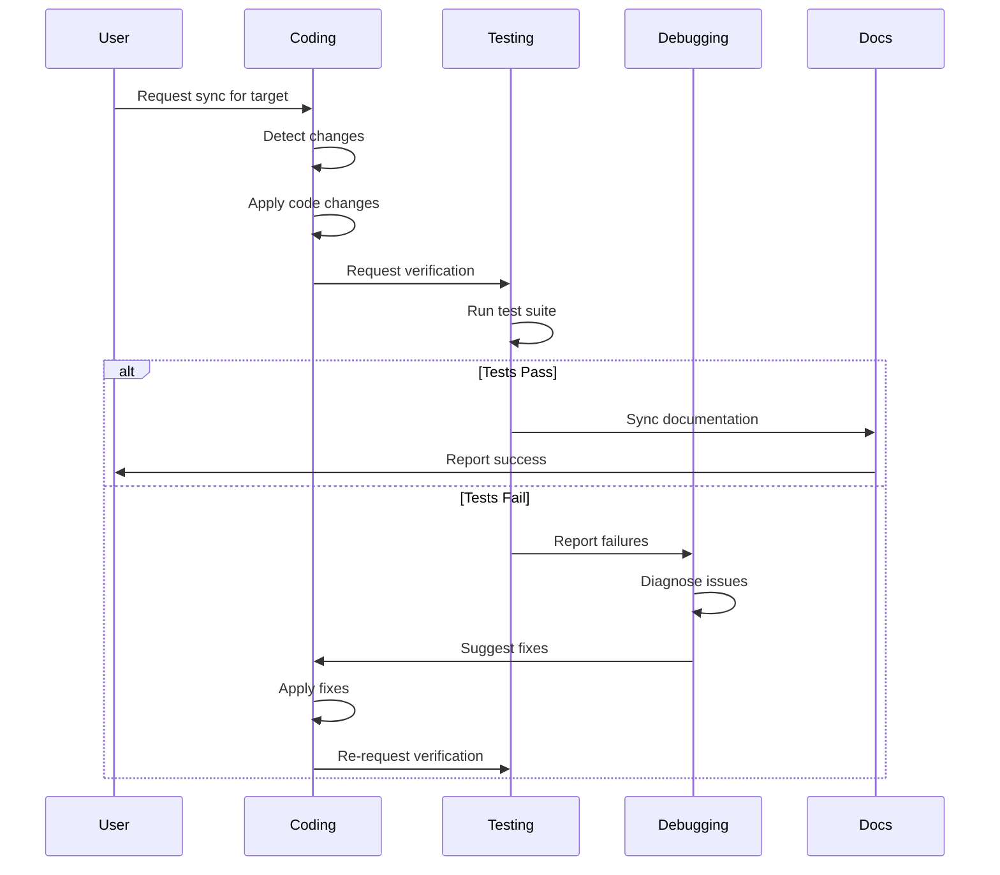

# Target Project Synchronization Plan

> *"Keeping target projects in sync with the main project - because nobody likes playing catch-up with features they didn't know existed."*

This document outlines the strategy for synchronizing changes made to the main opencode_4py project with target projects that have integrated opencode_4py.

> **Navigation:**
> - **Next:** [FOR_TESTING_PLAN.md](FOR_TESTING_PLAN.md) - Testing framework

> **Related Documents:**
> - [README.md](../README.md) - Project overview and features
> - [MISSION.md](../MISSION.md) - Mission statement and core principles
> - [FOR_TESTING_UPDATE_PLAN.md](FOR_TESTING_UPDATE_PLAN.md) - Troubleshooting procedures
> - [INTEGRATED_APP_INDEX_PLAN.md](INTEGRATED_APP_INDEX_PLAN.md) - Integrated app self-knowledge documentation

---

## Executive Summary

When changes are made to the main opencode_4py project, those changes need to be propagated to target projects that have integrated opencode_4py. This plan defines:

1. **What changes need to be synchronized**
2. **How to detect changes that require synchronization**
3. **The synchronization process for different integration types**
4. **Verification procedures to ensure target projects function correctly**

---

## Change Categories Requiring Synchronization

### Category 1: Core Functionality Changes

Changes that affect how opencode_4py operates:

| Change Type | Examples | Sync Priority |
|-------------|----------|---------------|
| **Provider Updates** | New providers, API changes, model updates | High |
| **Tool Changes** | New tools, tool interface modifications | High |
| **Session Management** | Session format changes, storage modifications | High |
| **Configuration** | New config options, format changes | Medium |
| **CLI Commands** | New commands, argument changes | Medium |

### Category 2: Documentation and Plans

Changes to documentation and planning documents:

| Change Type | Examples | Sync Priority |
|-------------|----------|---------------|
| **Troubleshooting RAG** | New error documents, pattern updates | High |
| **Integration Plans** | Updated procedures, new requirements | High |
| **API Documentation** | Endpoint changes, usage examples | Medium |
| **Feature Plans** | New feature documentation | Low |

### Category 3: Bug Fixes and Improvements

Changes that fix issues or improve functionality:

| Change Type | Examples | Sync Priority |
|-------------|----------|---------------|
| **Critical Fixes** | Security patches, data loss prevention | Critical |
| **Bug Fixes** | Error corrections, edge case handling | High |
| **Performance** | Optimizations, resource usage improvements | Medium |
| **Refactoring** | Code cleanup, structure improvements | Low |

---

## Change Detection System

### Automated Detection

The system automatically detects changes that require synchronization:

```python
# Conceptual implementation
class ChangeDetector:
    """Detects changes requiring synchronization."""
    
    CHANGE_PATTERNS = {
        "provider": ["src/opencode/provider/*.py"],
        "tools": ["src/opencode/tool/*.py"],
        "session": ["src/opencode/core/session.py"],
        "config": ["src/opencode/core/config.py", "opencode.toml"],
        "cli": ["src/opencode/cli/**/*.py"],
        "docs": ["docs/*.md", "plans/*.md"],
        "rag": ["RAG/**/*.md"],
    }
    
    def detect_changes(self, since_commit: str) -> List[ChangeRecord]:
        """Detect all changes since a given commit."""
        changes = []
        for category, patterns in self.CHANGE_PATTERNS.items():
            files_changed = self.git_diff(since_commit, patterns)
            if files_changed:
                changes.append(ChangeRecord(
                    category=category,
                    files=files_changed,
                    priority=self.get_priority(category),
                ))
        return changes
```

### Manual Detection Triggers

Synchronization should be triggered manually when:

1. **New target project integration** - Initial setup requires full sync
2. **Version upgrade** - Major/minor version changes
3. **Security advisory** - Critical security fixes
4. **User request** - Target project needs specific features

---

## Synchronization Process

### Phase 1: Preparation



**Preparation Steps:**

1. **Identify all target projects**
   ```bash
   # List all known target projects
   opencode target list
   
   # Example output:
   # - for_testing/as_dependency/ComfyUI_windows_portable
   # - for_testing/as_dependency/simple_python_app
   ```

2. **Create synchronization checklist**
   ```bash
   # Generate sync checklist for detected changes
   opencode sync checklist --since <commit>
   ```

3. **Backup target state**
   ```bash
   # Create backup before sync
   opencode target backup <target_project>
   ```

### Phase 2: Core Synchronization

#### For site-packages Installation

When opencode_4py is installed via pip to `site-packages/`:

```bash
# 1. Reinstall opencode_4py in target
cd <target_project>
pip install --upgrade opencode-ai

# Or from local source:
pip install --upgrade /path/to/opencode_4py/src/opencode
```

#### For Source Installation

When opencode_4py is installed from source:

```bash
# 1. Pull latest changes
cd /path/to/opencode_4py
git pull origin main

# 2. Reinstall in development mode
pip install -e .

# 3. Update target project's reference (if needed)
cd <target_project>
# Update any hardcoded paths in configuration
```

### Phase 3: Documentation Synchronization

Copy updated documentation and plans to target projects:

```bash
# Sync documentation to target project
opencode sync docs <target_project> --categories plans,docs,rag

# Complete directory copying for site-packages installation:
TARGET_ROOT="for_testing/as_dependency/ComfyUI_windows_portable"
TARGET_SITE_PACKAGES="$TARGET_ROOT/python_embeded/Lib/site-packages/opencode"
TARGET_DOCS="$TARGET_SITE_PACKAGES/docs"
TARGET_RAG="$TARGET_SITE_PACKAGES/RAG"

# Copy complete documentation directory (including all subdirectories):
robocopy "c:/Users/RyanT/Documents/code/ClaudeCode/opencode_4py/docs" "$TARGET_DOCS" /E

# Copy updated documents (for AI context during sessions)
cp README.md "$TARGET_SITE_PACKAGES/"
cp MISSION.md "$TARGET_SITE_PACKAGES/"

# Sync RAG troubleshooting (for AI troubleshooting assistance)
cp -r RAG/troubleshooting "$TARGET_RAG/"

# Plans are copied to site-packages/opencode/plans/ for consistency with documentation
# Project-specific plans should be maintained separately in:
# - $TARGET_ROOT/docs/opencode/ (project-specific documentation)
# - $TARGET_ROOT/docs/opencode/sessions/ (session data)
# - $TARGET_ROOT/docs/opencode/logs/ (debug logs)
```

### Phase 4: Configuration Synchronization

Update target project configuration:

```bash
# Check for configuration changes
opencode config diff <target_project>

# Apply configuration updates
opencode config sync <target_project> --merge

# Or manually update opencode.toml
```

**Configuration Merge Strategy:**

| Setting | Strategy | Notes |
|---------|----------|-------|
| `default_model` | Keep target value | Target may use different model |
| `providers` | Merge | Add new providers, keep existing |
| `tools` | Merge | Add new tools, keep existing |
| `data_dir` | Keep target value | Target-specific path |
| `log_level` | Keep target value | Target-specific preference |

---

## Verification Procedures

### Post-Sync Verification Checklist

After synchronization, verify the target project functions correctly:

```markdown
## Verification Checklist for <target_project>

### Core Functionality
- [ ] `opencode --help` runs without errors
- [ ] `opencode run` starts TUI successfully
- [ ] Provider connection works (test with available model)
- [ ] Basic tools function (read, write, bash)

### Integration-Specific
- [ ] Launch scripts execute correctly
- [ ] Configuration loads without errors
- [ ] Session files save to correct location
- [ ] Logs write to correct location

### Documentation
- [ ] Complete docs/ directory copied (32 files + 2 API docs + 1 archive + 1 sessions)
- [ ] Complete plans/ directory copied (27 files + 5 archive)
- [ ] RAG troubleshooting folder is complete
- [ ] No broken links in copied documents

### Feature Tests
- [ ] Run target-specific test suite
- [ ] Verify no regressions in target functionality
- [ ] Test integration with target's main features

### Pre-flight Check
- [ ] Run pre-flight check script successfully
- [ ] All critical checks pass (Python, dependencies, installation)
- [ ] GPU detection works correctly
- [ ] Configuration loads without errors
```

### Automated Verification

```bash
# Run verification suite
opencode target verify <target_project>

# Run with specific tests
opencode target verify <target_project> --tests core,integration,docs

# Run pre-flight check
cd <target_project>
python_embeded/python.exe check_prerequisites.py
```

---

## Rollback Procedures

If synchronization causes issues:

### Partial Rollback

Rollback specific components:

```bash
# Rollback to previous documentation
opencode target rollback <target_project> --component docs

# Rollback to previous configuration
opencode target rollback <target_project> --component config
```

### Full Rollback

Restore from backup:

```bash
# List available backups
opencode target backups <target_project>

# Restore from backup
opencode target restore <target_project> --backup <backup_id>
```

---

## Agent Coordination for Synchronization

### Agents Involved

| Agent | Role in Synchronization |
|-------|------------------------|
| **Coding Agent** | Applies code changes to target projects |
| **Testing Agent** | Verifies functionality after sync |
| **Debugging Agent** | Troubleshoots sync-related issues |
| **Documentation Agent** | Updates and syncs documentation |

### Coordination Workflow



### RAG Operations for Synchronization

Each agent maintains RAG for pattern learning:

| Agent | RAG Operations |
|-------|---------------|
| **Coding** | CREATE sync patterns, READ existing patterns, UPDATE after successful syncs, DELETE obsolete patterns |
| **Testing** | CREATE verification patterns, READ test patterns, UPDATE after test runs, DELETE failing patterns |
| **Debugging** | CREATE error patterns, READ troubleshooting RAG, UPDATE with solutions, DELETE resolved issues |
| **Documentation** | CREATE doc patterns, READ style guide, UPDATE documentation, DELETE outdated content |

---

## CLI Commands for Synchronization

### New Commands

```bash
# Detect changes requiring sync
opencode sync detect --since <commit>

# Generate sync checklist
opencode sync checklist --target <project>

# Execute full synchronization
opencode sync run --target <project>

# Verify target after sync
opencode sync verify --target <project>

# Rollback if needed
opencode sync rollback --target <project> --component <component>

# Complete directory sync (new commands)
opencode sync docs <target_project> --complete
opencode sync plans <target_project> --complete
```

### TUI Integration

```
/sync detect              - Detect changes requiring sync
/sync run <target>        - Run synchronization
/sync verify <target>     - Verify target project
/sync status              - Show sync status for all targets
/sync docs <target> --complete - Complete docs directory sync
/sync plans <target> --complete - Complete plans directory sync
```

---

## Integration with GitHub Upload Plan

This plan ensures:

1. **Pre-Push Sync Check**: Before pushing to GitHub, verify all target projects are synchronized
2. **Post-Push Sync**: After successful push, trigger synchronization for all target projects
3. **Version Tagging**: Tag synchronized targets with the corresponding GitHub release

### Pre-Push Checklist

```markdown
## Pre-Push Sync Verification

- [ ] All target projects identified
- [ ] Changes requiring sync detected
- [ ] Sync checklist generated
- [ ] Target projects backed up
- [ ] Ready to push to GitHub
```

### Post-Push Actions

```bash
# After successful GitHub push
git push origin main

# Trigger synchronization
opencode sync run --all-targets

# Verify all targets
opencode sync verify --all-targets

# Tag synchronized targets
opencode target tag --all --version $(git describe --tags)
```

---

## Maintenance Schedule

| Activity | Frequency | Owner |
|----------|-----------|-------|
| Change detection scan | Daily (automated) | CI/CD |
| Target project audit | Weekly | Dev team |
| Documentation sync | Per release | Docs agent |
| Full synchronization | Per major release | All agents |
| Verification suite run | Per sync | Testing agent |

---

## Success Criteria

- [ ] All target projects receive changes within 24 hours of main project update
- [ ] Verification suite passes for all synchronized targets
- [ ] No regressions in target project functionality
- [ ] Complete documentation (32 files + 2 API docs + 1 archive + 1 sessions) is consistent across all projects
- [ ] Complete plans (27 files + 5 archive) are accessible in site-packages/opencode/plans/
- [ ] RAG troubleshooting is up-to-date in all targets

---

## Appendix: Target Project Registry

### Registry Format

```json
{
  "targets": [
    {
      "name": "ComfyUI_windows_portable",
      "path": "for_testing/as_dependency/ComfyUI_windows_portable",
      "type": "site-packages",
      "last_sync": "2026-02-24T00:00:00Z",
      "sync_version": "v1.2.3",
      "status": "synchronized"
    },
    {
      "name": "simple_python_app",
      "path": "for_testing/as_dependency/simple_python_app",
      "type": "source",
      "last_sync": "2026-02-23T00:00:00Z",
      "sync_version": "v1.2.2",
      "status": "needs_sync"
    }
  ]
}
```

### Registry Commands

```bash
# List all registered targets
opencode target list

# Add new target to registry
opencode target add <name> --path <path> --type <type>

# Remove target from registry
opencode target remove <name>

# Update target status
opencode target update <name> --status <status>
```

---

*Created: 2026-02-24*
*Author: OpenCode AI Assistant*
*Status: Active*
