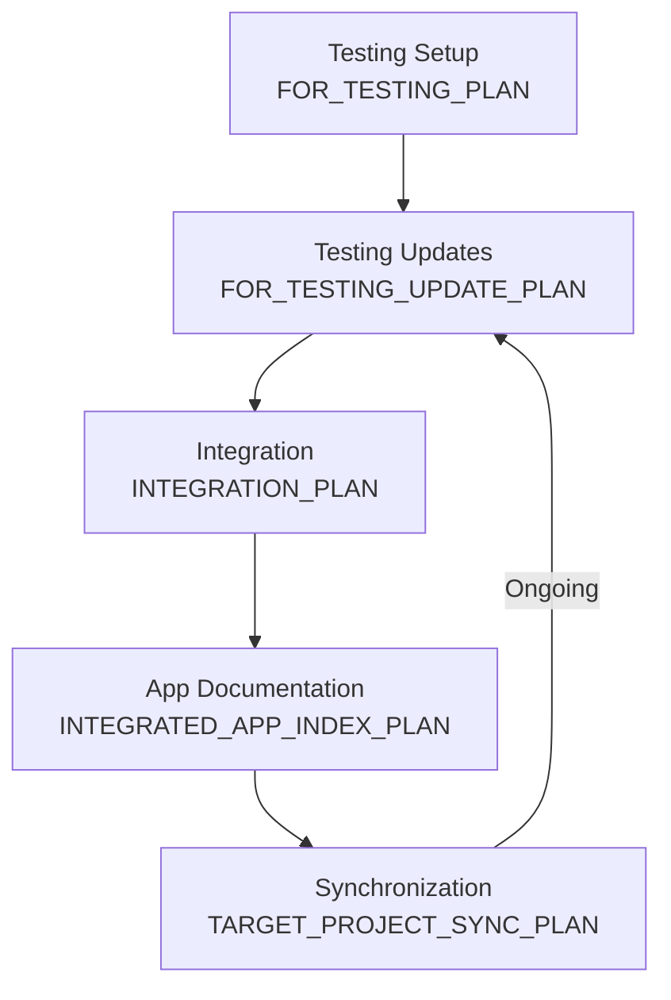

# Testing and Integration Plan

> **Navigation:** [PLAN_INDEX.md](PLAN_INDEX.md) - All plans | [DOCS_INDEX.md](../docs/DOCS_INDEX.md) - Documentation

This document serves as an **umbrella plan** that organizes and links to all testing and integration-related plans. It provides a logical workflow from testing infrastructure setup through integration and ongoing synchronization.

---

## Executive Summary

The Testing and Integration workflow encompasses:
1. **Setting up** testing infrastructure for opencode_4py
2. **Integrating** opencode_4py into target projects
3. **Synchronizing** changes between main and target projects

Each sub-plan addresses a specific phase or concern within this workflow.

---

## Plan Overview

| Phase | Plan | Purpose | Status |
|-------|------|---------|--------|
| **1. Testing Setup** | [FOR_TESTING_PLAN.md](archive/FOR_TESTING_PLAN.md) | Create testing infrastructure for for_testing/ directory | Active |
| **2. Testing Updates** | [FOR_TESTING_UPDATE_PLAN.md](archive/FOR_TESTING_UPDATE_PLAN.md) | Troubleshooting and maintaining test environment | Active |
| **3. Integration** | [INTEGRATION_PLAN.md](archive/INTEGRATION_PLAN.md) | Integrate opencode_4py into target projects | Active |
| **4. App Documentation** | [INTEGRATED_APP_INDEX_PLAN.md](archive/INTEGRATED_APP_INDEX_PLAN.md) | Track integration progress & document integrated apps | Active |
| **5. Synchronization** | [TARGET_PROJECT_SYNC_PLAN.md](archive/TARGET_PROJECT_SYNC_PLAN.md) | Keep target projects in sync with main project | Active |
| **6. Analysis** | [TARGET_PROJECT_FOR_TESTING_COMPARE.md](../docs/TARGET_PROJECT_FOR_TESTING_COMPARE.md) | Compare and analyze plan relationships | Reference |

---

## Phase 1: Testing Setup

### FOR_TESTING_PLAN.md

**Purpose:** Create and use the `for_testing/` directory to test opencode_4py's capabilities with external projects.

**Key Sections:**
- Directory structure for testing
- Purpose 1: Integration testing (as_dependency/)
- Purpose 2: Feature usage testing (as_tool/)
- Test projects and evaluation framework

**Related Documents:**
- [TARGET_PROJECT_SYNC_PLAN.md](archive/TARGET_PROJECT_SYNC_PLAN.md) - Maintaining test projects
- [INTEGRATION_PLAN.md](archive/INTEGRATION_PLAN.md) - Integration testing

---

## Phase 2: Testing Updates

### FOR_TESTING_UPDATE_PLAN.md

**Purpose:** Troubleshoot and maintain the testing environment.

**Key Sections:**
- TUI stall diagnosis and fixes
- Ollama connectivity issues
- Model availability checks
- Debug logging configuration

**Related Documents:**
- [FOR_TESTING_PLAN.md](archive/FOR_TESTING_PLAN.md) - Testing infrastructure
- [TARGET_PROJECT_SYNC_PLAN.md](archive/TARGET_PROJECT_SYNC_PLAN.md) - Ongoing maintenance

---

## Phase 3: Integration

### INTEGRATION_PLAN.md

**Purpose:** Integrate opencode_4py into target projects (e.g., ComfyUI_windows_portable).

**Key Sections:**
- Environment preparation
- File deployment procedures
- Launch script creation
- Configuration and testing
- Rollback procedures

**Related Documents:**
- [INTEGRATED_APP_INDEX_PLAN.md](archive/INTEGRATED_APP_INDEX_PLAN.md) - Tracking progress
- [TARGET_PROJECT_SYNC_PLAN.md](archive/TARGET_PROJECT_SYNC_PLAN.md) - Post-integration sync

---

## Phase 4: App Documentation

### INTEGRATED_APP_INDEX_PLAN.md

**Purpose:** Track integration progress and define how integrated apps document themselves for opencode_4py.

**Key Sections:**
- {APP_NAME}_INDEX.md concept and template
- Self-knowledge documentation for integrated apps
- Integration with opencode_4py README

**Related Documents:**
- [INTEGRATION_PLAN.md](archive/INTEGRATION_PLAN.md) - Integration procedures
- [TARGET_PROJECT_SYNC_PLAN.md](archive/TARGET_PROJECT_SYNC_PLAN.md) - Ongoing sync

---

## Phase 5: Synchronization

### TARGET_PROJECT_SYNC_PLAN.md

**Purpose:** Keep target projects synchronized with the main opencode_4py project.

**Key Sections:**
- Change detection system
- Synchronization process
- Verification procedures
- Rollback procedures
- Agent coordination

**Related Documents:**
- [FOR_TESTING_PLAN.md](archive/FOR_TESTING_PLAN.md) - Test project setup
- [INTEGRATION_PLAN.md](archive/INTEGRATION_PLAN.md) - Initial integration
- [GITHUB_UPLOAD_PLAN.md](GITHUB_UPLOAD_PLAN.md) - GitHub workflow integration

---

## Workflow Diagram



---

## Quick Start

> **Choose your workflow below:**

### Option A: Work with an Existing Project

Select a known project in `for_testing/`:

| Project | Path | Status |
|---------|------|--------|
| **ComfyUI_windows_portable** | `for_testing/as_dependency/ComfyUI_windows_portable/` | Integrated |
| **simple_python_app** | `for_testing/as_dependency/simple_python_app/` | Available |
| **fastapi_project** | `for_testing/as_dependency/fastapi_project/` | Available |
| **python_cli_tool** | `for_testing/as_tool/sample_projects/python_cli_tool/` | Available |
| **web_api** | `for_testing/as_tool/sample_projects/web_api/` | Available |
| **data_pipeline** | `for_testing/as_tool/sample_projects/data_pipeline/` | Available |

**For existing projects, use these quick commands:**

```bash
# Sync changes to an existing project
opencode sync run --target for_testing/as_dependency/ComfyUI_windows_portable

# Run prerequisite check
cd for_testing/as_dependency/ComfyUI_windows_portable
.\python_embeded\python.exe check_prerequisites.py

# Launch opencode_4py
.\run_opencode_4py.bat
```

See [QUICK_START_COMMANDS.md](QUICK_START_COMMANDS.md) for more prompts.

---

### Option B: Create a New Integration Project

If you want to integrate opencode_4py into a **new** project:

**Step 1:** Where is your project located?
- [ ] **Option 1:** Create new in `for_testing/as_dependency/` (for library integration)
- [ ] **Option 2:** Create new in `for_testing/as_tool/` (for AI testing)
- [ ] **Option 3:** External path - I'll provide the path

**Step 2:** Choose integration method:

| Method | Description | Use Case |
|--------|-------------|----------|
| **site-packages** | Install to embedded Python's site-packages | Portable apps, ComfyUI |
| **source** | Install from source with `-e` | Development projects |
| **pip** | Standard pip install | Standard Python projects |
| **CLI-only** | Run opencode as external command | Non-Python projects |

**Step 3:** Run integration:

```bash
# Follow INTEGRATION_PLAN.md workflow
# 1. Prepare environment (Phase 1)
# 2. Deploy files (Phase 2)
# 3. Create launch scripts (Phase 3)
# 4. Configure (Phase 4)
# 5. Test (Phase 5)
```

---

## Usage Guide

### Starting a New Target Project

1. **Setup Testing**: Use [FOR_TESTING_PLAN.md](archive/FOR_TESTING_PLAN.md) to create test infrastructure
2. **Integrate**: Use [INTEGRATION_PLAN.md](archive/INTEGRATION_PLAN.md) to deploy opencode_4py
3. **Document**: Use [INTEGRATED_APP_INDEX_PLAN.md](archive/INTEGRATED_APP_INDEX_PLAN.md) to create app documentation
4. **Sync**: Use [TARGET_PROJECT_SYNC_PLAN.md](archive/TARGET_PROJECT_SYNC_PLAN.md) to maintain

### Maintaining Existing Projects

1. **Troubleshoot**: Use [FOR_TESTING_UPDATE_PLAN.md](archive/FOR_TESTING_UPDATE_PLAN.md) for issues
2. **Synchronize**: Use [TARGET_PROJECT_SYNC_PLAN.md](archive/TARGET_PROJECT_SYNC_PLAN.md) for updates

---

## Plan Relationships

### Complementary Plans

| Plan Pair | Relationship |
|-----------|--------------|
| FOR_TESTING_PLAN ↔ TARGET_PROJECT_SYNC_PLAN | Setup vs Maintenance (complementary) |
| INTEGRATION_PLAN ↔ INTEGRATED_APP_INDEX_PLAN | Execution vs Documentation (complementary) |
| FOR_TESTING_UPDATE_PLAN ↔ TARGET_PROJECT_SYNC_PLAN | Specific fix vs General process |

### No Duplication

As analyzed in [TARGET_PROJECT_FOR_TESTING_COMPARE.md](../docs/TARGET_PROJECT_FOR_TESTING_COMPARE.md), all plans serve distinct purposes with no significant duplication.

---

## Archive Location

All sub-plans have been moved to the `archive/` directory:
- [archive/FOR_TESTING_PLAN.md](archive/FOR_TESTING_PLAN.md)
- [archive/FOR_TESTING_UPDATE_PLAN.md](archive/FOR_TESTING_UPDATE_PLAN.md)
- [archive/INTEGRATION_PLAN.md](archive/INTEGRATION_PLAN.md)
- [archive/INTEGRATED_APP_INDEX_PLAN.md](archive/INTEGRATED_APP_INDEX_PLAN.md)
- [archive/TARGET_PROJECT_SYNC_PLAN.md](archive/TARGET_PROJECT_SYNC_PLAN.md)

---

## Success Criteria

- [x] All testing plans organized under single umbrella
- [x] Clear workflow from setup to maintenance
- [x] Each plan accessible from this document
- [x] Relationships between plans documented

---

*Last updated: 2026-02-28*
*Replaces: FOR_TESTING_PLAN.md, FOR_TESTING_UPDATE_PLAN.md, INTEGRATION_PLAN.md, INTEGRATED_APP_INDEX_PLAN.md, TARGET_PROJECT_SYNC_PLAN.md*
