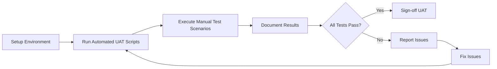

# User Acceptance Testing Plan for OpenCode Python

> **Purpose**: Validate integrated features from merge_projects through manual and automated testing

---

## Overview

This plan outlines the User Acceptance Testing (UAT) strategy for validating features integrated from external projects. UAT ensures that integrated functionality meets requirements and works correctly in real-world scenarios.

> **Navigation:**
> - **Previous:** [TESTING_PLAN.md](TESTING_PLAN.md) - Automated testing strategy
> - **Next:** [DOCUMENTATION_PLAN.md](DOCUMENTATION_PLAN.md) - Documentation standards

> **Related Documents:**
> - [MERGE_INTEGRATION_PLAN.md](MERGE_INTEGRATION_PLAN.md) - Integration tracking
> - [TESTING_STATUS.md](../docs/TESTING_STATUS.md) - Current test status

---

## UAT Philosophy

### Core Principles

1. **User-Centric**: Test from the user's perspective, not the developer's
2. **Scenario-Based**: Use realistic scenarios that reflect actual usage
3. **Pass/Fail Criteria**: Clear, measurable acceptance criteria
4. **Documented Results**: All test results documented for traceability

### UAT vs Automated Testing

| Aspect | Automated Testing | User Acceptance Testing |
|--------|-------------------|------------------------|
| Focus | Code correctness | User experience |
| Speed | Fast, repeatable | Slower, exploratory |
| Coverage | Known scenarios | Edge cases, usability |
| Execution | CI/CD pipeline | Manual + scripts |

---

## Test Categories

### Category 1: RAG Methods Validation

Test all integrated RAG methods for correct functionality.

#### Test Scenarios

| ID | Scenario | Steps | Expected Result | Status |
|----|----------|-------|-----------------|--------|
| RAG-001 | Import NaiveRAG | `from opencode.core.rag.methods import NaiveRAG` | Module imports without error | ⬜ |
| RAG-002 | Import all RAG methods | `from opencode.core.rag.methods import *` | All 9 methods importable | ⬜ |
| RAG-003 | Create NaiveRAG instance | `rag = NaiveRAG(config)` | Instance created successfully | ⬜ |
| RAG-004 | Create HyDeRAG instance | `rag = HyDeRAG(config)` | Instance created successfully | ⬜ |
| RAG-005 | Create SelfRAG instance | `rag = SelfRAG(config)` | Instance created successfully | ⬜ |
| RAG-006 | Create CorrectiveRAG instance | `rag = CorrectiveRAG(config)` | Instance created successfully | ⬜ |
| RAG-007 | Create GraphRAG instance | `rag = GraphRAG(config)` | Instance created successfully | ⬜ |
| RAG-008 | Create FusionRAG instance | `rag = FusionRAG(config)` | Instance created successfully | ⬜ |
| RAG-009 | Create RerankerRAG instance | `rag = RerankerRAG(config)` | Instance created successfully | ⬜ |
| RAG-010 | Create AdvancedRAG instance | `rag = AdvancedRAG(config)` | Instance created successfully | ⬜ |
| RAG-011 | Create AgenticRAG instance | `rag = AgenticRAG(config)` | Instance created successfully | ⬜ |
| RAG-012 | Index documents | `await rag.index_documents(["doc1", "doc2"])` | Returns count of indexed docs | ⬜ |
| RAG-013 | Query documents | `await rag.query("test question")` | Returns RAGResult with answer | ⬜ |
| RAG-014 | Registry create_rag_method | `rag = create_rag_method("hyde", config)` | Creates correct method type | ⬜ |
| RAG-015 | List available methods | `list_available_methods()` | Returns list of 9 methods | ⬜ |

#### Test Script

```python
# scripts/uat/test_rag_methods.py
"""
UAT script for RAG methods validation.
Run: python scripts/uat/test_rag_methods.py
"""

import asyncio
from typing import List, Dict, Any

# Test imports
def test_imports():
    """Test that all RAG methods can be imported."""
    print("Testing RAG method imports...")
    
    try:
        from opencode.core.rag.methods import (
            NaiveRAG,
            HyDeRAG,
            SelfRAG,
            CorrectiveRAG,
            GraphRAG,
            FusionRAG,
            RerankerRAG,
            AdvancedRAG,
            AgenticRAG,
            create_rag_method,
            list_available_methods,
        )
        print("✅ All RAG methods imported successfully")
        return True
    except ImportError as e:
        print(f"❌ Import failed: {e}")
        return False

def test_registry():
    """Test the RAG method registry."""
    print("\nTesting RAG method registry...")
    
    from opencode.core.rag.methods import list_available_methods, create_rag_method
    
    methods = list_available_methods()
    print(f"Available methods: {methods}")
    
    expected = {"naive", "hyde", "self", "corrective", "graph", "fusion", "reranker", "advanced", "agentic"}
    if set(methods) == expected:
        print("✅ All 9 methods registered")
        return True
    else:
        print(f"❌ Expected {expected}, got {set(methods)}")
        return False

async def test_instantiation():
    """Test creating RAG method instances."""
    print("\nTesting RAG method instantiation...")
    
    from opencode.core.rag.methods import create_rag_method, RAGMethodConfig
    
    config = RAGMethodConfig(top_k=5)
    
    methods_to_test = ["naive", "hyde", "self", "corrective", "graph", "fusion", "reranker", "advanced", "agentic"]
    results = {}
    
    for method_name in methods_to_test:
        try:
            rag = create_rag_method(method_name, config)
            results[method_name] = "✅" if rag is not None else "❌"
        except Exception as e:
            results[method_name] = f"❌ ({e})"
    
    print("Instantiation results:")
    for method, status in results.items():
        print(f"  {method}: {status}")
    
    return all("✅" in v for v in results.values())

def main():
    """Run all UAT tests for RAG methods."""
    print("=" * 60)
    print("RAG Methods User Acceptance Testing")
    print("=" * 60)
    
    results = []
    
    # Test 1: Imports
    results.append(("Imports", test_imports()))
    
    # Test 2: Registry
    results.append(("Registry", test_registry()))
    
    # Test 3: Instantiation
    results.append(("Instantiation", asyncio.run(test_instantiation())))
    
    # Summary
    print("\n" + "=" * 60)
    print("UAT Summary")
    print("=" * 60)
    
    passed = sum(1 for _, v in results if v)
    total = len(results)
    
    for name, status in results:
        print(f"  {name}: {'✅ PASS' if status else '❌ FAIL'}")
    
    print(f"\nTotal: {passed}/{total} tests passed")
    
    return passed == total

if __name__ == "__main__":
    success = main()
    exit(0 if success else 1)
```

---

### Category 2: Fine-tuning Module Validation

Test the fine-tuning module components.

#### Test Scenarios

| ID | Scenario | Steps | Expected Result | Status |
|----|----------|-------|-----------------|--------|
| FT-001 | Import config classes | `from opencode.core.finetuning import LoRAConfig, TrainingConfig, FineTuningConfig` | Imports successfully | ⬜ |
| FT-002 | Import dataset classes | `from opencode.core.finetuning import DatasetPreparer, AlpacaFormatter, ChatFormatter` | Imports successfully | ⬜ |
| FT-003 | Create LoRAConfig | `config = LoRAConfig(r=16, alpha=32)` | Instance created | ⬜ |
| FT-004 | Create TrainingConfig | `config = TrainingConfig(epochs=3, batch_size=4)` | Instance created | ⬜ |
| FT-005 | Create FineTuningConfig | `config = FineTuningConfig(model_name="test")` | Instance created | ⬜ |
| FT-006 | Create DatasetPreparer | `preparer = DatasetPreparer()` | Instance created | ⬜ |
| FT-007 | Format with AlpacaFormatter | `formatter.format(sample)` | Returns formatted dict | ⬜ |
| FT-008 | Format with ChatFormatter | `formatter.format(sample)` | Returns formatted dict | ⬜ |

#### Test Script

```python
# scripts/uat/test_finetuning.py
"""
UAT script for fine-tuning module validation.
Run: python scripts/uat/test_finetuning.py
"""

def test_imports():
    """Test that all fine-tuning components can be imported."""
    print("Testing fine-tuning module imports...")
    
    try:
        from opencode.core.finetuning import (
            LoRAConfig,
            TrainingConfig,
            FineTuningConfig,
            DatasetPreparer,
            AlpacaFormatter,
            ChatFormatter,
        )
        print("✅ All fine-tuning components imported successfully")
        return True
    except ImportError as e:
        print(f"❌ Import failed: {e}")
        return False

def test_config_creation():
    """Test creating configuration instances."""
    print("\nTesting configuration creation...")
    
    from opencode.core.finetuning import LoRAConfig, TrainingConfig, FineTuningConfig
    
    try:
        lora = LoRAConfig(r=16, lora_alpha=32)
        print(f"✅ LoRAConfig created: r={lora.r}, alpha={lora.lora_alpha}")
        
        training = TrainingConfig(num_train_epochs=3, per_device_train_batch_size=4)
        print(f"✅ TrainingConfig created: epochs={training.num_train_epochs}")
        
        finetune = FineTuningConfig(model_name="test-model")
        print(f"✅ FineTuningConfig created: model={finetune.model_name}")
        
        return True
    except Exception as e:
        print(f"❌ Configuration creation failed: {e}")
        return False

def test_dataset_preparation():
    """Test dataset preparation components."""
    print("\nTesting dataset preparation...")
    
    from opencode.core.finetuning import DatasetPreparer, AlpacaFormatter, ChatFormatter
    
    try:
        preparer = DatasetPreparer()
        print("✅ DatasetPreparer created")
        
        alpaca = AlpacaFormatter()
        sample = {"instruction": "Test", "input": "", "output": "Result"}
        formatted = alpaca.format(sample)
        print(f"✅ AlpacaFormatter works: {formatted.get('text', '')[:50]}...")
        
        chat = ChatFormatter()
        messages = [{"role": "user", "content": "Hello"}, {"role": "assistant", "content": "Hi"}]
        formatted = chat.format({"messages": messages})
        print(f"✅ ChatFormatter works")
        
        return True
    except Exception as e:
        print(f"❌ Dataset preparation failed: {e}")
        return False

def main():
    """Run all UAT tests for fine-tuning module."""
    print("=" * 60)
    print("Fine-tuning Module User Acceptance Testing")
    print("=" * 60)
    
    results = []
    
    results.append(("Imports", test_imports()))
    results.append(("Config Creation", test_config_creation()))
    results.append(("Dataset Preparation", test_dataset_preparation()))
    
    print("\n" + "=" * 60)
    print("UAT Summary")
    print("=" * 60)
    
    passed = sum(1 for _, v in results if v)
    total = len(results)
    
    for name, status in results:
        print(f"  {name}: {'✅ PASS' if status else '❌ FAIL'}")
    
    print(f"\nTotal: {passed}/{total} tests passed")
    
    return passed == total

if __name__ == "__main__":
    success = main()
    exit(0 if success else 1)
```

---

### Category 3: Integration Workflow Validation

Test complete workflows combining multiple components.

#### Test Scenarios

| ID | Scenario | Steps | Expected Result | Status |
|----|----------|-------|-----------------|--------|
| WF-001 | End-to-end RAG workflow | Create RAG → Index docs → Query | Returns relevant answer | ⬜ |
| WF-002 | Multi-method comparison | Query same question with different methods | Each returns valid result | ⬜ |
| WF-003 | Config persistence | Save config → Load config | Config preserved | ⬜ |
| WF-004 | Error handling | Query without indexing | Graceful error message | ⬜ |

---

## UAT Execution Process

### Pre-requisites

1. **Environment Setup**:
   ```bash
   # Install opencode with optional dependencies
   cd src/opencode
   pip install -e ".[rag-advanced,finetuning]"
   ```

2. **Test Data Preparation**:
   - Sample documents for RAG testing
   - Sample datasets for fine-tuning testing

### Execution Steps



### Running UAT Scripts

```bash
# Run all UAT tests
python scripts/uat/test_rag_methods.py
python scripts/uat/test_finetuning.py

# Or run all at once
python scripts/run_uat.py
```

---

## Acceptance Criteria

### Pass Criteria

| Category | Minimum Pass Rate | Critical Tests |
|----------|-------------------|----------------|
| RAG Methods | 100% | RAG-001, RAG-002, RAG-014 |
| Fine-tuning | 100% | FT-001, FT-002, FT-003 |
| Workflows | 75% | WF-001 |

### Sign-off Requirements

1. All critical tests pass
2. No blocking issues
3. Documentation updated for any deviations
4. UAT report completed

---

## Issue Tracking

### Issue Template

```markdown
## UAT Issue

**Test ID**: [e.g., RAG-005]
**Severity**: [Critical | Major | Minor]
**Description**: [What went wrong]
**Steps to Reproduce**: [Detailed steps]
**Expected**: [What should have happened]
**Actual**: [What actually happened]
**Environment**: [Python version, OS, etc.]
```

### Issue Tracking Table

| Issue ID | Test ID | Severity | Description | Status | Resolution |
|----------|---------|----------|-------------|--------|------------|
| | | | | | |

---

## UAT Report Template

```markdown
# UAT Report

**Date**: [Date]
**Tester**: [Name]
**Version**: [Version being tested]

## Executive Summary

[Brief summary of UAT results]

## Test Results Summary

| Category | Tests Run | Passed | Failed | Pass Rate |
|----------|-----------|--------|--------|-----------|
| RAG Methods | 15 | | | |
| Fine-tuning | 8 | | | |
| Workflows | 4 | | | |
| **Total** | **27** | | | |

## Issues Found

[List of issues, if any]

## Recommendations

[Recommendations for improvement]

## Sign-off

- [ ] All critical tests passed
- [ ] No blocking issues remain
- [ ] Documentation updated

**Approved by**: ________________ **Date**: ________________
```

---

## Related Plans

- [`TESTING_PLAN.md`](TESTING_PLAN.md) - Automated testing strategy
- [`DOCUMENTATION_PLAN.md`](DOCUMENTATION_PLAN.md) - Documentation standards
- [`MERGE_INTEGRATION_PLAN.md`](MERGE_INTEGRATION_PLAN.md) - Integration tracking

---

## Success Criteria

1. **All UAT scripts execute without errors**
2. **All critical test scenarios pass**
3. **No blocking issues remain unresolved**
4. **UAT report completed and signed off**

---

*Last updated: 2026-02-24*
