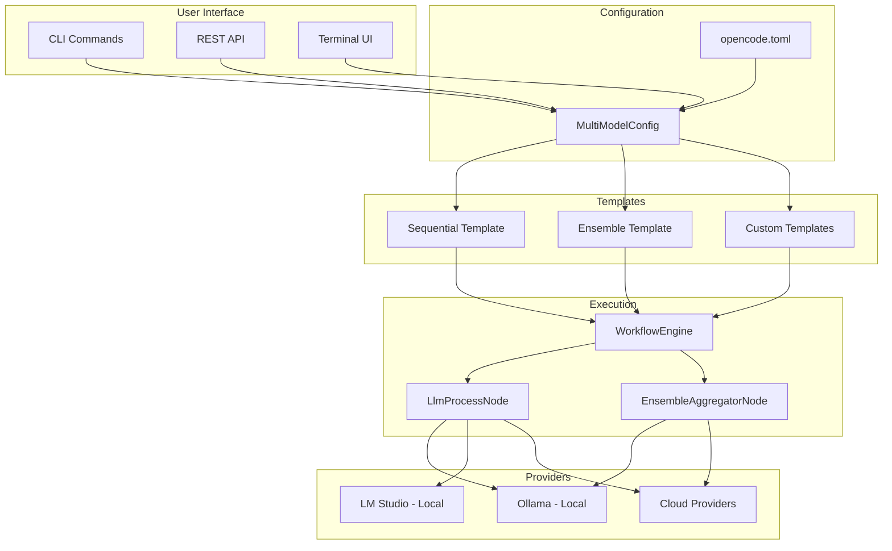

# Multi-Model Accuracy Patterns Implementation Plan

## Overview

This plan outlines the implementation of user-friendly multi-model accuracy patterns for OpenCode. The infrastructure exists (WorkflowEngine, LlmProcessNode, etc.), but simple user settings and pre-built templates are missing.

> **Related Documents:**
> - [README.md](../../README.md) - Project overview and features
> - [MISSION.md](../../MISSION.md) - Mission statement and core principles

## Goals

1. Enable users to configure multi-model patterns via simple settings
2. Provide pre-built workflow templates for common patterns
3. Add CLI commands for multi-model execution
4. Create an ensemble aggregator node for combining model outputs

## Architecture



## Implementation Phases

### Phase 1: Configuration Extension

**Goal**: Add multi-model configuration support

#### 1.1 Create MultiModelConfig Class

**File**: `src/opencode/src/opencode/core/config.py`

```python
class MultiModelPattern(str, Enum):
    """Available multi-model patterns."""
    SEQUENTIAL = "sequential"      # Chain of models refining output
    ENSEMBLE = "ensemble"          # Parallel models with aggregation
    VOTING = "voting"              # Multiple models vote on best answer
    SPECIALIZED = "specialized"    # Route to specialized models


class ModelStepConfig(BaseModel):
    """Configuration for a single model step in a pattern."""
    model: str                     # Model identifier
    provider: str = "ollama"       # Provider name
    system_prompt: Optional[str] = None
    temperature: float = 0.7
    max_tokens: int = 4096


class MultiModelConfig(BaseModel):
    """Configuration for multi-model patterns."""
    pattern: MultiModelPattern
    models: List[ModelStepConfig]
    aggregator_model: Optional[str] = None  # For ensemble pattern
    voting_strategy: str = "majority"       # For voting pattern
    enabled: bool = True
```

#### 1.2 Extend Config Class

**File**: `src/opencode/src/opencode/core/config.py`

Add to the `Config` class:

```python
class Config(BaseSettings):
    # ... existing fields ...
    
    # Multi-model configurations
    multi_model_patterns: Dict[str, MultiModelConfig] = Field(default_factory=dict)
```

#### 1.3 TOML Configuration Example

```toml
# opencode.toml

[multi_model_patterns.code_review]
pattern = "sequential"
enabled = true

[[multi_model_patterns.code_review.models]]
model = "llama3.2"
provider = "ollama"
system_prompt = "You are a code generator. Generate clean, efficient code."
temperature = 0.8

[[multi_model_patterns.code_review.models]]
model = "mistral:7b"
provider = "ollama"
system_prompt = "You are a code reviewer. Review and improve the code."
temperature = 0.5

[[multi_model_patterns.code_review.models]]
model = "codellama:13b"
provider = "ollama"
system_prompt = "You are a code validator. Check for bugs and security issues."
temperature = 0.3

[multi_model_patterns.ensemble_analysis]
pattern = "ensemble"
aggregator_model = "llama3.2:70b"

[[multi_model_patterns.ensemble_analysis.models]]
model = "llama3.2"
provider = "ollama"

[[multi_model_patterns.ensemble_analysis.models]]
model = "mistral:7b"
provider = "ollama"

[[multi_model_patterns.ensemble_analysis.models]]
model = "codellama:7b"
provider = "ollama"
```

---

### Phase 2: Workflow Templates

**Goal**: Create pre-built workflow templates for multi-model patterns

#### 2.1 Create Template Registry

**File**: `src/opencode/src/opencode/workflow/templates/__init__.py`

```python
"""Built-in workflow templates for multi-model patterns."""

from opencode.workflow.templates.sequential import SequentialRefinementTemplate
from opencode.workflow.templates.ensemble import EnsembleTemplate
from opencode.workflow.templates.voting import VotingTemplate

BUILTIN_TEMPLATES = {
    "sequential_refinement": SequentialRefinementTemplate,
    "ensemble": EnsembleTemplate,
    "voting": VotingTemplate,
}

def get_template(name: str, config: MultiModelConfig) -> WorkflowGraph:
    """Get a workflow template by name with configuration."""
    template_class = BUILTIN_TEMPLATES.get(name)
    if template_class:
        return template_class(config).build()
    raise ValueError(f"Unknown template: {name}")
```

#### 2.2 Sequential Refinement Template

**File**: `src/opencode/src/opencode/workflow/templates/sequential.py`

```python
"""Sequential refinement workflow template."""

from typing import List
from opencode.workflow.graph import WorkflowGraph, WorkflowNode, WorkflowEdge, WorkflowMetadata
from opencode.core.config import MultiModelConfig

class SequentialRefinementTemplate:
    """
    Sequential refinement pattern.
    
    Flow: Input → Model1 → Model2 → Model3 → Output
    
    Each model receives the output from the previous model
    and refines/improves it.
    """
    
    def __init__(self, config: MultiModelConfig):
        self.config = config
    
    def build(self) -> WorkflowGraph:
        """Build the workflow graph from configuration."""
        graph = WorkflowGraph(
            metadata=WorkflowMetadata(
                name="Sequential Refinement",
                description="Chain of models refining output",
            )
        )
        
        # Create input node
        graph.add_node(WorkflowNode(
            id="input",
            node_type="data_source",
            config={"source_type": "input"}
        ))
        
        # Create model nodes
        prev_node = "input"
        for i, model_config in enumerate(self.config.models):
            node_id = f"model_{i}"
            graph.add_node(WorkflowNode(
                id=node_id,
                node_type="llm_process",
                config={
                    "provider": model_config.provider,
                    "model": model_config.model,
                    "systemPrompt": model_config.system_prompt or "You are a helpful assistant.",
                    "temperature": model_config.temperature,
                    "maxTokens": model_config.max_tokens,
                    "userPromptTemplate": "{{input}}" if i == 0 else "{{previous_output}}",
                }
            ))
            
            # Connect to previous node
            graph.add_edge(WorkflowEdge(
                source=prev_node,
                target=node_id,
                label="output" if prev_node == "input" else "output"
            ))
            prev_node = node_id
        
        # Create output node
        graph.add_node(WorkflowNode(
            id="output",
            node_type="data_source",
            config={"source_type": "output"}
        ))
        graph.add_edge(WorkflowEdge(source=prev_node, target="output"))
        
        return graph
```

#### 2.3 Ensemble Template

**File**: `src/opencode/src/opencode/workflow/templates/ensemble.py`

```python
"""Ensemble workflow template."""

from opencode.workflow.graph import WorkflowGraph, WorkflowNode, WorkflowEdge, WorkflowMetadata
from opencode.core.config import MultiModelConfig

class EnsembleTemplate:
    """
    Ensemble pattern.
    
    Flow:
        Input ─┬→ Model1 ─┐
               ├→ Model2 ─┼→ Aggregator → Output
               └→ Model3 ─┘
    
    Multiple models process the same input in parallel,
    then an aggregator model synthesizes the results.
    """
    
    def __init__(self, config: MultiModelConfig):
        self.config = config
    
    def build(self) -> WorkflowGraph:
        """Build the workflow graph from configuration."""
        graph = WorkflowGraph(
            metadata=WorkflowMetadata(
                name="Ensemble",
                description="Multiple models with aggregation",
            )
        )
        
        # Create input node
        graph.add_node(WorkflowNode(
            id="input",
            node_type="data_source",
            config={"source_type": "input"}
        ))
        
        # Create parallel model nodes
        model_nodes = []
        for i, model_config in enumerate(self.config.models):
            node_id = f"model_{i}"
            model_nodes.append(node_id)
            
            graph.add_node(WorkflowNode(
                id=node_id,
                node_type="llm_process",
                config={
                    "provider": model_config.provider,
                    "model": model_config.model,
                    "systemPrompt": model_config.system_prompt or "You are a helpful assistant.",
                    "temperature": model_config.temperature,
                    "maxTokens": model_config.max_tokens,
                    "userPromptTemplate": "{{input}}",
                }
            ))
            
            # Connect input to each model
            graph.add_edge(WorkflowEdge(source="input", target=node_id))
        
        # Create aggregator node
        aggregator_model = self.config.aggregator_model or self.config.models[0].model
        graph.add_node(WorkflowNode(
            id="aggregator",
            node_type="ensemble_aggregator",  # New node type
            config={
                "provider": "ollama",
                "model": aggregator_model,
                "aggregation_prompt": "Synthesize these responses into a single best answer:",
            }
        ))
        
        # Connect all models to aggregator
        for node_id in model_nodes:
            graph.add_edge(WorkflowEdge(source=node_id, target="aggregator"))
        
        # Create output node
        graph.add_node(WorkflowNode(
            id="output",
            node_type="data_source",
            config={"source_type": "output"}
        ))
        graph.add_edge(WorkflowEdge(source="aggregator", target="output"))
        
        return graph
```

---

### Phase 3: Ensemble Aggregator Node

**Goal**: Create a new node type for combining multiple model outputs

#### 3.1 Ensemble Aggregator Node Implementation

**File**: `src/opencode/src/opencode/workflow/nodes/ensemble_aggregator.py`

```python
"""
Ensemble Aggregator Node

Combines outputs from multiple LLM calls into a single response.
"""

import json
from typing import Any, Dict, List
import logging

from opencode.workflow.node import (
    BaseNode,
    NodePort,
    NodeSchema,
    ExecutionContext,
    ExecutionResult,
    PortDataType,
    PortDirection,
)
from opencode.workflow.registry import NodeRegistry

logger = logging.getLogger(__name__)


@NodeRegistry.register("ensemble_aggregator")
class EnsembleAggregatorNode(BaseNode):
    """
    Ensemble Aggregator Node - Combines multiple model outputs.
    
    This node receives outputs from multiple LLM calls and synthesizes
    them into a single, coherent response using another LLM.
    
    Configuration:
        provider: Provider for aggregator model
        model: Model to use for aggregation
        aggregation_prompt: Prompt template for aggregation
        aggregation_strategy: How to combine (synthesize, vote, best)
    """
    
    _schema = NodeSchema(
        node_type="ensemble_aggregator",
        display_name="Ensemble Aggregator",
        description="Combine multiple model outputs into one",
        category="processing",
        icon="merge",
        inputs=[
            NodePort(
                name="responses",
                data_type=PortDataType.ARRAY,
                direction=PortDirection.INPUT,
                required=True,
                description="List of responses from multiple models",
            ),
            NodePort(
                name="original_input",
                data_type=PortDataType.STRING,
                direction=PortDirection.INPUT,
                required=False,
                description="Original input prompt",
            ),
        ],
        outputs=[
            NodePort(
                name="output",
                data_type=PortDataType.STRING,
                direction=PortDirection.OUTPUT,
                required=True,
                description="Synthesized response",
            ),
            NodePort(
                name="metadata",
                data_type=PortDataType.OBJECT,
                direction=PortDirection.OUTPUT,
                required=False,
                description="Metadata about aggregation",
            ),
        ],
        config_schema={
            "type": "object",
            "properties": {
                "provider": {
                    "type": "string",
                    "default": "ollama",
                },
                "model": {
                    "type": "string",
                    "default": "llama3.2",
                },
                "aggregation_prompt": {
                    "type": "string",
                    "default": "Synthesize these responses into the best single answer:",
                },
                "aggregation_strategy": {
                    "type": "string",
                    "enum": ["synthesize", "vote", "best"],
                    "default": "synthesize",
                },
            },
        },
        version="1.0.0",
    )
    
    @classmethod
    def get_schema(cls) -> NodeSchema:
        return cls._schema
    
    async def execute(
        self,
        inputs: Dict[str, Any],
        context: ExecutionContext,
    ) -> ExecutionResult:
        """Execute the ensemble aggregation."""
        import time
        start_time = time.time()
        
        try:
            responses = inputs.get("responses", [])
            original_input = inputs.get("original_input", "")
            strategy = self.config.get("aggregation_strategy", "synthesize")
            
            if not responses:
                return ExecutionResult(
                    success=False,
                    error="No responses to aggregate",
                )
            
            if strategy == "synthesize":
                result = await self._synthesize(responses, original_input)
            elif strategy == "vote":
                result = await self._vote(responses)
            elif strategy == "best":
                result = await self._select_best(responses, original_input)
            else:
                result = await self._synthesize(responses, original_input)
            
            duration_ms = (time.time() - start_time) * 1000
            
            return ExecutionResult(
                success=True,
                outputs={
                    "output": result["output"],
                    "metadata": {
                        "strategy": strategy,
                        "input_count": len(responses),
                        "duration_ms": duration_ms,
                    },
                },
                duration_ms=duration_ms,
            )
            
        except Exception as e:
            logger.exception(f"Ensemble aggregation failed: {e}")
            return ExecutionResult(
                success=False,
                error=str(e),
            )
    
    async def _synthesize(self, responses: List[str], original_input: str) -> Dict:
        """Synthesize multiple responses into one."""
        provider_name = self.config.get("provider", "ollama")
        model = self.config.get("model", "llama3.2")
        aggregation_prompt = self.config.get(
            "aggregation_prompt",
            "Synthesize these responses into the best single answer:"
        )
        
        # Build prompt with all responses
        prompt = f"{aggregation_prompt}\n\n"
        if original_input:
            prompt += f"Original question: {original_input}\n\n"
        
        for i, response in enumerate(responses):
            prompt += f"Response {i+1}:\n{response}\n\n"
        
        prompt += "Synthesized answer:"
        
        # Call aggregator model
        provider = self._get_provider(provider_name)
        if provider is None:
            # Fallback: return first response
            return {"output": responses[0]}
        
        response = await provider.complete_sync(
            messages=[{"role": "user", "content": prompt}],
            model=model,
            temperature=0.3,  # Lower temperature for aggregation
        )
        
        return {"output": response.content}
    
    async def _vote(self, responses: List[str]) -> Dict:
        """Vote on the best response (simple majority voting)."""
        # For now, return the most common response
        # In a full implementation, this would use semantic similarity
        from collections import Counter
        
        if not responses:
            return {"output": ""}
        
        # Simple exact match voting
        counter = Counter(responses)
        most_common = counter.most_common(1)[0][0]
        
        return {"output": most_common}
    
    async def _select_best(self, responses: List[str], original_input: str) -> Dict:
        """Select the best response using an evaluator model."""
        # Use the configured model to evaluate and select
        provider_name = self.config.get("provider", "ollama")
        model = self.config.get("model", "llama3.2")
        
        prompt = f"Select the best response to: {original_input}\n\n"
        for i, response in enumerate(responses):
            prompt += f"Response {i+1}: {response}\n\n"
        prompt += "Which response number (1, 2, 3, etc.) is best? Just give the number."
        
        provider = self._get_provider(provider_name)
        if provider is None:
            return {"output": responses[0]}
        
        response = await provider.complete_sync(
            messages=[{"role": "user", "content": prompt}],
            model=model,
            temperature=0.1,
        )
        
        # Parse the response number
        try:
            import re
            match = re.search(r'\d+', response.content)
            if match:
                idx = int(match.group()) - 1
                if 0 <= idx < len(responses):
                    return {"output": responses[idx]}
        except:
            pass
        
        return {"output": responses[0]}
    
    def _get_provider(self, provider_name: str):
        """Get the LLM provider instance."""
        # Same implementation as LlmProcessNode
        try:
            from opencode.core.config import Config
            config = Config.load()
            
            if provider_name == "ollama":
                from opencode.provider.ollama import OllamaProvider
                return OllamaProvider()
            elif provider_name == "lmstudio":
                from opencode.provider.lmstudio import LMStudioProvider
                return LMStudioProvider()
            # ... other providers
        except Exception as e:
            logger.error(f"Failed to load provider {provider_name}: {e}")
            return None
```

---

### Phase 4: CLI Integration

**Goal**: Add CLI commands for multi-model execution

#### 4.1 Extend Run Command

**File**: `src/opencode/src/opencode/cli/commands/run.py`

```python
from typing import List, Optional
import typer

def run_command(
    prompt: str = typer.Argument(..., help="The prompt to send to the AI"),
    model: str = typer.Option(None, "--model", "-m", help="Model to use"),
    provider: str = typer.Option(None, "--provider", "-p", help="Provider to use"),
    
    # NEW: Multi-model options
    multi_model: str = typer.Option(
        None, 
        "--multi-model", 
        help="Multi-model pattern name from config"
    ),
    pattern: str = typer.Option(
        None,
        "--pattern",
        help="Built-in pattern: sequential, ensemble, voting"
    ),
    models: List[str] = typer.Option(
        [],
        "--models",
        help="Models to use (e.g., --models llama3.2 --models mistral:7b)"
    ),
    
    project: Path = typer.Option(".", "--project", "-d", help="Project directory"),
    stream: bool = typer.Option(True, "--stream/--no-stream", help="Stream the response"),
    system: Optional[str] = typer.Option(None, "--system", "-s", help="System prompt"),
) -> None:
    """
    Run a prompt with optional multi-model patterns.
    
    Examples:
        # Single model (existing behavior)
        opencode run "Write a function" --model llama3.2
        
        # Use named multi-model pattern from config
        opencode run "Write a function" --multi-model code_review
        
        # Quick sequential pattern with specified models
        opencode run "Write a function" --pattern sequential --models llama3.2 --models mistral:7b
        
        # Quick ensemble pattern
        opencode run "Analyze this code" --pattern ensemble --models llama3.2 --models mistral:7b --models codellama:7b
    """
    asyncio.run(_run_async(
        prompt, model, provider, multi_model, pattern, models, 
        project, stream, system
    ))


async def _run_async(
    prompt: str,
    model: Optional[str],
    provider: Optional[str],
    multi_model: Optional[str],
    pattern: Optional[str],
    models: List[str],
    project: Path,
    stream: bool,
    system: Optional[str],
) -> None:
    """Async implementation of run command."""
    config = Config.load(project)
    
    # Check if multi-model mode
    if multi_model or pattern:
        await _run_multi_model(prompt, multi_model, pattern, models, config)
        return
    
    # Existing single-model logic
    # ...


async def _run_multi_model(
    prompt: str,
    pattern_name: Optional[str],
    pattern_type: Optional[str],
    models: List[str],
    config: Config,
) -> None:
    """Execute a multi-model pattern."""
    from opencode.workflow.templates import get_template
    from opencode.workflow.engine import WorkflowEngine
    
    # Get pattern configuration
    if pattern_name:
        # Use named pattern from config
        mm_config = config.multi_model_patterns.get(pattern_name)
        if not mm_config:
            console.print(f"[red]Unknown multi-model pattern: {pattern_name}[/red]")
            raise typer.Exit(1)
    elif pattern_type and models:
        # Build ad-hoc pattern
        mm_config = _build_adhoc_pattern(pattern_type, models, config)
    else:
        console.print("[red]Specify --multi-model name or --pattern with --models[/red]")
        raise typer.Exit(1)
    
    # Get template and build workflow
    template = get_template(mm_config.pattern.value, mm_config)
    
    # Execute workflow
    engine = WorkflowEngine()
    
    console.print(f"[blue]Running {mm_config.pattern.value} pattern with {len(mm_config.models)} models...[/blue]")
    
    state = await engine.execute(template, variables={"input": prompt})
    
    if state.is_successful():
        # Get final output
        output = state.node_states.get("output", {}).get("output", "")
        console.print(Panel(output, title="Result", border_style="green"))
    else:
        console.print(f"[red]Workflow failed: {state.error}[/red]")


def _build_adhoc_pattern(pattern_type: str, models: List[str], config: Config) -> MultiModelConfig:
    """Build an ad-hoc multi-model configuration from CLI args."""
    from opencode.core.config import MultiModelConfig, MultiModelPattern, ModelStepConfig
    
    model_configs = []
    for model_id in models:
        # Get model config from global config or create default
        model_cfg = config.models.get(model_id)
        model_configs.append(ModelStepConfig(
            model=model_id,
            provider=model_cfg.provider if model_cfg else "ollama",
            temperature=model_cfg.temperature if model_cfg else 0.7,
            max_tokens=model_cfg.max_tokens if model_cfg else 4096,
        ))
    
    return MultiModelConfig(
        pattern=MultiModelPattern(pattern_type),
        models=model_configs,
    )
```

#### 4.2 Add Multi-Model List Command

**File**: `src/opencode/src/opencode/cli/commands/config.py`

```python
def list_multi_model_patterns() -> None:
    """List available multi-model patterns."""
    config = get_config()
    
    console.print("\n[bold]Multi-Model Patterns:[/bold]\n")
    
    if not config.multi_model_patterns:
        console.print("  No patterns configured.")
        console.print("\n  Add patterns to opencode.toml:")
        console.print("""
  [multi_model_patterns.example]
  pattern = "sequential"
  
  [[multi_model_patterns.example.models]]
  model = "llama3.2"
  provider = "ollama"
        """)
        return
    
    for name, mm_config in config.multi_model_patterns.items():
        console.print(f"  [bold cyan]{name}[/bold cyan]")
        console.print(f"    Pattern: {mm_config.pattern.value}")
        console.print(f"    Models: {[m.model for m in mm_config.models]}")
        console.print(f"    Enabled: {mm_config.enabled}")
        console.print()
```

---

### Phase 5: REST API Enhancement

**Goal**: Add API endpoints for multi-model patterns

#### 5.1 Multi-Model Pattern Endpoints

**File**: `src/opencode/src/opencode/server/routes/workflow.py`

```python
@router.get("/multi-model/patterns")
async def list_multi_model_patterns() -> List[Dict[str, Any]]:
    """List available multi-model patterns."""
    from opencode.core.config import get_config
    config = get_config()
    
    return [
        {
            "name": name,
            "pattern": mm_config.pattern.value,
            "models": [m.model for m in mm_config.models],
            "enabled": mm_config.enabled,
        }
        for name, mm_config in config.multi_model_patterns.items()
    ]


@router.post("/multi-model/execute")
async def execute_multi_model(
    request: MultiModelExecuteRequest,
    background_tasks: BackgroundTasks,
) -> Dict[str, Any]:
    """Execute a multi-model pattern."""
    from opencode.workflow.templates import get_template
    from opencode.workflow.engine import WorkflowEngine
    from opencode.core.config import get_config
    
    config = get_config()
    
    # Get pattern config
    if request.pattern_name:
        mm_config = config.multi_model_patterns.get(request.pattern_name)
        if not mm_config:
            raise HTTPException(404, f"Pattern not found: {request.pattern_name}")
    else:
        # Build ad-hoc pattern
        mm_config = MultiModelConfig(
            pattern=request.pattern,
            models=[ModelStepConfig(**m) for m in request.models],
        )
    
    # Build and execute workflow
    template = get_template(mm_config.pattern.value, mm_config)
    engine = get_engine()
    
    state = await engine.execute(template, variables={"input": request.prompt})
    
    return {
        "execution_id": state.execution_id,
        "status": state.status.value,
        "output": state.node_states.get("output", {}).get("output"),
    }


class MultiModelExecuteRequest(BaseModel):
    """Request to execute a multi-model pattern."""
    prompt: str
    pattern_name: Optional[str] = None
    pattern: Optional[str] = None  # "sequential", "ensemble", etc.
    models: Optional[List[Dict[str, Any]]] = None
```

---

### Phase 6: Testing

**Goal**: Comprehensive test coverage for multi-model features

#### 6.1 Unit Tests

**File**: `src/opencode/src/opencode/tests/unit/test_multi_model.py`

```python
"""Tests for multi-model configuration and execution."""

import pytest
from opencode.core.config import (
    MultiModelConfig,
    MultiModelPattern,
    ModelStepConfig,
    Config,
)


class TestMultiModelConfig:
    """Tests for multi-model configuration."""
    
    def test_pattern_enum(self):
        """Test pattern enum values."""
        assert MultiModelPattern.SEQUENTIAL.value == "sequential"
        assert MultiModelPattern.ENSEMBLE.value == "ensemble"
    
    def test_model_step_config(self):
        """Test model step configuration."""
        config = ModelStepConfig(
            model="llama3.2",
            provider="ollama",
            temperature=0.7,
        )
        assert config.model == "llama3.2"
        assert config.provider == "ollama"
    
    def test_multi_model_config_sequential(self):
        """Test sequential pattern configuration."""
        config = MultiModelConfig(
            pattern=MultiModelPattern.SEQUENTIAL,
            models=[
                ModelStepConfig(model="llama3.2"),
                ModelStepConfig(model="mistral:7b"),
            ],
        )
        assert config.pattern == MultiModelPattern.SEQUENTIAL
        assert len(config.models) == 2
    
    def test_multi_model_config_ensemble(self):
        """Test ensemble pattern configuration."""
        config = MultiModelConfig(
            pattern=MultiModelPattern.ENSEMBLE,
            models=[
                ModelStepConfig(model="llama3.2"),
                ModelStepConfig(model="mistral:7b"),
            ],
            aggregator_model="llama3.2:70b",
        )
        assert config.aggregator_model == "llama3.2:70b"


class TestSequentialTemplate:
    """Tests for sequential refinement template."""
    
    def test_template_build(self):
        """Test building sequential template."""
        from opencode.workflow.templates.sequential import SequentialRefinementTemplate
        
        config = MultiModelConfig(
            pattern=MultiModelPattern.SEQUENTIAL,
            models=[
                ModelStepConfig(model="llama3.2", provider="ollama"),
                ModelStepConfig(model="mistral:7b", provider="ollama"),
            ],
        )
        
        template = SequentialRefinementTemplate(config)
        graph = template.build()
        
        assert graph is not None
        assert len(graph.nodes) > 0


class TestEnsembleTemplate:
    """Tests for ensemble template."""
    
    def test_template_build(self):
        """Test building ensemble template."""
        from opencode.workflow.templates.ensemble import EnsembleTemplate
        
        config = MultiModelConfig(
            pattern=MultiModelPattern.ENSEMBLE,
            models=[
                ModelStepConfig(model="llama3.2"),
                ModelStepConfig(model="mistral:7b"),
            ],
            aggregator_model="llama3.2:70b",
        )
        
        template = EnsembleTemplate(config)
        graph = template.build()
        
        assert graph is not None
        assert "aggregator" in graph.nodes


class TestEnsembleAggregatorNode:
    """Tests for ensemble aggregator node."""
    
    @pytest.mark.asyncio
    async def test_vote_strategy(self):
        """Test voting aggregation strategy."""
        from opencode.workflow.nodes.ensemble_aggregator import EnsembleAggregatorNode
        
        node = EnsembleAggregatorNode(
            node_id="test",
            config={"aggregation_strategy": "vote"}
        )
        
        result = await node._vote(["answer1", "answer2", "answer1"])
        assert result["output"] == "answer1"
```

#### 6.2 Integration Tests

**File**: `src/opencode/src/opencode/tests/integration/test_multi_model_integration.py`

```python
"""Integration tests for multi-model execution."""

import pytest
from opencode.core.config import Config, MultiModelConfig, MultiModelPattern, ModelStepConfig
from opencode.workflow.engine import WorkflowEngine
from opencode.workflow.templates import get_template


class TestMultiModelIntegration:
    """Integration tests for multi-model patterns."""
    
    @pytest.fixture
    def config(self):
        """Create test configuration."""
        return MultiModelConfig(
            pattern=MultiModelPattern.SEQUENTIAL,
            models=[
                ModelStepConfig(
                    model="llama3.2",
                    provider="ollama",
                    system_prompt="You are a code generator.",
                ),
                ModelStepConfig(
                    model="mistral:7b",
                    provider="ollama",
                    system_prompt="You are a code reviewer.",
                ),
            ],
        )
    
    @pytest.mark.asyncio
    @pytest.mark.skipif(
        not os.environ.get("OLLAMA_HOST"),
        reason="Ollama not available"
    )
    async def test_sequential_execution(self, config):
        """Test sequential pattern execution with real models."""
        template = get_template("sequential", config)
        engine = WorkflowEngine()
        
        state = await engine.execute(
            template,
            variables={"input": "Write a hello world function in Python"}
        )
        
        assert state.is_successful()
        assert state.node_states.get("output") is not None
```

---

## File Structure After Implementation

```
src/opencode/
├── core/
│   └── config.py                    # Extended with MultiModelConfig
│
├── workflow/
│   ├── templates/                   # NEW DIRECTORY
│   │   ├── __init__.py
│   │   ├── sequential.py            # Sequential refinement template
│   │   ├── ensemble.py              # Ensemble template
│   │   └── voting.py                # Voting template
│   │
│   └── nodes/
│       └── ensemble_aggregator.py   # NEW FILE
│
├── cli/commands/
│   ├── run.py                       # Extended with --multi-model
│   └── config.py                    # Extended with list patterns
│
├── server/routes/
│   └── workflow.py                  # Extended with multi-model endpoints
│
└── tests/
    ├── unit/
    │   └── test_multi_model.py      # NEW FILE
    │
    └── integration/
        └── test_multi_model_integration.py  # NEW FILE
```

---

### Phase 8: Multi-GPU Support

**Goal**: Enable multi-GPU support for parallel model execution with GPU affinity and VRAM-aware scheduling

#### 8.1 GPU Affinity Configuration

**File**: `src/opencode/src/opencode/core/config.py`

Extend `ModelStepConfig` with GPU affinity:

```python
class ModelStepConfig(BaseModel):
    """Configuration for a single model step in a pattern."""
    model: str                     # Model identifier
    provider: str = "ollama"       # Provider name
    system_prompt: Optional[str] = None
    temperature: float = 0.7
    max_tokens: int = 4096
    
    # Multi-GPU support
    gpu_id: Optional[int] = None   # Specific GPU ID to use (None = auto-select)
    gpu_ids: Optional[List[int]] = None  # Multiple GPUs for tensor parallelism
    vram_required_gb: Optional[float] = None  # Estimated VRAM requirement
```

#### 8.2 GPU Manager Module

**File**: `src/opencode/src/opencode/core/gpu_manager.py` (NEW)

```python
"""GPU management for multi-model execution."""

from dataclasses import dataclass, field
from typing import Dict, List, Optional, Set
from enum import Enum
import asyncio

from opencode.llmchecker.hardware.models import GPUInfo
from opencode.router.vram_monitor import VRAMMonitor, VRAMStatus


class GPUAllocationStrategy(str, Enum):
    """Strategy for allocating GPUs to models."""
    AUTO = "auto"              # Automatically select best available GPU
    ROUND_ROBIN = "round_robin"  # Distribute across GPUs evenly
    PACK = "pack"              # Fill GPUs before using next one
    SPREAD = "spread"          # Spread models across all GPUs
    MANUAL = "manual"          # Use explicitly configured GPU IDs


@dataclass
class GPUAllocation:
    """Represents a GPU allocation for a model."""
    gpu_id: int
    model_id: str
    vram_required_gb: float
    exclusive: bool = True  # If True, GPU is reserved exclusively


@dataclass
class GPUManagerConfig:
    """Configuration for GPU manager."""
    strategy: GPUAllocationStrategy = GPUAllocationStrategy.AUTO
    vram_threshold_percent: float = 85.0  # Don't allocate if GPU above this
    allow_shared_gpu: bool = True  # Allow multiple models on same GPU
    auto_unload: bool = True  # Auto-unload models when VRAM is low


class GPUManager:
    """
    Manages GPU allocations for multi-model execution.
    
    Features:
    - GPU affinity: Assign specific models to specific GPUs
    - VRAM monitoring: Track VRAM usage per GPU
    - Load balancing: Distribute models across available GPUs
    - Auto-unload: Unload models when VRAM is low
    """
    
    def __init__(self, config: Optional[GPUManagerConfig] = None):
        self.config = config or GPUManagerConfig()
        self._vram_monitor = VRAMMonitor()
        self._allocations: Dict[str, GPUAllocation] = {}  # model_id -> allocation
        self._gpu_models: Dict[int, Set[str]] = {}  # gpu_id -> set of model_ids
        self._lock = asyncio.Lock()
    
    async def get_available_gpus(self) -> List[GPUInfo]:
        """Get list of available GPUs with current status."""
        status = await self._vram_monitor.get_status()
        return status.gpus
    
    async def allocate_gpu(
        self,
        model_id: str,
        vram_required_gb: Optional[float] = None,
        preferred_gpu_id: Optional[int] = None,
    ) -> Optional[int]:
        """
        Allocate a GPU for a model.
        
        Args:
            model_id: Unique identifier for the model
            vram_required_gb: Estimated VRAM requirement
            preferred_gpu_id: Preferred GPU ID (if strategy allows)
            
        Returns:
            Allocated GPU ID, or None if no GPU available
        """
        async with self._lock:
            status = await self._vram_monitor.get_status()
            
            if preferred_gpu_id is not None:
                # Try to use preferred GPU
                gpu = status.get_gpu(preferred_gpu_id)
                if gpu and self._can_allocate(gpu, vram_required_gb):
                    self._record_allocation(model_id, preferred_gpu_id, vram_required_gb)
                    return preferred_gpu_id
            
            # Use strategy to select GPU
            gpu_id = await self._select_gpu(status, vram_required_gb)
            if gpu_id is not None:
                self._record_allocation(model_id, gpu_id, vram_required_gb)
            return gpu_id
    
    async def release_gpu(self, model_id: str) -> None:
        """Release GPU allocation for a model."""
        async with self._lock:
            if model_id in self._allocations:
                allocation = self._allocations.pop(model_id)
                if allocation.gpu_id in self._gpu_models:
                    self._gpu_models[allocation.gpu_id].discard(model_id)
    
    async def get_gpu_for_model(self, model_id: str) -> Optional[int]:
        """Get the GPU ID allocated to a model."""
        allocation = self._allocations.get(model_id)
        return allocation.gpu_id if allocation else None
    
    def _can_allocate(
        self,
        gpu: GPUInfo,
        vram_required_gb: Optional[float],
    ) -> bool:
        """Check if a GPU can accommodate the allocation."""
        if not self.config.allow_shared_gpu:
            # Check if GPU already has models
            if gpu.index in self._gpu_models and self._gpu_models[gpu.index]:
                return False
        
        # Check VRAM threshold
        usage_percent = (gpu.used_memory_mb / gpu.total_memory_mb) * 100
        if usage_percent >= self.config.vram_threshold_percent:
            return False
        
        # Check if enough VRAM
        if vram_required_gb is not None:
            free_gb = gpu.free_memory_mb / 1024
            if free_gb < vram_required_gb:
                return False
        
        return True
    
    async def _select_gpu(
        self,
        status: VRAMStatus,
        vram_required_gb: Optional[float],
    ) -> Optional[int]:
        """Select best GPU based on strategy."""
        available_gpus = [
            gpu for gpu in status.gpus
            if self._can_allocate(gpu, vram_required_gb)
        ]
        
        if not available_gpus:
            return None
        
        if self.config.strategy == GPUAllocationStrategy.AUTO:
            # Select GPU with most free memory
            return max(available_gpus, key=lambda g: g.free_memory_mb).index
        
        elif self.config.strategy == GPUAllocationStrategy.ROUND_ROBIN:
            # Simple round-robin based on number of models per GPU
            gpu_counts = {
                gpu.index: len(self._gpu_models.get(gpu.index, set()))
                for gpu in available_gpus
            }
            return min(gpu_counts, key=gpu_counts.get)
        
        elif self.config.strategy == GPUAllocationStrategy.PACK:
            # Fill GPUs in order
            return min(available_gpus, key=lambda g: g.index).index
        
        elif self.config.strategy == GPUAllocationStrategy.SPREAD:
            # Spread across GPUs - use least utilized
            return min(available_gpus, key=lambda g: g.utilization_percent).index
        
        return available_gpus[0].index if available_gpus else None
    
    def _record_allocation(
        self,
        model_id: str,
        gpu_id: int,
        vram_required_gb: Optional[float],
    ) -> None:
        """Record a GPU allocation."""
        self._allocations[model_id] = GPUAllocation(
            gpu_id=gpu_id,
            model_id=model_id,
            vram_required_gb=vram_required_gb or 0.0,
        )
        if gpu_id not in self._gpu_models:
            self._gpu_models[gpu_id] = set()
        self._gpu_models[gpu_id].add(model_id)
    
    async def get_status(self) -> Dict:
        """Get current GPU manager status."""
        status = await self._vram_monitor.get_status()
        return {
            "gpus": [
                {
                    "index": gpu.index,
                    "name": gpu.name,
                    "total_memory_mb": gpu.total_memory_mb,
                    "used_memory_mb": gpu.used_memory_mb,
                    "free_memory_mb": gpu.free_memory_mb,
                    "utilization_percent": gpu.utilization_percent,
                    "models_loaded": list(self._gpu_models.get(gpu.index, set())),
                }
                for gpu in status.gpus
            ],
            "allocations": {
                model_id: {
                    "gpu_id": alloc.gpu_id,
                    "vram_required_gb": alloc.vram_required_gb,
                }
                for model_id, alloc in self._allocations.items()
            },
            "strategy": self.config.strategy.value,
        }
```

#### 8.3 Extend LlmProcessNode for GPU Selection

**File**: `src/opencode/src/opencode/workflow/nodes/llm_process.py`

Add GPU selection support:

```python
class LlmProcessNode(WorkflowNode):
    """Process node that calls an LLM."""
    
    async def execute(self, context: Dict) -> Dict:
        # Get GPU allocation if configured
        gpu_id = self.config.get("gpu_id")
        vram_required = self.config.get("vram_required_gb")
        
        if gpu_id is not None or vram_required is not None:
            # Use GPU manager for allocation
            from opencode.core.gpu_manager import get_gpu_manager
            manager = get_gpu_manager()
            
            allocated_gpu = await manager.allocate_gpu(
                model_id=f"{self.config.get('provider')}:{self.config.get('model')}",
                vram_required_gb=vram_required,
                preferred_gpu_id=gpu_id,
            )
            
            if allocated_gpu is not None:
                # Pass GPU ID to provider
                self.config["gpu_id"] = allocated_gpu
        
        # ... rest of execute method
```

#### 8.4 Provider GPU Support

**File**: `src/opencode/src/opencode/provider/ollama.py`

Add GPU selection for Ollama:

```python
async def _make_request(
    self,
    model: str,
    messages: List[Message],
    gpu_id: Optional[int] = None,
    **kwargs,
) -> Dict:
    """Make request to Ollama with optional GPU selection."""
    
    options = kwargs.get("options", {})
    
    # Set GPU for this request (Ollama uses CUDA_VISIBLE_DEVICES)
    if gpu_id is not None:
        options["num_gpu"] = 1  # Use single GPU
        # Note: Ollama handles GPU selection via environment or config
    
    request = {
        "model": model,
        "messages": [m.to_dict() for m in messages],
        "stream": kwargs.get("stream", False),
        "options": options,
    }
    
    # ... rest of request
```

#### 8.5 Ensemble Template with GPU Affinity

**File**: `src/opencode/src/opencode/workflow/templates/ensemble.py`

Update ensemble template to support GPU affinity:

```python
class EnsembleTemplate:
    """Ensemble pattern with multi-GPU support."""
    
    def build(self) -> WorkflowGraph:
        """Build the workflow graph with GPU allocation."""
        graph = WorkflowGraph(...)
        
        # Create parallel model nodes with GPU affinity
        for i, model_config in enumerate(self.config.models):
            node_id = f"model_{i}"
            
            # Get GPU ID from config or auto-assign
            gpu_id = model_config.gpu_id
            
            graph.add_node(WorkflowNode(
                id=node_id,
                node_type="llm_process",
                config={
                    "provider": model_config.provider,
                    "model": model_config.model,
                    "gpu_id": gpu_id,
                    "vram_required_gb": model_config.vram_required_gb,
                    # ... other config
                }
            ))
        
        # ... rest of build
```

#### 8.6 TOML Configuration Example

```toml
# Multi-GPU configuration example

[gpu]
strategy = "auto"  # auto, round_robin, pack, spread, manual
vram_threshold_percent = 85.0
allow_shared_gpu = true
auto_unload = true

# Multi-model pattern with GPU affinity
[multi_model_patterns.gpu_ensemble]
pattern = "ensemble"
enabled = true

[[multi_model_patterns.gpu_ensemble.models]]
model = "llama3.2:70b"
provider = "ollama"
gpu_id = 0  # Run on GPU 0
vram_required_gb = 40.0

[[multi_model_patterns.gpu_ensemble.models]]
model = "mistral:7b"
provider = "ollama"
gpu_id = 1  # Run on GPU 1
vram_required_gb = 16.0

[[multi_model_patterns.gpu_ensemble.models]]
model = "codellama:13b"
provider = "ollama"
gpu_id = 1  # Share GPU 1 with mistral
vram_required_gb = 8.0
```

#### 8.7 REST API Endpoints

**File**: `src/opencode/src/opencode/server/routes/workflow.py`

Add GPU management endpoints:

```python
@router.get("/gpu/status")
async def get_gpu_status() -> Dict[str, Any]:
    """Get current GPU status and allocations."""
    from opencode.core.gpu_manager import get_gpu_manager
    manager = get_gpu_manager()
    return await manager.get_status()

@router.post("/gpu/allocate")
async def allocate_gpu(request: GPUAllocateRequest) -> Dict[str, Any]:
    """Manually allocate a GPU for a model."""
    from opencode.core.gpu_manager import get_gpu_manager
    manager = get_gpu_manager()
    gpu_id = await manager.allocate_gpu(
        model_id=request.model_id,
        vram_required_gb=request.vram_required_gb,
        preferred_gpu_id=request.preferred_gpu_id,
    )
    return {"allocated_gpu_id": gpu_id}

@router.post("/gpu/release")
async def release_gpu(request: GPUReleaseRequest) -> Dict[str, Any]:
    """Release GPU allocation for a model."""
    from opencode.core.gpu_manager import get_gpu_manager
    manager = get_gpu_manager()
    await manager.release_gpu(request.model_id)
    return {"released": True}
```

#### 8.8 CLI Commands

**File**: `src/opencode/src/opencode/cli/commands/run.py`

Add GPU-related CLI options:

```python
@app.command("run")
def run_command(
    prompt: str,
    # ... existing options ...
    gpu_id: Optional[int] = Option(None, "--gpu", help="GPU ID to use"),
    gpu_strategy: Optional[str] = Option(None, "--gpu-strategy", help="GPU allocation strategy"),
):
    """Run a prompt with optional GPU selection."""
    # ... implementation
```

---

## Dependencies

No new external dependencies required. All functionality uses existing:
- `pydantic` for configuration models
- `asyncio` for async execution
- Existing provider system for LLM calls
- Existing VRAM monitoring (`VRAMMonitor`)

---

## Migration Path

1. **Phase 1-2**: Configuration and templates - No breaking changes
2. **Phase 3**: New node type - Additive only
3. **Phase 4**: CLI changes - Backward compatible (new flags only)
4. **Phase 5**: API changes - Additive only (new endpoints)
5. **Phase 8**: Multi-GPU - Additive only (new GPU manager module)

---

### Phase 7: Documentation Updates

**Goal**: Update README.md and docs with multi-model features

#### 7.1 Update README.md

Add new section after "Configuration" section:

```markdown
---

## Multi-Model Patterns

OpenCode supports multi-model patterns for improved accuracy through model collaboration.

### Available Patterns

| Pattern | Description | Use Case |
|---------|-------------|----------|
| `sequential` | Chain of models refining output | Code generation → Review → Validation |
| `ensemble` | Parallel models with aggregation | Multiple perspectives on same problem |
| `voting` | Models vote on best answer | Consensus-based decisions |

### Configuration

Add to `opencode.toml`:

```toml
[multi_model_patterns.code_review]
pattern = "sequential"
enabled = true

[[multi_model_patterns.code_review.models]]
model = "llama3.2"
provider = "ollama"
system_prompt = "You are a code generator."

[[multi_model_patterns.code_review.models]]
model = "mistral:7b"
provider = "ollama"
system_prompt = "You are a code reviewer."
```

### CLI Usage

```bash
# Use named pattern from config
opencode run "Write a function" --multi-model code_review

# Quick sequential pattern
opencode run "Write a function" --pattern sequential --models llama3.2 --models mistral:7b

# Quick ensemble pattern
opencode run "Analyze this code" --pattern ensemble --models llama3.2 --models mistral:7b
```

### REST API

```bash
# Execute multi-model pattern
curl -X POST http://localhost:4096/workflows/multi-model/execute \
  -H "Content-Type: application/json" \
  -d '{
    "prompt": "Write a Python function",
    "pattern_name": "code_review"
  }'
```

---

## Success Criteria

1. Users can define multi-model patterns in `opencode.toml`
2. CLI supports `--multi-model` and `--pattern` flags
3. REST API exposes multi-model execution endpoints
4. Sequential and ensemble patterns work correctly
5. Tests cover all new functionality
6. Documentation is updated (README.md, docs/)
7. RAG integration enhances multi-model accuracy

---

## Estimated Effort

| Phase | Complexity |
|-------|------------|
| Phase 1: Configuration | Low |
| Phase 2: Templates | Medium |
| Phase 3: Aggregator Node | Medium |
| Phase 4: CLI Integration | Low |
| Phase 5: REST API | Low |
| Phase 6: Testing | Medium |
| Phase 7: Documentation | Low |
| Phase 8: Multi-GPU Support | Medium |
| Phase 9: RAG Integration | Medium |

---

## Next Steps

1. Review and approve this plan
2. Create feature branch
3. Implement Phase 1 (Configuration)
4. Implement Phase 2 (Templates)
5. Implement Phase 3 (Aggregator Node)
6. Implement Phase 4 (CLI)
7. Implement Phase 5 (REST API)
8. Implement Phase 6 (Testing)
9. Implement Phase 7 (Documentation)
10. Implement Phase 8 (Multi-GPU Support)
11. Implement Phase 9 (RAG Integration)
12. Create PR for review

---

### Phase 9: RAG Integration

**Goal**: Integrate RAG (Retrieval-Augmented Generation) with multi-model patterns for context-aware responses

#### 9.1 RAG Configuration Extension

**File**: `src/opencode/src/opencode/core/config.py`

```python
class RAGConfig(BaseModel):
    """Configuration for RAG integration with multi-model patterns."""
    enabled: bool = False
    collection: Optional[str] = None  # Document collection to use
    top_k: int = 5  # Number of documents to retrieve
    similarity_threshold: float = 0.7
    query_rewriting: bool = True  # Enable query rewriting
    query_rewriting_method: str = "hyde"  # hyde, expansion, rewrite
    
    # Embedding settings
    embedding_model: str = "nomic-embed-text"
    embedding_provider: str = "ollama"


class MultiModelConfig(BaseModel):
    """Configuration for multi-model patterns."""
    pattern: MultiModelPattern
    models: List[ModelStepConfig]
    # ... existing fields ...
    
    # RAG integration
    rag: Optional[RAGConfig] = None  # Enable RAG for this pattern
```

#### 9.2 RAG Process Node

**File**: `src/opencode/src/opencode/workflow/nodes/rag_process.py` (NEW)

```python
"""RAG Process Node for retrieval-augmented generation."""

from typing import Dict, Any, List, Optional
from opencode.workflow.nodes.base import WorkflowNode
from opencode.core.rag import RAGPipeline, RAGConfig


class RAGProcessNode(WorkflowNode):
    """
    Node that retrieves relevant documents using RAG.
    
    This node:
    1. Takes a query from input
    2. Retrieves relevant documents from the RAG pipeline
    3. Returns context for use by LLM nodes
    """
    
    node_type = "rag_process"
    
    def __init__(self, node_id: str, config: Dict[str, Any]):
        super().__init__(node_id, config)
        self._rag_pipeline: Optional[RAGPipeline] = None
    
    @property
    def rag_pipeline(self) -> RAGPipeline:
        """Lazy-load RAG pipeline."""
        if self._rag_pipeline is None:
            rag_config = RAGConfig(
                collection=self.config.get("collection", "default"),
                top_k=self.config.get("top_k", 5),
                similarity_threshold=self.config.get("similarity_threshold", 0.7),
            )
            self._rag_pipeline = RAGPipeline(rag_config)
        return self._rag_pipeline
    
    async def execute(self, context: Dict[str, Any]) -> Dict[str, Any]:
        """
        Execute RAG retrieval.
        
        Args:
            context: Must contain 'query' or 'input' key
            
        Returns:
            Dict with 'context' (retrieved documents) and 'query' (possibly rewritten)
        """
        query = context.get("query") or context.get("input", "")
        
        # Optional query rewriting
        if self.config.get("query_rewriting", False):
            query = await self.rag_pipeline.rewrite_query(query)
        
        # Retrieve documents
        documents = await self.rag_pipeline.retrieve(
            query,
            top_k=self.config.get("top_k", 5),
            threshold=self.config.get("similarity_threshold", 0.7),
        )
        
        # Format context
        context_text = "\n\n".join([
            f"[{doc.metadata.get('source', 'Unknown')}]\n{doc.content}"
            for doc in documents
        ])
        
        return {
            "context": context_text,
            "documents": [doc.to_dict() for doc in documents],
            "query": query,
            "document_count": len(documents),
        }
```

#### 9.3 RAG-Enhanced Sequential Template

**File**: `src/opencode/src/opencode/workflow/templates/sequential.py`

Update to support RAG:

```python
class SequentialRefinementTemplate:
    """Sequential refinement pattern with optional RAG support."""
    
    def build(self) -> WorkflowGraph:
        """Build the workflow graph from configuration."""
        graph = WorkflowGraph(...)
        
        # Add RAG node if configured
        if self.config.rag and self.config.rag.enabled:
            graph.add_node(WorkflowNode(
                id="rag_retrieval",
                node_type="rag_process",
                config={
                    "collection": self.config.rag.collection,
                    "top_k": self.config.rag.top_k,
                    "similarity_threshold": self.config.rag.similarity_threshold,
                    "query_rewriting": self.config.rag.query_rewriting,
                    "query_rewriting_method": self.config.rag.query_rewriting_method,
                }
            ))
            
            # Connect input to RAG
            graph.add_edge(WorkflowEdge(source="input", target="rag_retrieval"))
            prev_node = "rag_retrieval"
        else:
            prev_node = "input"
        
        # Create model nodes with RAG context
        for i, model_config in enumerate(self.config.models):
            node_id = f"model_{i}"
            
            # Build prompt template with optional RAG context
            prompt_template = model_config.system_prompt or ""
            if self.config.rag and self.config.rag.enabled:
                prompt_template = (
                    "Context from retrieved documents:\n"
                    "{{rag_retrieval.context}}\n\n"
                    f"{prompt_template}\n\n"
                    "{{input}}"
                )
            
            graph.add_node(WorkflowNode(
                id=node_id,
                node_type="llm_process",
                config={
                    "provider": model_config.provider,
                    "model": model_config.model,
                    "systemPrompt": prompt_template,
                    # ... other config
                }
            ))
            
            graph.add_edge(WorkflowEdge(source=prev_node, target=node_id))
            prev_node = node_id
        
        # ... rest of build
```

#### 9.4 RAG-Enhanced Ensemble Template

**File**: `src/opencode/src/opencode/workflow/templates/ensemble.py`

```python
class EnsembleTemplate:
    """Ensemble pattern with RAG support."""
    
    def build(self) -> WorkflowGraph:
        """Build the workflow graph with RAG context."""
        graph = WorkflowGraph(...)
        
        # Add RAG node if configured
        rag_node_id = None
        if self.config.rag and self.config.rag.enabled:
            rag_node_id = "rag_retrieval"
            graph.add_node(WorkflowNode(
                id=rag_node_id,
                node_type="rag_process",
                config={
                    "collection": self.config.rag.collection,
                    "top_k": self.config.rag.top_k,
                }
            ))
            graph.add_edge(WorkflowEdge(source="input", target=rag_node_id))
        
        # Create parallel model nodes with RAG context
        for i, model_config in enumerate(self.config.models):
            node_id = f"model_{i}"
            
            # Build prompt with RAG context
            prompt_template = "{{input}}"
            if rag_node_id:
                prompt_template = (
                    "Context:\n{{rag_retrieval.context}}\n\n"
                    "Query: {{input}}"
                )
            
            graph.add_node(WorkflowNode(
                id=node_id,
                node_type="llm_process",
                config={
                    "provider": model_config.provider,
                    "model": model_config.model,
                    "userPromptTemplate": prompt_template,
                    # ... GPU config from Phase 8
                }
            ))
            
            # Connect RAG or input to model
            source = rag_node_id if rag_node_id else "input"
            graph.add_edge(WorkflowEdge(source=source, target=node_id))
        
        # ... aggregator node
```

#### 9.5 TOML Configuration Example

```toml
# RAG-enhanced multi-model pattern
[multi_model_patterns.rag_code_review]
pattern = "sequential"
enabled = true

[multi_model_patterns.rag_code_review.rag]
enabled = true
collection = "project_docs"
top_k = 5
similarity_threshold = 0.7
query_rewriting = true
query_rewriting_method = "hyde"

[[multi_model_patterns.rag_code_review.models]]
model = "llama3.2"
provider = "ollama"
system_prompt = "You are a code generator. Use the context to generate relevant code."

[[multi_model_patterns.rag_code_review.models]]
model = "mistral:7b"
provider = "ollama"
system_prompt = "You are a code reviewer. Review the code considering the context."

# RAG-enhanced ensemble pattern
[multi_model_patterns.rag_ensemble]
pattern = "ensemble"
aggregator_model = "llama3.2:70b"

[multi_model_patterns.rag_ensemble.rag]
enabled = true
collection = "knowledge_base"
top_k = 10

[[multi_model_patterns.rag_ensemble.models]]
model = "llama3.2"
provider = "ollama"
gpu_id = 0

[[multi_model_patterns.rag_ensemble.models]]
model = "mistral:7b"
provider = "ollama"
gpu_id = 1
```

#### 9.6 REST API Enhancement

**File**: `src/opencode/src/opencode/server/routes/workflow.py`

```python
class RAGMultiModelExecuteRequest(BaseModel):
    """Request to execute a RAG-enhanced multi-model pattern."""
    prompt: str
    pattern_name: Optional[str] = None
    pattern: Optional[str] = None
    models: Optional[List[Dict[str, Any]]] = None
    
    # RAG options
    rag_enabled: bool = False
    rag_collection: Optional[str] = None
    rag_top_k: int = 5


@router.post("/multi-model/execute-with-rag")
async def execute_multi_model_with_rag(
    request: RAGMultiModelExecuteRequest,
) -> Dict[str, Any]:
    """
    Execute a multi-model pattern with RAG enhancement.
    
    The RAG pipeline will:
    1. Retrieve relevant documents
    2. Pass context to all models in the pattern
    3. Models generate responses with context awareness
    """
    # ... implementation
```

#### 9.7 CLI Enhancement

**File**: `src/opencode/src/opencode/cli/commands/run.py`

```python
@app.command("run")
def run_command(
    prompt: str,
    # ... existing options ...
    rag: bool = Option(False, "--rag", help="Enable RAG for context retrieval"),
    rag_collection: Optional[str] = Option(None, "--rag-collection", help="RAG collection to use"),
    rag_top_k: int = Option(5, "--rag-top-k", help="Number of documents to retrieve"),
):
    """Run a prompt with optional RAG enhancement."""
    # ... implementation
```

#### 9.8 Tests for RAG Integration

**File**: `src/opencode/src/opencode/tests/unit/test_rag_integration.py` (NEW)

```python
"""Tests for RAG integration with multi-model patterns."""

import pytest
from unittest.mock import AsyncMock, MagicMock, patch

from opencode.workflow.nodes.rag_process import RAGProcessNode
from opencode.workflow.templates.sequential import SequentialRefinementTemplate
from opencode.core.config import MultiModelConfig, RAGConfig, ModelStepConfig, MultiModelPattern


class TestRAGProcessNode:
    """Tests for RAGProcessNode."""
    
    @pytest.mark.asyncio
    async def test_rag_retrieval(self):
        """Test basic RAG retrieval."""
        node = RAGProcessNode("test_rag", {
            "collection": "test",
            "top_k": 5,
        })
        
        with patch.object(node, 'rag_pipeline') as mock_pipeline:
            mock_pipeline.retrieve = AsyncMock(return_value=[
                MagicMock(content="Doc 1", metadata={"source": "file1.txt"}),
                MagicMock(content="Doc 2", metadata={"source": "file2.txt"}),
            ])
            
            result = await node.execute({"query": "test query"})
            
            assert "context" in result
            assert result["document_count"] == 2
    
    @pytest.mark.asyncio
    async def test_rag_with_query_rewriting(self):
        """Test RAG with query rewriting enabled."""
        node = RAGProcessNode("test_rag", {
            "collection": "test",
            "query_rewriting": True,
            "query_rewriting_method": "hyde",
        })
        
        # ... test implementation


class TestRAGEnhancedTemplates:
    """Tests for RAG-enhanced workflow templates."""
    
    def test_sequential_with_rag(self):
        """Test sequential template builds with RAG node."""
        config = MultiModelConfig(
            pattern=MultiModelPattern.SEQUENTIAL,
            models=[
                ModelStepConfig(model="llama3.2", provider="ollama"),
            ],
            rag=RAGConfig(
                enabled=True,
                collection="test_docs",
                top_k=5,
            ),
        )
        
        template = SequentialRefinementTemplate(config)
        graph = template.build()
        
        # Verify RAG node exists
        rag_nodes = [n for n in graph.nodes if n.node_type == "rag_process"]
        assert len(rag_nodes) == 1
        
        # Verify RAG node connects to model
        # ... assertions
```
