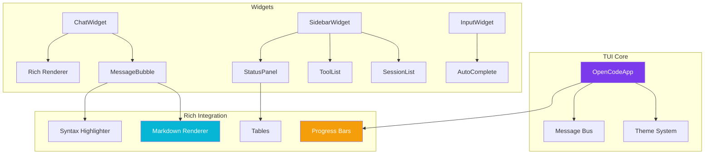

# OpenCode 4py TUI Improvement Plan

## Overview

This document outlines a comprehensive plan to modernize and enhance the opencode_4py Terminal User Interface (TUI) using Modern Python TUI frameworks (Rich + Textual).

## Current State Analysis

### Existing Implementation
- **Framework**: Textual (v0.50+) + Rich (v13.0+)
- **Structure**:
  - `app.py` - Main TUI application (33KB)
  - `widgets/chat.py` - Message bubbles and chat display
  - `widgets/sidebar.py` - Session/tool navigation
  - `widgets/input.py` - Multi-line input with send button
  - `widgets/completion.py` - Path/command/mention auto-complete
  - `widgets/approval.py` - Approval dialogs
- **Features**:
  - Chat interface with role-based message bubbles
  - Session management
  - Tool toggles
  - Status display (Computer, Network, Ollama)
  - Keyboard shortcuts
  - Basic CSS styling using Textual themes

### Current Gaps
1. **Visual**: Basic styling, no custom color themes
2. **Rich Integration**: Limited use of Rich's advanced features
3. **UX**: No progress bars, basic animations
4. **Layout**: Fixed sidebar width, simple organization

---

## Improvement Plan

### 1. Dependency Updates

**Objective**: Ensure latest stable versions of Textual and Rich

```toml
# pyproject.toml updates
textual>=0.80.0  # Latest with improved performance
rich>=13.9.0     # Latest with better markdown support
```

### 2. Custom Color Theme System

**Objective**: Create a modern, visually appealing theme system

**Implementation**:
- Define CSS custom properties for colors
- Support light/dark theme switching
- Add accent colors for different message types

```python
# New file: tui/themes.py
from textual.theme import Theme

OPENCODE_DARK = Theme(
    colors={
        "primary": "#7C3AED",      # Purple accent
        "secondary": "#06B6D4",      # Cyan
        "accent": "#F59E0B",        # Amber
        "success": "#10B981",       # Green
        "warning": "#F59E0B",       # Amber
        "error": "#EF4444",         # Red
        "background": "#1E1E2E",    # Dark background
        "surface": "#2D2D3F",       # Card background
        "text": "#E4E4E7",          # Primary text
        "text-muted": "#A1A1AA",    # Secondary text
    }
)
```

### 3. Rich-Powered Message Rendering

**Objective**: Display markdown and syntax-highlighted code in chat

**Enhancements**:
- Render assistant messages as Markdown
- Syntax highlight code blocks with language detection
- Add copy button for code blocks

```python
# chat.py improvements
from rich.markdown import Markdown
from rich.syntax import Syntax

class MessageBubble(Static):
    def render_content(self):
        if self.role == "assistant":
            # Render markdown with syntax highlighting
            return Markdown(self.content, code_theme="monokai")
```

### 4. Progress Bars for Tool Execution

**Objective**: Visual feedback for long-running operations

**Implementation**:
- Use Rich Progress for file operations
- Show percentage and ETA
- Support cancellation

```python
# Add to app.py
from rich.progress import Progress, SpinnerColumn, BarColumn, TextColumn

async def execute_with_progress(self, tool_name: str):
    with Progress(
        SpinnerColumn(),
        TextColumn("[progress.description]{task.description}"),
        BarColumn(),
        TextColumn("[progress.percentage]{task.percentage:>3.0f}%"),
    ) as progress:
        task = progress.add_task(f"Running {tool_name}...", total=100)
        # Process with progress updates
```

### 5. Enhanced Status Tables

**Objective**: Beautiful, readable status display

**Implementation**:
- Use Rich Table for organized status
- Add icons and color coding
- Collapsible sections

### 6. Loading Indicators & Animations

**Objective**: Modern loading states

**Enhancements**:
- Animated spinner during AI processing
- Pulse animation for "thinking" state
- Smooth transitions for message appearance

### 7. Improved Sidebar

**Objective**: Better navigation and organization

**Features**:
- Collapsible sections (Sessions, Tools, Status)
- Search/filter for tools
- Session preview on hover
- Better visual hierarchy

### 8. Enhanced Approval Dialogs

**Objective**: Clear, actionable approval requests

**Implementation**:
- Rich-styled modal screens
- Show diff/summary of changes
- Quick action buttons (Approve/Deny/Edit)

### 9. Keyboard Navigation

**Objective**: Power-user efficiency

**Enhancements**:
- Vim-style navigation (j/k for up/down)
- Command palette (Ctrl+P)
- Shortcuts help overlay (?)
- Tab completion in input

### 10. Flicker Reduction

**Objective**: Smooth visual experience

**Techniques**:
- Use Textual's synchronized output
- Batch UI updates
- Smooth scrolling

### 11. Terminal Capability Detection

**Objective**: Graceful degradation

**Implementation**:
- Detect color support
- Detect Unicode support
- Fallback for older terminals
- Detect mouse support

### 12. Extended TUIConfig

**Objective**: User-customizable experience

```python
class TUIConfig(BaseModel):
    theme: str = "dark"
    show_token_count: bool = True
    show_cost: bool = True
    compact_mode: bool = False
    # New options
    syntax_theme: str = "monokai"
    animation_speed: float = 1.0
    show_shortcuts: bool = True
    sidebar_width: int = 30
    font_size: str = "normal"  # small, normal, large
```

---

## Architecture Overview



---

## Implementation Order

1. **Phase 1: Foundation** (Dependencies + Theme)
   - Update dependencies
   - Create theme system
   - Update CSS variables

2. **Phase 2: Core Visuals** (Message Rendering)
   - Rich markdown in chat
   - Syntax highlighting
   - Code block improvements

3. **Phase 3: Feedback** (Progress + Loading)
   - Progress bars for tools
   - Loading spinners
   - Animations

4. **Phase 4: UX Polish** (Layout + Navigation)
   - Sidebar improvements
   - Keyboard shortcuts
   - Help overlay

5. **Phase 5: Refinement** (Testing + Compatibility)
   - Terminal testing
   - Fallback handling
   - Bug fixes

---

## Files to Modify

| File | Changes |
|------|---------|
| `pyproject.toml` | Update dependencies |
| `tui/app.py` | Main app enhancements, progress bars |
| `tui/themes.py` | NEW - Theme definitions |
| `tui/widgets/chat.py` | Markdown + syntax highlighting |
| `tui/widgets/sidebar.py` | Collapsible sections |
| `tui/widgets/input.py` | Command palette |
| `tui/widgets/approval.py` | Rich modals |
| `src/opencode/core/config.py` | Extended TUIConfig |

---

## Success Criteria

- [ ] Modern, visually appealing dark theme
- [ ] Markdown messages render correctly with syntax highlighting
- [ ] Progress bars show during long operations
- [ ] Status displays use organized tables
- [ ] Sidebar is collapsible and searchable
- [ ] Keyboard shortcuts improve workflow
- [ ] Works across Windows Terminal, iTerm2, VS Code terminal
- [ ] Graceful fallbacks for limited terminals
